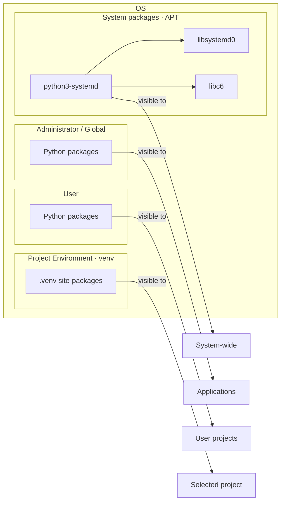

# Python System Environment

This page explains how Python is installed on common operating systems and where Python packages are live.

## Applied Project

### Project Setup

The applied project is a small admin CLI called `simply_journal_admin`, exposed as the `simply-journal-admin` command, that reads recent `systemd` journal entries. It imports [`systemd.journal`](https://www.freedesktop.org/software/systemd/python-systemd/journal.html) from the APT package [`python3-systemd`](https://packages.ubuntu.com/noble/python3-systemd) and declares no PyPI runtime dependencies because the binding comes from the distribution package manager and links against `libsystemd` in `/usr/lib`. This makes it a good fit for the system environment because the runtime dependency is intentionally owned by the operating system package manager instead of a project-local environment.

### Run the Project

Application, test, lint, and shell-exit commands are documented in the [section README](https://github.com/ValentinTwin1206/modern-python-devops-egineering/blob/main/projects/proj2_journal_admin/README.md).

## Python System Setup

### When to Use the System Environment?

Generally, do not use the Python system environment for application development. Prefer a project-specific virtual environment to isolate dependencies, and only use the system environment when Python is intentionally provided and managed by the operating system, container image, or platform.

Typical exceptions include:

- **OS-managed tools** — Python is maintained by the operating system.
- **Dependency-free scripts** — Scripts use only the Python standard library.
- **System automation** — Scripts run via `systemd`, cron, or other OS services.
- **Restricted environments** — `pip`, `venv`, or package downloads are unavailable or prohibited, e.g. zero-trust environments.
- **Minimal containers** — The container image provides the complete runtime and defines the isolation boundary.
- **Centrally managed utilities** — Administrators provide and maintain a shared Python runtime.

## Tradeoffs

### Pros

- ✅ **No environment setup** — Run scripts directly with the system interpreter.
- ✅ **OS lifecycle integration** — Python and packages follow the distribution's package management.
- ✅ **Works in restricted environments** — No dependency tooling is required.
- ✅ **Simple container runtime** — Dependencies can be baked into the image.

### Cons

- ⚠️ **Not isolated** — Changes can affect the OS, users, or other projects.
- ⚠️ **Version conflicts** — Different projects may require incompatible dependencies.
- ⚠️ **Less reproducible** — Shared environments can drift over time.
- ⚠️ **Risk to OS tooling** — Modifying OS-managed Python can break system utilities.
- ⚠️ **Poor fit for development** — Project dependencies should normally live in a virtual environment.


### Install Python

Python can be installed by the operating system, by a language-specific installer, or by a third-party package manager. The project in this section still uses Linux containers, but the host-level installation model differs across Linux, Windows, and macOS.

#### Default Python

=== "Linux (Debian-based)"

    Debian-based systems such as Debian, Ubuntu, Linux Mint, and Raspberry Pi OS ship Python as part of the operating system. The default interpreter lives at `/usr/bin/python3` and is managed by APT under `/usr`, alongside the standard library, headers, and distribution-provided packages.

    | Ubuntu release | APT suite | Bundled `python3` |
    | -------------- | --------- | ----------------- |
    | 22.04 LTS      | jammy     | Python 3.10       |
    | 24.04 LTS      | noble     | Python 3.12       |
    | 26.04 LTS      | resolute  | Python 3.14       |

    Avoid replacing the distribution-managed `/usr/bin/python3`, because operating system tools expect the default interpreter that ships with the release.

=== "Windows"

    Windows does not ship a distribution-managed Python in the same way Debian-based Linux does. The usual choices are the [python.org installer](https://www.python.org/downloads/windows/), [winget](https://learn.microsoft.com/windows/package-manager/winget/), or the Microsoft Store package.

    !!! info

        The Python launcher (`py`) is useful on Windows because multiple Python versions can be installed at the same time without relying only on `PATH` order. It is typically installed alongside the above mentioned installation packages.

=== "macOS"

    Modern macOS does not provide a full Python setup for project development. Since macOS Monterey 12.3, Apple has discouraged relying on the system-provided Python for development work, so developers usually install Python from [python.org](https://www.python.org/downloads/macos/), [Homebrew](https://brew.sh/), `uv`, or `pyenv`.

    !!! info

        On Ventura, Sonoma, and Sequoia, `python3` may be missing, may point to an Apple-managed `/usr/bin/python3` stub, or may come from Xcode Command Line Tools. Do not treat that interpreter as a stable project dependency.

#### Install Another Version

=== "Linux (Debian-based)"

    Install another Python version side by side instead of replacing the distribution-managed interpreter. On Ubuntu, an extra package source is the common path when the release does not ship the Python version you need.

    Add the extra package source:

    ```bash
    sudo add-apt-repository ppa:deadsnakes/ppa
    ```

    Refresh the APT package index:

    ```bash
    sudo apt update
    ```

    Install the versioned interpreter together with the matching `venv` and header packages:

    ```bash
    sudo apt install python3.13 python3.13-venv python3.13-dev
    ```

    Create environments with the explicit interpreter command you installed:

    ```bash
    python3.13 -m venv .venv
    ```

=== "Windows"

    Install Python with `winget`:

    ```powershell
    winget install Python.Python.3.13
    ```

    Check the installed version with the Python launcher:

    ```powershell
    py -3.13 --version
    ```

    Create environments with the explicit version:

    ```powershell
    py -3.13 -m venv .venv
    ```

=== "macOS"

    Install Python with Homebrew:

    ```bash
    brew install python@3.13
    ```

    Check the installed version:

    ```bash
    python3.13 --version
    ```

    Create environments with the explicit interpreter:

    ```bash
    python3.13 -m venv .venv
    ```

### Installation Footprint

A Python installation includes the CPython interpreter, standard library modules, package directories, native extension headers, build configuration, and integration with the operating system shell through `PATH` entries or launchers.

=== "Linux (Debian-based)"

    | Component | Common Debian-based path |
    | --------- | ------------------------ |
    | Interpreter | `/usr/bin/python3` |
    | Standard library | `/usr/lib/python3.x/` |
    | Interpreter installation packages | `/usr/lib/python3/dist-packages/` |
    | System-wide administrator-installed packages | `/usr/local/lib/python3.x/dist-packages/` |
    | User packages | `~/.local/lib/python3.x/site-packages/` |
    | Header files | `/usr/include/python3.x/` |

=== "Windows"

    | Component | Common Windows path |
    | --------- | ------------------- |
    | Interpreter | `%LocalAppData%\Programs\Python\Python313\python.exe` |
    | Standard library | `%LocalAppData%\Programs\Python\Python313\Lib` |
    | Interpreter installation packages |  |
    | System-wide administrator-installed packages | `C:\Program Files\Python313\Lib\site-packages` if Python is installed for all users |
    | User packages | `%AppData%\Python\Python313\site-packages` |
    | Header files | `%LocalAppData%\Programs\Python\Python313\include` |

=== "macOS"

    | Component | Common macOS path |
    | --------- | ----------------- |
    | Interpreter | `/opt/homebrew/bin/python3.13` |
    | Standard library | `/opt/homebrew/Frameworks/Python.framework/Versions/3.13/lib/python3.13/` |
    | Interpreter installation packages |  |
    | System-wide administrator-installed packages | `/Library/Frameworks/Python.framework/Versions/3.13/lib/python3.13/site-packages` |
    | User packages | `~/Library/Python/3.13/lib/python/site-packages` |
    | Header files | `/opt/homebrew/Frameworks/Python.framework/Versions/3.13/include/python3.13/` |

- **Standard library:** built-in modules such as `os`, `pathlib`, `json`, and `subprocess` ship with Python itself.

- **Interpreter installation packages:** in this section, the concrete example is the Debian [system target](#system-target), where a package such as `python3-systemd` lands under `/usr/lib/python3/dist-packages/`.

- **System-wide administrator-installed packages:** packages installed into the administrator-controlled prefix affect every project that uses that interpreter. They are covered in [Local administrator target](#local-administrator-target).

- **User packages:** packages installed with `--user` stay under the current user's home directory and are only available to that user's Python processes. They are covered in [User target](#user-target).

- **Header files:** development headers are needed when packages compile C or C++ extension modules against the current interpreter. On Debian-based Linux, they come from packages such as `python3-dev` or `python3.13-dev`; python.org installers for Windows and macOS include the development files needed for common extension builds.

### Package Installation Targets

Python packages can land in [operating-system](#system-target), [administrator](#local-administrator-target), or [user](#user-target) locations. In this section, the operating-system-backed system target is a Debian-based Linux concept; Windows and macOS do not provide the same kind of OS-managed Python package target for importable libraries. A package can be used with an `import` statement when it is installed into a directory that the active interpreter searches on `sys.path`, and Python resolves that import from the first matching package directory on that search path. The target therefore decides who can import the package and which projects are affected by future upgrades. The [PATH and import path](#path-and-import-path) inspection commands show how to inspect that search path.

The following diagram shows how the different installation targets affect permissions and package visibility on a Linux host.



#### System Target

On Debian-based Linux, the system target is owned and managed by APT, and importable Python packages typically land under `/usr/lib/python3/dist-packages/`. Unlike a Python-only package manager, APT resolves both Python and native system dependencies as part of the operating system, which makes it appropriate for distribution-managed tools, system services, and Python bindings to OS libraries. For a precise explanation of how OS packages integrate native components into the dependency graph, see [Chapter 02, Section 02](../chapter-02/section-02/index.md).

For example, `python3-systemd` provides Python bindings for `systemd`, and installing it with APT also pulls in the required native `libsystemd` library; those dependencies on system packages are illustrated in the Mermaid chart above.

Install the distribution-managed Python binding with the distribution package manager:

```bash
sudo apt install python3-systemd
```

Import it with the system interpreter:

```bash
python3 -c "import systemd.journal; print(systemd.journal.__file__)"
```

!!! info "Windows and macOS"
    Windows and macOS do not have an APT-like Python system target for importable Python libraries. Package managers such as WinGet and Homebrew can install Python, applications, and global tools such as `uv`, but Python libraries for `import` statements usually belong in a [local administrator target](#local-administrator-target), [user target](#user-target), or virtual environment.

#### Local Administrator Target

=== "Linux (Debian-based)"

    The local administrator target installs packages outside APT while still making them available to the system interpreter. Those installs usually land under `/usr/local/lib/python3.x/dist-packages/`. On modern Debian and Ubuntu, the interpreter is marked as externally managed under PEP 668, so `pip` and `uv` require an explicit override.

    === "uv"

        Install a package into the local administrator target with `uv`:

        ```bash
        uv pip install --system --break-system-packages requests
        ```

    === "pip"

        Install a package into the local administrator target with `pip`:

        ```bash
        pip3 install --break-system-packages requests
        ```

=== "Windows"

    An all-users Python install under `C:\Program Files\Python313\` is the closest equivalent. Installing packages into it usually requires administrator permissions.

    === "uv"

        Install a package into the selected all-users interpreter with `uv`:

        ```powershell
        uv pip install --python "C:\Program Files\Python313\python.exe" requests
        ```

    === "pip"

        Install a package into the selected all-users interpreter with `pip`:

        ```powershell
        py -3.13 -m pip install requests
        ```

=== "macOS"

    A Homebrew or python.org interpreter prefix is the closest equivalent. Installing packages into that prefix affects every project using that interpreter.

    === "uv"

        Install a package into the selected interpreter prefix with `uv`:

        ```bash
        uv pip install --python /opt/homebrew/bin/python3.13 --break-system-packages requests
        ```

    === "pip"

        Install a package into the selected interpreter prefix with `pip`:

        ```bash
        python3.13 -m pip install --break-system-packages requests
        ```

#### User Target

=== "Linux (Debian-based)"

    The user target keeps packages inside the current user's home directory, usually under `~/.local/lib/python3.x/site-packages/`.

    ```bash
    uv pip install --user karva ruff
    ```

=== "Windows"

    Install user-level tools without administrator permissions:

    ```powershell
    uv pip install --user karva ruff
    ```

    User packages usually land under `%AppData%\Python\Python313\site-packages`.

=== "macOS"

    Install user-level tools without writing into the interpreter prefix:

    ```bash
    uv pip install --user karva ruff
    ```

    User packages usually land under `~/Library/Python/3.13/lib/python/site-packages`.

## Inspection

### PATH and import path

The shell searches `PATH` from left to right. Python's import resolver searches `sys.path`, which is independent from `PATH`.

Show the resolved interpreter:

```bash
which python3
```

Show the active import path:

```bash
python3 -c "import sys; [print(path) for path in sys.path]"
```

Show the full site configuration:

```bash
python3 -m site
```

### Inspecting installed packages

Show where the APT-managed `systemd.journal` binding lives:

```bash
python3 -c "import systemd.journal; print(systemd.journal.__file__)"
```

Show where user-installed packages and their console scripts live:

```bash
python3 -c "import karva, ruff; print(karva.__file__); print(ruff.__file__)"
```

Show the files owned by an APT-managed Python package:

```bash
dpkg -L python3-systemd | grep -E '/dist-packages/systemd(/|$)' | head
```
