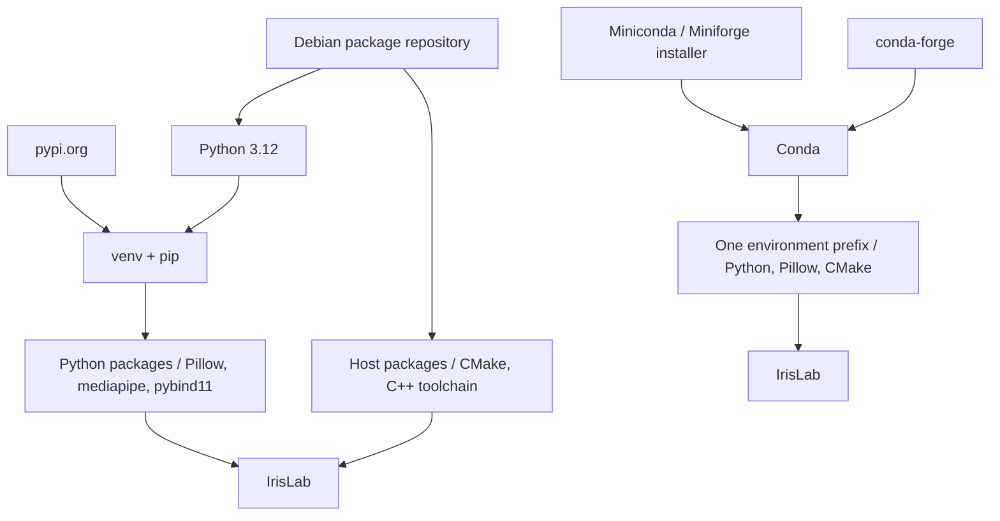

# Python Conda Environments

This page covers Conda as both a package manager and an environment manager. Conda can replace the usual `pip` plus `venv` workflow when one tool needs to manage Python, Python packages, native libraries, and other non-Python dependencies.

## Applied Project

### Project Setup

The applied project is `IrisLab`, a small image-based iris color analysis application. It uses MediaPipe Face Landmarker with a **local machine-learning model** to locate the irises in real photos, then analyzes the extracted pixels with NumPy and CIELAB color space to determine perceptual color features and classify the eye color. The resulting color profile is compared with reference colors using a native C++ library that calculates CIE ΔE color distances and is exposed to Python through `pybind11`. This makes `IrisLab` a good fit for Conda because a single environment manages Python packages, native libraries, compiled C++ code, and local machine-learning dependencies together.

### Run the Project

Application, test, lint, package-build, and shell-exit commands are documented in the [project README](https://github.com/ValentinTwin1206/modern-python-devops-egineering/blob/main/projects/proj4_irislab/README.md).

## Conda Environment Model

Conda can manage the Python interpreter version itself and install non-Python dependencies from Conda channels. One Conda environment can therefore bundle the interpreter, Python packages, native shared libraries, headers, and other runtime files that would otherwise come from the host operating system.

Conda is more than an environment directory. It is an ecosystem made of remote package repositories, channels such as `conda-forge`, a package manager, an environment manager, and conventions for publishing binary scientific software. This is especially useful for projects such as `IrisLab` that combine scientific Python packages, image processing, local machine-learning inference, and compiled C++ code within a single environment.

The simplified diagram compares a plain `venv` workflow with a Conda workflow:



### When to Use Conda?

Conda is a strong fit for computer vision, numerical computing, geospatial processing, machine learning, and scientific workflows that need reproducible environments with compiled packages. It is particularly useful when Python bindings and native binaries must be installed and upgraded together.

### Tradeoffs

#### Pros

- ✅ Manages the Python version as part of the environment.
- ✅ Installs Python and non-Python packages together from Conda channels.
- ✅ Keeps Python bindings and native binaries in one environment prefix.
- ✅ Works well for scientific or compiled dependencies.

#### Cons

- ⚠️ Heavier than `venv` in tooling footprint and environment size.
- ⚠️ Uses a separate ecosystem alongside PyPI, so some projects need both `conda` and `pip`.
- ⚠️ Dependency solving can be slower than simpler PyPI-only workflows.
- ⚠️ Pure-Python projects are often simpler with `venv` plus `pip` or `uv`.

### Install Conda

Conda is available on Linux, Windows, and macOS. A common starting point is **Miniconda**, a minimal distribution 
containing Conda, Python, and the packages required to run them.

A user installation typically lives under `~/miniconda3` on Linux and macOS.

=== "Linux"

    Download the Miniconda installer for Linux x86-64:

    ```bash
    curl -LsSf \
      -o miniconda.sh \
      https://repo.anaconda.com/miniconda/Miniconda3-latest-Linux-x86_64.sh
    ```

    Install Miniconda into your home directory:

    ```bash
    bash miniconda.sh -b -p "$HOME/miniconda3"
    ```

    Initialize Conda for Bash:

    ```bash
    "$HOME/miniconda3/bin/conda" init bash
    ```

    Restart the shell or load the updated configuration:

    ```bash
    source ~/.bashrc
    ```

    Verify the installation:

    ```bash
    conda --version
    ```

    !!! note "ARM64 / AArch64"
        On an ARM64 Linux system, use `Miniconda3-latest-Linux-aarch64.sh` instead.

=== "Windows"

    Install Miniconda with Windows Package Manager:

    ```powershell
    winget install Anaconda.Miniconda3
    ```

    Open a new terminal and verify the installation:

    ```powershell
    conda --version
    ```

=== "macOS"

    For an Apple Silicon Mac, download the ARM64 installer:

    ```bash
    curl -LsSf \
      -o miniconda.sh \
      https://repo.anaconda.com/miniconda/Miniconda3-latest-MacOSX-arm64.sh
    ```

    Install Miniconda:

    ```bash
    bash miniconda.sh -b -p "$HOME/miniconda3"
    ```

    Initialize Conda for the default Zsh shell:

    ```bash
    "$HOME/miniconda3/bin/conda" init zsh
    ```

    Restart the shell or load the updated configuration:

    ```bash
    source ~/.zshrc
    ```

    Verify the installation:

    ```bash
    conda --version
    ```

    !!! note "Intel Macs"
        On an Intel Mac, use `Miniconda3-latest-MacOSX-x86_64.sh` instead.

!!! warning
    Run `conda init bash`, `conda init powershell`, or `conda init zsh` only when you want Conda activation integrated into future shells. Initialization can leave the `base` environment active by default.

### Environment Layout

#### Environment Definition

The dedicated `projects/proj4_irislab/environment.yml` file defines the `irislab` Conda environment. It records the channels and dependencies needed by the project, including Python, scientific and machine-learning packages, native libraries, and development tools. A Conda environment can be created via `conda env create --file environment.yml`; Conda uses this file to create the environment consistently on a new machine.

```yaml
name: irislab

channels:
  - conda-forge
  - nodefaults

dependencies:
  - python=3.12

  # CLI
  - click
  - rich

  # Image / numerical processing
  - pillow
  - numpy

  # MediaPipe native runtime
  - libgl
  - libegl
  - libgles

  # Native C++ extension
  - pybind11
  - cmake
  - ninja

  # Development / testing
  - pytest

  # Packages not available from conda-forge
  - pip
  - pip:
      - mediapipe
```

- `name`: Sets the Conda environment name to `irislab`.
- `channels`: Tells Conda where to resolve Conda-managed packages.
    - `conda-forge`: The community channel explicitly selected here for the project's scientific, machine-learning, and native packages.
    - `nodefaults`: Prevents Conda from adding the Anaconda `defaults` channels from its global configuration. This keeps dependency resolution on `conda-forge` and avoids requiring Anaconda channel Terms of Service acceptance.
- `dependencies`: Lists the packages that Conda should install. Version constraints can pin an exact version or define a range, using operators such as `=`, `==`, `<`, `<=`, `>`, and `>=`. For example, `python=3.12` requests Python 3.12, while leaving a package unpinned lets Conda resolve a compatible version from the selected channels.
    - `pip`: Installs the `mediapipe` package, which is not installed from the Conda dependencies in this environment definition.

#### Key Directories and Files

After creating the environment described in [Environment Definition](#environment-definition), its directory layout looks like this:

=== "Linux (Debian-based)"

    ```text
    <conda-prefix>/
    ├── bin/conda
    ├── envs/
    │   └── irislab/
    │       ├── bin/
    │       │   ├── python
    │       │   ├── python3.12
    │       │   └── irislab
    │       ├── conda-meta/
    │       ├── include/python3.12/
    │       ├── lib/python3.12/site-packages/
    │       └── lib/libirislab.so
    └── pkgs/
    ```

=== "Windows"

    ```text
    <conda-prefix>\
    ├── condabin\conda.bat
    ├── envs\
    │   └── irislab\
    │       ├── python.exe
    │       ├── Scripts\irislab.exe
    │       ├── Lib\site-packages\
    │       ├── Library\bin\
    │       └── conda-meta\
    └── pkgs\
    ```

=== "macOS"

    ```text
    <conda-prefix>/
    ├── bin/conda
    ├── envs/
    │   └── irislab/
    │       ├── bin/python
    │       ├── bin/irislab
    │       ├── conda-meta/
    │       ├── lib/python3.12/site-packages/
    │       └── lib/libirislab.dylib
    └── pkgs/
    ```

- **Conda executable:** lives under the installation prefix, such as `~/miniconda3/bin/conda` or `%UserProfile%\miniconda3\condabin\conda.bat`.
- **`<conda-prefix>/envs/<name>/`:** is the named environment directory.
- **Environment-local executables:** Linux and macOS use `bin/`; Windows uses the environment root and `Scripts\`.
- **Python packages:** Linux and macOS use `lib/python3.12/site-packages/`; Windows uses `Lib\site-packages\`.
- **Native runtime files:** Conda installs shared libraries into `lib/` on Linux and macOS or `Library\bin\` on Windows.
- **`conda-meta/`:** stores Conda package records and environment history.
- **`pkgs/`:** stores the shared package cache for the Conda installation prefix.

## Development Workflow

The `Dockerfile.devEnv` image installs Miniconda, configures `conda-forge` as its only system 
package channel, and includes the compiler toolchain, MediaPipe model, and project files. 
Choose the workflow that matches the state of the local `mpe/proj4_irislab` image:

=== "Image does not exist"

    From the repository's `projects/` directory, use `build.sh` to build the image and open 
    the dedicated IrisLab development container. The command enables GPU access and forwards
    the Cloudsmith configuration into the container session:

    ```bash
    ./build.sh build \
        --path proj4_irislab/Dockerfile.devEnv \
        --gpus all \
        --cloudsmith-workspace "<cloudsmith-repo>" \
        --cloudsmith-api-key "$CLOUDSMITH_API_KEY"
    ```

=== "Image already exists"

    From the repository's `projects/` directory, run the existing image
    directly:

    ```bash
    docker run -it \
        -v "$PWD/proj4_irislab:/app" \
        -v "$PWD/proj4_irislab/.build:/build" \
        mpe/proj4_irislab \
        /bin/bash
    ```

!!! info "Local ML Inference"
    `IrisLab` uses **MediaPipe Face and Iris Landmark models** to locate the eyes and irises in a portrait. Inference runs **locally inside the container** on the CPU, so GPU-enabled containers are optional and no image data is sent to a cloud service.

    The detected iris landmarks are used to isolate the actual iris pixels. `IrisLab` then analyzes their color distribution with Python and NumPy before passing the resulting color information to the native C++ harmony algorithm.

### Create the Environment

The `irislab` sample project uses Conda to create and manage a complete development environment, including the Python interpreter, Python packages, native libraries, and build tools listed in `environment.yml`. CMake then uses the installed compiler and pybind11 tools to build the project's native extension. In a real-world Python project, use a `pyproject.toml` file to define the Python project's metadata, dependencies, and build configuration, while keeping Conda-specific requirements such as the Python version, native libraries, and external build tools in `environment.yml`.
    
=== "Create from `environment.yml`"

    From the project root, create the `irislab` environment in the container's writable Conda prefix at `/opt/conda/envs/irislab` and install the dependencies listed in `environment.yml`:

    ```bash
    conda env create --file environment.yml
    ```

    After the environment has been created, activate it for the current shell:

    ```bash
    conda activate irislab
    ```

=== "Create from scratch"

    Create the `irislab` environment and install its dependencies directly
    from the Conda command line:

    ```bash
    conda create -y \
        -n irislab \
        -c conda-forge \
            python=3.12 \
            rdkit \
            pillow \
            rich \
            click \
            numpy \
            glib \
            libgl \
            libegl \
            libgles \
            pybind11 \
            cmake \
            ninja \
            pytest \
            pip
    ```

    After the environment has been created, activate it for the current shell:

    ```bash
    conda activate irislab
    ```

    And finally install the "pip-only" dependencies:

    ```bash
    python -m pip install mediapipe
    ```

After the first activation, configure `irislab` as the default environment for
future interactive Bash shells. This setting applies to `alice`, the development
user created by the Dockerfile.

```bash
conda config --set default_activation_env irislab
conda config --set auto_activate true
```

### Add Additional Packages

Use the tab that matches the dependency change you want to make:

=== "Update from `environment.yml`"

    Ensure that `irislab` is active before synchronizing the environment:

    ```bash
    conda activate irislab
    ```

    Add the respective package to the `dependencies` entry:

    ```yaml
    dependencies:
        - ruff
    ```

    To synchronize an existing environment with the definition file, update it
    from the project root:

    ```bash
    conda env update --file environment.yml --prune
    ```

    Inspect the installed package records after the update:

    ```bash
    conda list
    ```

=== "Install an additional package"

    Ensure that `irislab` is active before installing a package:

    ```bash
    conda activate irislab
    ```

    Add an additional development tool, such as `ruff`, from the `conda-forge`
    channel:

    ```bash
    conda install -c conda-forge ruff
    ```

    Inspect the installed package records:

    ```bash
    conda list
    ```

### Run the Project

With the `irislab` environment active, remove any previous CMake cache before
configuring the native extension:

Remove any previous development build and re-create it:

```bash
rm -rf build-dev && mkdir -p build-dev
```

Configure the `IrisLab` native extension with the installed CMake and Ninja toolchain and
build it:

```bash
cmake -S cpp -B build-dev -G Ninja -DIRISLAB_BUILD_BINDINGS=ON
cmake --build build-dev
```

Copy the compiled extension into the Python package:

```bash
cp build-dev/_native*.so src/irislab/
```

During the development loop, run the CLI module directly from the source tree
so that changes can be tested without reinstalling the package:

```bash
PYTHONPATH=src python -m irislab.cli --image samples/blue-eyes.png
```

```bash
PYTHONPATH=src python -m irislab.cli --image samples/blue-eyes.png --gpu
```

!!! info "Package Integration Testing"
    For package-level integration testing, build and install the `irislab-tools`
    Conda package from `meta.yaml`. Conda-build automatically builds `libirislab`
    and the `_native` extension; manual CMake is only needed for the local
    development loop. Its generated console entry point then becomes available
    in the active environment (see [Conda Packages](../chapter-02/section-04.md)).

### Inspect the Environment

Inspect the active Conda environment and its installation prefix:

```bash
conda info --envs
conda list
which python
python -c "import sys; print(sys.prefix)"
```

### Test the Project

Run the test suite against the current source tree with the project's test tool:

```bash
pytest tests/
```
