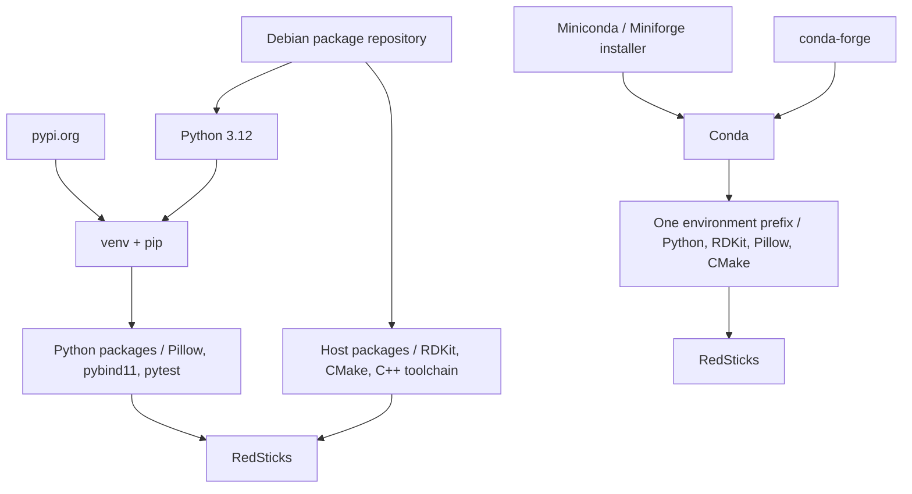

# Python Conda Environments

This page covers Conda as both a package manager and an environment manager. Conda can replace the usual `pip` plus `venv` workflow when one tool needs to manage Python, Python packages, native libraries, and other non-Python dependencies.

## Applied Project

### Project Setup

The applied project is `RedSticks`, a small image-based lipstick shade suggestion library. It combines [RDKit](https://www.rdkit.org/), [Pillow](https://python-pillow.org/), [Rich](https://rich.readthedocs.io/), a native [pybind11](https://pybind11.readthedocs.io/) extension, and an open-weight AI face-parsing model ([transformers](https://huggingface.co/docs/transformers) + [PyTorch](https://pytorch.org/)) for extracting the eye color from real photos. This makes it a good fit for Conda because the workflow combines Python packages, native libraries, compiled C++ code, and a heavyweight ML stack in one environment.

### Run the Project

Application, test, lint, package-build, and shell-exit commands are documented in the [project README](https://github.com/ValentinTwin1206/modern-python-devops-egineering/blob/main/projects/proj4_redsticks/README.md).

## Conda Environment Model

Conda can manage the Python interpreter version itself and install non-Python dependencies from Conda channels. One Conda environment can therefore bundle the interpreter, Python packages, native shared libraries, headers, and other runtime files that would otherwise come from the host operating system.

Conda is more than an environment directory. It is an ecosystem made of remote package repositories, channels such as `conda-forge`, a package manager, an environment manager, and conventions for publishing binary scientific software. This is especially useful for projects such as RedSticks that combine RDKit, image processing, and compiled C++ code.

The simplified diagram compares a plain `venv` workflow with a Conda workflow:



### When to Use Conda?

Conda is a strong fit for computer vision, numerical computing, geospatial processing, machine learning, and scientific workflows that need reproducible environments with compiled packages. It is particularly useful when Python bindings and native binaries must be installed and upgraded together.

### Tradeoffs

#### Pros

- ✅ Manages the Python version as part of the environment.
- ✅ Installs Python and non-Python packages together from Conda channels.
- ✅ Keeps Python bindings and native binaries in one environment prefix.
- ✅ Works well for scientific or compiled dependencies.

#### Cons

- ⚠️ Heavier than `venv` in tooling footprint and environment size.
- ⚠️ Uses a separate ecosystem alongside PyPI, so some projects need both `conda` and `pip`.
- ⚠️ Dependency solving can be slower than simpler PyPI-only workflows.
- ⚠️ Pure-Python projects are often simpler with `venv` plus `pip` or `uv`.

### Install Conda

Conda is available on Linux, Windows, and macOS. A common starting point is **Miniconda**, a minimal distribution 
containing Conda, Python, and the packages required to run them.

A user installation typically lives under `~/miniconda3` on Linux and macOS.

=== "Linux"

    Download the Miniconda installer for Linux x86-64:

    ```bash
    curl -LsSf \
      -o miniconda.sh \
      https://repo.anaconda.com/miniconda/Miniconda3-latest-Linux-x86_64.sh
    ```

    Install Miniconda into your home directory:

    ```bash
    bash miniconda.sh -b -p "$HOME/miniconda3"
    ```

    Initialize Conda for Bash:

    ```bash
    "$HOME/miniconda3/bin/conda" init bash
    ```

    Restart the shell or load the updated configuration:

    ```bash
    source ~/.bashrc
    ```

    Verify the installation:

    ```bash
    conda --version
    ```

    !!! note "ARM64 / AArch64"
        On an ARM64 Linux system, use `Miniconda3-latest-Linux-aarch64.sh` instead.

=== "Windows"

    Install Miniconda with Windows Package Manager:

    ```powershell
    winget install Anaconda.Miniconda3
    ```

    Open a new terminal and verify the installation:

    ```powershell
    conda --version
    ```

=== "macOS"

    For an Apple Silicon Mac, download the ARM64 installer:

    ```bash
    curl -LsSf \
      -o miniconda.sh \
      https://repo.anaconda.com/miniconda/Miniconda3-latest-MacOSX-arm64.sh
    ```

    Install Miniconda:

    ```bash
    bash miniconda.sh -b -p "$HOME/miniconda3"
    ```

    Initialize Conda for the default Zsh shell:

    ```bash
    "$HOME/miniconda3/bin/conda" init zsh
    ```

    Restart the shell or load the updated configuration:

    ```bash
    source ~/.zshrc
    ```

    Verify the installation:

    ```bash
    conda --version
    ```

    !!! note "Intel Macs"
        On an Intel Mac, use `Miniconda3-latest-MacOSX-x86_64.sh` instead.

!!! warning
    Run `conda init bash`, `conda init powershell`, or `conda init zsh` only when you want Conda activation integrated into future shells. Initialization can leave the `base` environment active by default.

### Environment Layout

#### Environment Definition

The dedicated `projects/proj4_redsticks/environment.yml` file defines the `redsticks` Conda environment. It records the 
channels and dependencies needed by the project, including Python, scientific and machine-learning packages, native 
libraries, and build tools. A Conda environment can be created via `conda env create -f environment.yml`; Conda uses this 
file to create the environment consistently on a new machine.

```yaml
name: redsticks

channels:
  - conda-forge

dependencies:
  - python=3.12

  # CLI
  - click
  - rich

  # Image / numerical processing
  - pillow
  - numpy

  # MediaPipe native runtime
  - libgl
  - libegl
  - libgles

  # Chemistry
  - rdkit

  # Native C++ extension
  - pybind11
  - cmake
  - ninja

  - pip
  - pip:
      - mediapipe
      - cloudsmith-cli==1.26.0
      - pytest
```

- `name`: Sets the Conda environment name to `redsticks`.
- `channels`: Tells Conda where to resolve Conda-managed packages.
    - `default`: Conda's standard package channel, used when it is enabled in the Conda configuration.
    - `conda-forge`: The community channel explicitly selected here for the project's scientific, machine-learning, and native packages.
- `dependencies`: Lists the packages that Conda should install. Version constraints can pin an exact version or define a range, using operators such as `=`, `==`, `<`, `<=`, `>`, and `>=`. For example, `python=3.12` requests Python 3.12, while leaving a package unpinned lets Conda resolve a compatible version from the selected channels.
    - `pip`: Installs packages available only from PyPI through the environment definition. For example, `cloudsmith-cli==1.26.0` requests exactly version 1.26.0, while `pytest` is left unpinned. Prefer Conda channels for Conda-compatible dependencies; packages that exist only on PyPI, such as `cloudsmith-cli` and `pytest`, belong in this subsection and are installed by the Conda CLI when the environment is created or synced.

#### Key Directories and Files

After creating the environment described in [Environment Definition](#environment-definition), its directory layout looks like this:

=== "Linux (Debian-based)"

    ```text
    <conda-prefix>/
    ├── bin/conda
    ├── envs/
    │   └── redsticks/
    │       ├── bin/
    │       │   ├── python
    │       │   ├── python3.12
    │       │   └── redsticks
    │       ├── conda-meta/
    │       ├── include/python3.12/
    │       ├── lib/python3.12/site-packages/
    │       └── lib/libredsticks.so
    └── pkgs/
    ```

=== "Windows"

    ```text
    <conda-prefix>\
    ├── condabin\conda.bat
    ├── envs\
    │   └── redsticks\
    │       ├── python.exe
    │       ├── Scripts\redsticks.exe
    │       ├── Lib\site-packages\
    │       ├── Library\bin\
    │       └── conda-meta\
    └── pkgs\
    ```

=== "macOS"

    ```text
    <conda-prefix>/
    ├── bin/conda
    ├── envs/
    │   └── redsticks/
    │       ├── bin/python
    │       ├── bin/redsticks
    │       ├── conda-meta/
    │       ├── lib/python3.12/site-packages/
    │       └── lib/libredsticks.dylib
    └── pkgs/
    ```

- **Conda executable:** lives under the installation prefix, such as `~/miniconda3/bin/conda` or `%UserProfile%\miniconda3\condabin\conda.bat`.
- **`<conda-prefix>/envs/<name>/`:** is the named environment directory.
- **Environment-local executables:** Linux and macOS use `bin/`; Windows uses the environment root and `Scripts\`.
- **Python packages:** Linux and macOS use `lib/python3.12/site-packages/`; Windows uses `Lib\site-packages\`.
- **Native runtime files:** Conda installs shared libraries into `lib/` on Linux and macOS or `Library\bin\` on Windows.
- **`conda-meta/`:** stores Conda package records and environment history.
- **`pkgs/`:** stores the shared package cache for the Conda installation prefix.

## Development Workflow

From the repository's `projects/` directory, use `build.sh` to open the dedicated RedSticks development container. The 
command enables GPU access and forwards the Cloudsmith configuration into the container session:

```bash
./build.sh build \
    --path proj4_redsticks/Dockerfile.devEnv \
    --gpus all \
    --cloudsmith-workspace "<cloudsmith-repo>" \
    --cloudsmith-api-key "$CLOUDSMITH_API_KEY"
```

The `Dockerfile.devEnv` image installs Miniconda, the base-environment packaging tools, the compiler toolchain, and 
the project files. It deliberately does **not** create the `redsticks` environment during the image build. This
keeps the image reusable and makes environment creation an explicit, inspectable workflow step.

!!! info "Local ML Inference"
    RedSticks uses **MediaPipe Face and Iris Landmark models** to locate the eyes and irises in a portrait. Inference runs entirely **locally inside the container** using MediaPipe and TensorFlow Lite — no image data is sent to a cloud service.

    The detected iris landmarks are used to isolate the actual iris pixels. RedSticks then analyzes their color distribution with Python and NumPy before passing the resulting color information to the native C++ harmony algorithm.

    The MediaPipe models are lightweight and run efficiently on the **CPU**, so CUDA, PyTorch, an NVIDIA GPU, and GPU-enabled Docker containers are no longer required.

### Create the Environment

The `redsticks` sample project uses Conda to create and manage a complete development environment, including the Python interpreter, Python packages, native libraries, and build tools listed in `environment.yml`. CMake then uses the installed compiler and pybind11 tools to build the project's native extension. In a real-world Python project, use a `pyproject.toml` file to define the Python project's metadata, dependencies, and build configuration, while keeping Conda-specific requirements such as the Python version, native libraries, and external build tools in `environment.yml`.
    
=== "Create from `environment.yml`"

    From the project root, create the `redsticks` environment in the container's writable Conda prefix at `/opt/conda/envs/redsticks` and install the dependencies listed in `environment.yml`:

    ```bash
    conda env create -f environment.yml
    ```

    After the environment has been created, activate it for the current shell:

    ```bash
    conda activate redsticks
    ```

=== "Create from scratch"

    Create the `redsticks` environment and install its dependencies directly
    from the Conda command line:

    ```bash
    conda create -y \
        -n redsticks \
        -c conda-forge \
            python=3.12 \
            rdkit \
            pillow \
            rich \
            click \
            numpy \
            libgl \
            libegl \
            libgles \
            pybind11 \
            cmake \
            ninja \
            pip
    ```

    After the environment has been created, activate it for the current shell:

    ```bash
    conda activate redsticks
    ```

    And finally install the "pip-only" dependencies:

    ```bash
    python -m pip install \
        mediapipe \
        cloudsmith-cli==1.26.0 \
        pytest
    ```

After the first activation, configure `redsticks` as the default environment for
future interactive Bash shells. This setting applies to `alice`, the development
user created by the Dockerfile.

```bash
conda config --set default_activation_env redsticks
conda config --set auto_activate true
```

!!! info "Base Environment"
    The Conda `"base"` environment remains available within the container image as
    it provides the packaging tools like `conda-build` and `conda-package-handling`, 
    required for the *Packaging Workflow* explained in [Chapter 02, Section 04](../chapter-02/section-04.md).

### Add Additional Packages

Ensure that `redsticks` is active before installing or updating dependencies:

```bash
conda activate redsticks
```

To synchronize an existing environment with the definition file, update it
from the project root:

```bash
conda env update -f environment.yml --prune
```

Add an additional development tool, such as `ruff`, from the `conda-forge`
channel:

```bash
conda install -c conda-forge ruff
```

Export the environment's explicit package records when you need to reproduce the exact platform solve:

```bash
conda list --explicit > redsticks-linux-64.txt
```

### Run the Project

With the `redsticks` environment active, remove any previous CMake cache before
configuring the native extension:

```bash
rm -rf build-dev
```

Configure the native extension with the installed CMake and Ninja toolchain:

```bash
cmake -S cpp -B build-dev -G Ninja -DREDSTICKS_BUILD_BINDINGS=ON
```

Build the configured native extension:

```bash
cmake --build build-dev
```

Copy the compiled extension into the Python package:

```bash
cp build-dev/_native*.so src/redsticks/
```

During the development loop, run the CLI module directly from the source tree
so that changes can be tested without reinstalling the package:

```bash
python -m redsticks.cli --image samples/blue-eye.png
```

> The Dockerfile sets `PYTHONPATH=/app/src`, so no path prefix is required.

Run the same source-tree module on the GPU when the container has GPU access and
the environment contains a CUDA-enabled PyTorch build:

```bash
python -m redsticks.cli --image samples/blue-eye.png --gpu
```

!!! info "Package Integration Testing"
    For package-level integration testing, build and install the
    `redsticks-tools` Conda package from `recipe/meta.yaml`. Its generated
    console entry point then becomes available in the active environment. See
    [Conda Packages](../chapter-02/section-04.md) for the packaging workflow.

    ```bash
    redsticks --image samples/blue-eye.png
    ```

### Inspect the Environment

Inspect the active Conda environment and its installation prefix:

```bash
conda info --envs
conda list
which python
python -c "import sys; print(sys.prefix)"
```

### Test the Project

Run the test suite against the current source tree with the project's test tool:

```bash
pytest tests/
```
