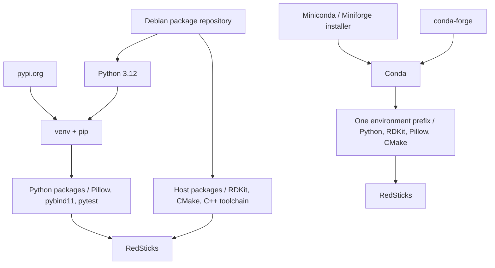

# Python Conda Environments

This page covers Conda as both a package manager and an environment manager. Conda can replace the usual `pip` plus `venv` workflow when one tool needs to manage Python, Python packages, native libraries, and other non-Python dependencies.

## Applied Project

### Project Setup

The applied project is `RedSticks`, a small image-based lipstick shade suggestion library. It combines [RDKit](https://www.rdkit.org/), [Pillow](https://python-pillow.org/), [Rich](https://rich.readthedocs.io/), a native [pybind11](https://pybind11.readthedocs.io/) extension, and an open-weight AI face-parsing model ([transformers](https://huggingface.co/docs/transformers) + [PyTorch](https://pytorch.org/)) for extracting the eye color from real photos. This makes it a good fit for Conda because the workflow combines Python packages, native libraries, compiled C++ code, and a heavyweight ML stack in one environment.

### Run the Project

Application, test, lint, package-build, and shell-exit commands are documented in the [project README](https://github.com/ValentinTwin1206/modern-python-devops-egineering/blob/main/projects/proj4_redsticks/README.md).

## Conda Environment Model

Conda can manage the Python interpreter version itself and install non-Python dependencies from Conda channels. One Conda environment can therefore bundle the interpreter, Python packages, native shared libraries, headers, and other runtime files that would otherwise come from the host operating system.

Conda is more than an environment directory. It is an ecosystem made of remote package repositories, channels such as `conda-forge`, a package manager, an environment manager, and conventions for publishing binary scientific software. This is especially useful for projects such as RedSticks that combine RDKit, image processing, and compiled C++ code.

The simplified diagram compares a plain `venv` workflow with a Conda workflow:



### When to Use Conda?

Conda is a strong fit for computer vision, numerical computing, geospatial processing, machine learning, and scientific workflows that need reproducible environments with compiled packages. It is particularly useful when Python bindings and native binaries must be installed and upgraded together.

### Tradeoffs

#### Pros

- ✅ Manages the Python version as part of the environment.
- ✅ Installs Python and non-Python packages together from Conda channels.
- ✅ Keeps Python bindings and native binaries in one environment prefix.
- ✅ Works well for scientific or compiled dependencies.

#### Cons

- ⚠️ Heavier than `venv` in tooling footprint and environment size.
- ⚠️ Uses a separate ecosystem alongside PyPI, so some projects need both `conda` and `pip`.
- ⚠️ Dependency solving can be slower than simpler PyPI-only workflows.
- ⚠️ Pure-Python projects are often simpler with `venv` plus `pip` or `uv`.

### Install Conda

On Linux, Windows, and macOS, a common starting point is Miniconda. It provides the minimal pieces needed to run `conda` without installing the full Anaconda distribution. User installs typically live under `~/miniconda3` on Unix-like systems, while the project Docker image uses `/opt/conda`.

=== "Linux (Debian-based)"

    Download the Miniconda installer:

    ```bash
    curl -LsSf -o miniconda.sh https://repo.anaconda.com/miniconda/Miniconda3-latest-Linux-x86_64.sh
    ```

    Install it into a user-local prefix:

    ```bash
    bash miniconda.sh -b -p "$HOME/miniconda3"
    ```

    Add Conda to the current shell's `PATH`:

    ```bash
    export PATH="$HOME/miniconda3/bin:$PATH"
    ```

=== "Windows"

    Install Miniconda with Windows Package Manager:

    ```powershell
    winget install Anaconda.Miniconda3
    ```

    Check that Conda is available:

    ```powershell
    conda --version
    ```

=== "macOS"

    Download and install the Apple Silicon Miniconda installer:

    ```bash
    curl -LsSf -o miniconda.sh https://repo.anaconda.com/miniconda/Miniconda3-latest-MacOSX-arm64.sh
    bash miniconda.sh -b -p "$HOME/miniconda3"
    export PATH="$HOME/miniconda3/bin:$PATH"
    ```

!!! warning
    Run `conda init bash`, `conda init powershell`, or `conda init zsh` only when you want Conda activation integrated into future shells. Initialization can leave the `base` environment active by default.

### Environment Definition (`environment.yml`)

The dedicated `environment.yml` file defines a Conda environment, in the sample below it is named `redsticks-demo`. It records the `channels` and `dependencies` needed by the project, including Python, scientific and machine-learning packages, and native build tools. A Conda environment can be created via `conda env create -f environment.yml`; Conda uses this file to create the environment consistently on a new machine.

```yaml
name: redsticks-demo
channels:
  - conda-forge
dependencies:
  - python=3.12
  - click
  - rdkit
  - pillow
  - rich
  - numpy
  - pytorch
  - torchvision
  - transformers
  - huggingface_hub
  - pybind11
  - cmake
  - ninja
  - pip
  - pip:
      - cloudsmith-cli==1.26.0
      - pytest
```

- `name`: Sets the Conda environment name to `redsticks-demo`.
- `channels`: Tells Conda where to resolve Conda-managed packages.
  - `default`: Conda's standard package channel, used when it is enabled in the Conda configuration.
  - `conda-forge`: The community channel explicitly selected here for the project's scientific, machine-learning, and native packages.
- `dependencies`: Lists Conda-managed packages, including the PyTorch/torchvision/transformers ML stack. Because `pytorch` is unpinned, Conda selects a CUDA build when an NVIDIA driver is detected and a CPU build otherwise.
- `pip`: Installs packages available only from PyPI through the environment definition; here it provides `cloudsmith-cli` and `pytest`.

### Environment Layout

After creating the environment described in [Environment Definition](#environment-definition-environmentyml), its directory layout looks like this:

=== "Linux (Debian-based)"

    ```text
    <conda-prefix>/
    ├── bin/conda
    ├── envs/
    │   └── redsticks-demo/
    │       ├── bin/
    │       │   ├── python
    │       │   ├── python3.12
    │       │   └── redsticks
    │       ├── conda-meta/
    │       ├── include/python3.12/
    │       ├── lib/python3.12/site-packages/
    │       └── lib/libredsticks.so
    └── pkgs/
    ```

=== "Windows"

    ```text
    <conda-prefix>\
    ├── condabin\conda.bat
    ├── envs\
    │   └── redsticks-demo\
    │       ├── python.exe
    │       ├── Scripts\redsticks.exe
    │       ├── Lib\site-packages\
    │       ├── Library\bin\
    │       └── conda-meta\
    └── pkgs\
    ```

=== "macOS"

    ```text
    <conda-prefix>/
    ├── bin/conda
    ├── envs/
    │   └── redsticks-demo/
    │       ├── bin/python
    │       ├── bin/redsticks
    │       ├── conda-meta/
    │       ├── lib/python3.12/site-packages/
    │       └── lib/libredsticks.dylib
    └── pkgs/
    ```

### Key Directories and Files

- **Conda executable:** lives under the installation prefix, such as `~/miniconda3/bin/conda` or `%UserProfile%\miniconda3\condabin\conda.bat`.
- **`<conda-prefix>/envs/<name>/`:** is the named environment directory.
- **Environment-local executables:** Linux and macOS use `bin/`; Windows uses the environment root and `Scripts\`.
- **Python packages:** Linux and macOS use `lib/python3.12/site-packages/`; Windows uses `Lib\site-packages\`.
- **Native runtime files:** Conda installs shared libraries into `lib/` on Linux and macOS or `Library\bin\` on Windows.
- **`conda-meta/`:** stores Conda package records and environment history.
- **`pkgs/`:** stores the shared package cache for the Conda installation prefix.

## Development Workflow

### Create and Activate

The `redsticks` sample project is deliberately Conda-only: its `environment.yml` defines the Python dependencies, native libraries, and build tools, while CMake compiles the pybind11 extension.

!!! info "BEST PRACTICE IN REAL WORLD"
    Use a `pyproject.toml` as the Python project's build and packaging definition.
    This keeps the Python part's metadata and build configuration in one standard file.
    
=== "Create from `environment.yml`"

    Create the environment from the project root:

    ```bash
    conda env create -f environment.yml
    conda activate redsticks-demo
    ```

=== "Create from scratch"

    Create the Conda-managed portion directly:

    ```bash
    conda create -y -n redsticks-demo -c conda-forge \
        python=3.12 rdkit pillow rich click numpy pytorch torchvision \
        transformers huggingface_hub pybind11 cmake ninja pip
    conda activate redsticks-demo
    ```

With the environment active, build the native extension in-place using the CMake and compiler toolchain that Conda installed:

```bash
cmake -S cpp -B build-dev -G Ninja -DREDSTICKS_BUILD_BINDINGS=ON
cmake --build build-dev
cp build-dev/_native*.so src/redsticks/
```

The Python package then runs directly from the source tree via `PYTHONPATH=src`. Installation as a package happens only through the Conda recipe (`recipe/meta.yaml`), which builds and ships `redsticks-tools` as a Conda artifact.

### Add Packages

Ensure that `redsticks-demo` is active:

```bash
conda activate redsticks-demo
```

Add a package from a Conda channel:

```bash
conda install -c conda-forge numpy
```

Prefer Conda channels for every dependency. Packages that exist only on PyPI, such as `cloudsmith-cli` and `pytest`, are declared in the `pip:` subsection of `environment.yml`, so they are still installed by the Conda CLI when the environment is created or synced.

Export the environment's explicit package records when you need to reproduce the exact platform solve:

```bash
conda list --explicit > redsticks-linux-64.txt
```

### Run the Project

In the development environment the package is not installed; run it from the source tree with one of the sample images shipped with the project:

```bash
PYTHONPATH=src python -m redsticks.cli --image samples/blue-eye.png
```

Run the AI model on the GPU (requires the CUDA build of PyTorch and an NVIDIA driver):

```bash
PYTHONPATH=src python -m redsticks.cli --image samples/blue-eye.png --gpu
```

> The `redsticks` console command becomes available once the `redsticks-tools` Conda package is installed in an environment; the entry point is generated by the Conda recipe, not by a pip install.

### Test the Project

Run the test suite with the project's test tool:

```bash
PYTHONPATH=src pytest tests/
```
