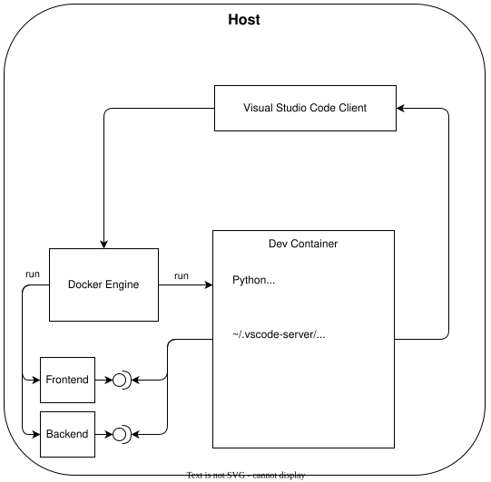

# Python Dev Containers

This page explains how a Dev Container turns a Python project environment into a complete editor-backed development environment.

## Applied Project

### Project Setup

The applied project continues the orchestration of the [License Service Orchestration](./../../projects/proj1_license_service_frontend/README.md). It introduces an additional *(JavaScript dominated)* Dev Container that includes [Artillery](https://www.artillery.io/) and [Playwright](https://playwright.dev/), two full-stack development tools for load and UI testing.

This project is a good example of when Dev Containers can be useful. Instead of installing only a few isolated packages, the project requires a complete end-to-end testing environment with several tools and dependencies. Setting up this environment can involve deep and potentially time-consuming installations. A Dev Container provides a consistent, reproducible environment in which all of these tools can be installed and used together.

The `devcontainer.json` configuration also shows how a Dev Container can be integrated into an existing Docker Compose setup. In this case, the Dev Container works alongside the backend and frontend services defined in the Compose configuration, allowing the entire application stack to be developed and tested as one environment.

### Run the Project

Application, (frontend/backend) tests and bootstrapping commands are documented in the [README](https://github.com/ValentinTwin1206/modern-python-devops-egineering/blob/main/projects/proj11_license_service_devcontainer/README.md).

## Dev Containers environment model

Dev Containers emerged in VS Code workflows in 2019 to make full development machines reproducible, not just Python package sets. A `venv` isolates a project-local Python interpreter and its Python packages, and Conda can extend that boundary to non-Python runtime packages as well. By contrast, a Dev Container declares the operating system image, system packages, language runtimes, editor extensions, lifecycle hooks, workspace mount, user account, and project setup commands. The boundary moves from one project environment to the entire development machine.

Inside the container, VS Code installs a `~/.vscode-server/` component that enables VS Code to work remotely with the container. It provides the remote VS Code environment and allows extensions to be installed and run directly inside the container, giving them access to the container's files, runtimes, and tools.



### When to use Dev Containers?

As described in the [Dev Containers environment model](#dev-containers-environment-model), Dev Containers are a strong fit for projects that need more than Python package isolation but a whole toolchain provisioning like a complete end-to-end testing environment with the required JavaScript runtime, Artillery, Playwright, browser dependencies, editor integration, and supporting configuration. s

| Capability | `venv` | Conda | Dev Containers |
| ---------- | ------ | ----- | -------------- |
| Keep project packages separate from the system Python and other projects | ✅ | ✅ | ✅ |
| Guarantee every developer uses the exact same Python interpreter version | ❌ | ✅ | ✅ |
| Install non-Python runtime packages inside the environment boundary | ❌ | ✅ | ✅ |
| Install OS-level libraries via `apt` or similar inside the environment boundary | ❌ | ❌ | ✅ |
| Ship tools such as `uv`, `ruff`, or compiler dependencies inside the environment boundary | ❌ | Limited | ✅ |
| Automatically install editor extensions and apply workspace settings for every developer | ❌ | ❌ | ✅ |
| Run the same OS, Python, and toolchain locally as the CI pipeline | ❌ | ❌ | ✅ |

### Tradeoffs

#### Pros

- ✅ Captures the operating system, tools, editor integration, and project setup in one reproducible boundary.
- ✅ Keeps host machine dependencies to a minimum while still giving a full development environment.
- ✅ Makes native build toolchains and multi-runtime setups such as CPython plus PyPy straightforward.

#### Cons

- ⚠️ Heavier than plain `venv` or Conda workflows because the boundary is an entire containerized machine.
- ⚠️ Depends on container tooling and editor integration, which adds setup overhead.
- ⚠️ Build, startup, and image maintenance costs are higher than interpreter-only workflows.
- ⚠️ Centered on Linux containers, so Windows environments are not supported.

### Install Dev Containers

#### System requirements

The Dev Containers CLI runs on Linux, macOS, and Windows. In typical Python workflows, it works with Linux containers provided by a supported container runtime such as Docker or Podman. The following examples use the Dev Containers CLI because its installation and usage are easier to reproduce in documentation than a full IDE setup with the Dev Containers extension, and some editor-driven steps cannot be performed entirely from a shell or other CLI-only environment.

#### Install the Dev Containers CLI

=== "Linux (Debian-based)"

	Use the official install script. It downloads the Dev Containers CLI together with a bundled Node.js runtime, so no separate `node` or `npm` installation is required:

	```bash
	curl -fsSL https://raw.githubusercontent.com/devcontainers/cli/main/scripts/install.sh | sh
	export PATH="$HOME/.devcontainers/bin:$PATH"
	```

	Check that the CLI is available:

	```bash
	devcontainer --version
	```

=== "Windows"

	Install Node.js LTS with Windows Package Manager, then install the Dev Containers CLI with npm:

	```powershell
	winget install OpenJS.NodeJS.LTS
	npm install -g @devcontainers/cli
	```

	Check that the CLI is available:

	```powershell
	devcontainer --version
	```

=== "macOS"

	Use the official install script. It supports both Intel and Apple Silicon Macs and installs the Dev Containers CLI together with a bundled Node.js runtime:

	```bash
	curl -fsSL https://raw.githubusercontent.com/devcontainers/cli/main/scripts/install.sh | sh
	export PATH="$HOME/.devcontainers/bin:$PATH"
	```

	Check that the CLI is available:

	```bash
	devcontainer --version
	```

### Environment layout

#### Project structure

A Dev Container is configured through a `.devcontainer/` folder at the repository root. The required file is `devcontainer.json`, while `Dockerfile` and helper scripts such as `postCreateCommand.sh` are optional and useful when the project needs system-level setup or more complex lifecycle commands.

```text
project-root/
├── .devcontainer/
│   ├── devcontainer.json
│   ├── Dockerfile            # optional
│   └── postCreateCommand.sh  # optional
├── src/
├── tests/
├── docker-compose.yml
├── package.json
└── pyproject.toml
```

#### DevContainer configuration

The `devcontainer.json` file is the central configuration file. It tells the IDE or CLI how to build and start the development container for the applied project.

```json
{
  "name": "License Service DevContainer",
  "dockerComposeFile": ["../docker-compose.yml"],
  "service": "devcontainer",
  "workspaceFolder": "/workspace",
  "runServices": [
    "backend",
    "frontend",
    "devcontainer"
  ],
  "customizations": {
    "vscode": {
      "extensions": [
        "ms-azuretools.vscode-docker",
        "ms-playwright.playwright"
      ]
    }
  },
  "forwardPorts": [
    8080,
    8501
  ],
  "portsAttributes": {
    "8080": {
      "label": "Backend",
      "onAutoForward": "silent"
    },
    "8501": {
      "label": "Frontend",
      "onAutoForward": "silent"
    }
  },
  "remoteUser": "node",
  "overrideCommand": false
}
```

- `name`: labels the development container as `License Service DevContainer`.
- `dockerComposeFile`: tells Dev Containers to use the Compose file at `../docker-compose.yml`.
- `service`: selects the `devcontainer` service from the Compose file.
- `workspaceFolder`: opens the mounted project at `/workspace` inside the container.
- `runServices`: starts the `backend`, `frontend`, and `devcontainer` Compose services together.
- `customizations.vscode.extensions`: installs the Docker and Playwright extensions in VS Code.
- `forwardPorts`: forwards the backend port `8080` and frontend port `8501` to the host.
- `portsAttributes`: labels the forwarded backend and frontend ports without opening a browser automatically.
- `remoteUser`: runs the development session as the `node` user provided by the JavaScript/Node Dev Container image.
- `overrideCommand`: keeps the Compose service command instead of replacing it with a Dev Containers command.

#### Container image

The `Dockerfile` defines the content of the container image, such as preinstalled system tools, users, shells, and permissions, while `devcontainer.json` controls how the IDE integrates with that image and which lifecycle commands to run.

```dockerfile
FROM mcr.microsoft.com/devcontainers/javascript-node:24-bookworm

SHELL ["/bin/bash", "-o", "pipefail", "-c"]

# Optional: proxy support for apt-get and npm during build
ARG HTTP_PROXY
ARG HTTPS_PROXY
ARG NO_PROXY
ENV HTTP_PROXY=${HTTP_PROXY}
ENV HTTPS_PROXY=${HTTPS_PROXY}
ENV NO_PROXY=${NO_PROXY}

# Set Playwright browsers path to shared location (outside node_modules)
ENV PLAYWRIGHT_BROWSERS_PATH=/ms-playwright

# 1. SYSTEM PACKAGES
USER root
RUN apt-get update && apt-get upgrade -y \
    && apt-get install -y \
        dnsutils \
    && rm -rf /var/lib/apt/lists/*

# Install Bun and create symlinks for both bun and bunx in /usr/local/bin
# The development network intercepts TLS with a CA that is not in the base image.
RUN curl -kfsSL https://bun.com/install \
    | sed 's/curl --fail/curl --insecure --fail/' \
    | bash \
    && cp /root/.bun/bin/bun /usr/local/bin/bun \
    && cp /root/.bun/bin/bunx /usr/local/bin/bunx

# Install Playwright and Artillery globally
RUN mkdir -p /ms-playwright \
    && npm install -g @playwright/test@1.58.0 \
    artillery \
    && apt-get update \
    && npx playwright install --with-deps \
    && chown -R node:node /ms-playwright

USER node
WORKDIR /workspace

# Ensure local node_modules binaries are in the path
ENV PATH=/workspace/node_modules/.bin:$PATH

EXPOSE 9323

CMD ["sleep", "infinity"]

```

#### Microsoft's DevContainer base images

Microsoft publishes purpose-built base images at [mcr.microsoft.com/devcontainers](https://mcr.microsoft.com/en-us/catalog?search=devcontainers) for common languages and stacks such as Python, JavaScript, and Rust. Unlike general-purpose container images, these Dev Container images are prepared for development workflows.

| Feature / Aspect | `python:3.12` | `mcr.microsoft.com/devcontainers/python:3.12` |
| ---------------- | ------------- | ---------------------------------------------- |
| Default user | `root` | `vscode` with `sudo` access |
| Non-root workflow | Manual setup required | Ready out of the box |
| Preinstalled tools | Minimal | Extensive |
| Python tooling | `pip` only | `pip`, `pipx`, and common development tools |
| Shell | `sh`, `bash` | `sh`, `bash`, `zsh` |
| VS Code Server support | Manual setup required | Works out of the box |

#### Lifecycle commands

Dev Containers support several lifecycle hooks that run at different points in the environment startup flow:


- `postCreateCommand`: runs once after the container is created and the project has been mounted into `workspaceFolder`. It is typically used to install project dependencies with commands such as `uv sync --group dev` or `npm install`. ⚠️ **Do not install project dependencies in the `Dockerfile`**: the image is built before the repository is mounted, so the workspace mount would hide those files.
- `postStartCommand`: runs each time the container starts, including later restarts.
- `postAttachCommand`: runs each time the IDE attaches to the running container, including later reconnects, which makes it useful for editor-session setup tasks.

## Workflow

### Create and start

Start the environment from a shell with the globally installed CLI:

```bash
devcontainer up --workspace-folder projects/proj5_pixelpack
```

After the container has started, activate the virtual environment created by `uv`:
inside it:

```bash
vscode@container:/workspaces/section-04$ source .venv/bin/activate
```

Then you can run the applied project:

```bash
(.venv) vscode@container:/workspaces/section-04$ pixelpack --help
```

## Inspection

Show the workspace location inside the running container:

```bash
pwd
```

Show the current user inside the container:

```bash
whoami
```

Show the default Python interpreter inside the container:

```bash
which python3
```

Show the active container configuration file:

```bash
cat .devcontainer/devcontainer.json
```
