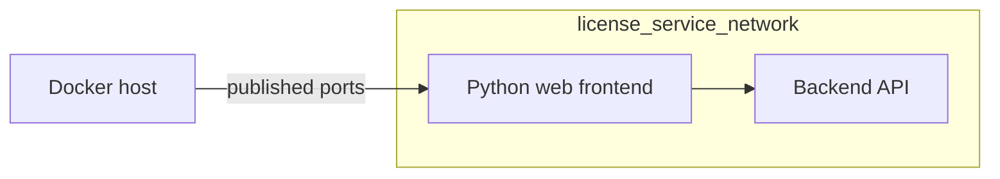
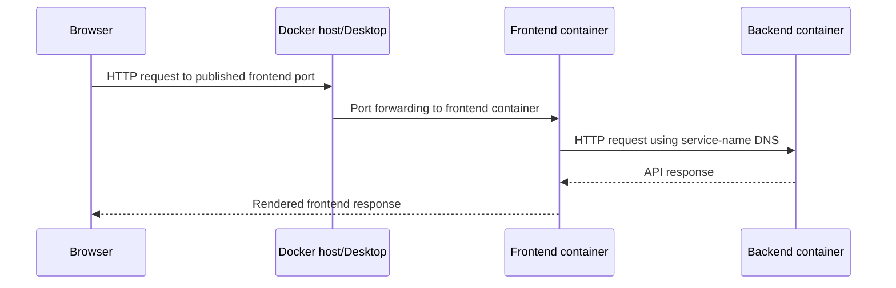

# Python Service Orchestration

This section explains the general pattern of running a Python web frontend
and a backend service as a small, multi-container application. 

## Applied Project

### Project Setup

The applied project builds on the already introduced [License Service](./../../projects/proj3_license_service/README.md) and adds a small user-interface layer in front of it. Together, the two components form a typical service-orchestration use case.

Docker Compose is used to start and connect both components as a small,
multi-container application over a shared container network. 



### Run the Project

Setup and usage details are documented in the [proj10_license_service_frontend](./../../projects/proj10_license_service_frontend/README.md) folder.

## Tradeoffs

### Pros

- ✅ **Easy setup** — Docker Compose needs only Docker and a Compose file.
- ✅ **One-command startup** — Start the frontend and backend together.
- ✅ **Repeatable environments** — Share the same service configuration with
	the team and CI system.
- ✅ **Useful for small projects** — Run multiple containers on one host
	without setting up a cluster.

### Cons

- ⚠️ **Limited scalability** — Compose is not designed for multi-node
	scheduling or large-scale service orchestration.
- ⚠️ **Fewer production features** — It provides less self-healing, scaling,
	and rollout functionality than Kubernetes.
- ⚠️ **Single-host boundary** — A host failure can affect the complete project.

## System Setup

### Compose File

The `docker-compose.yml` file describes the complete application as a group of
services. Docker Compose reads this file and uses it to create the containers,
network, port mappings, and environment configuration.

```yaml
services:
  
  backend:
    container_name: backend
    image: license-service-backend:latest
    ports:
      - "8080:8080"
    networks:
      license_service_network:
        ipv4_address: ${BACKEND_IP:-172.20.0.2}

  frontend:
    build: .
    container_name: frontend
    depends_on:
      - backend
    ports:
      - "8501:8501"
    networks:
      license_service_network:
        ipv4_address: ${FRONTEND_IP:-172.20.0.3}
    environment:
      BACKEND_URL: http://backend:8080


networks:
  license_service_network:
    ipam:
      config:
        - subnet: 172.20.0.0/24

```

The most important configuration keys are:

- `services` — Defines the containers that make up the application.
- `image` — Selects an existing container image for a service.
- `build` — Builds a service image from a local Dockerfile.
- `container_name` — Assigns a readable name to the container.
- `depends_on` — Defines service startup order.
- `ports` — Maps host ports to container ports.
- `networks` — Connects services to a shared Docker network.
- `ipv4_address` — Assigns a fixed address within a configured network.
- `environment` — Passes configuration values into the container.
- `ipam` and `subnet` — Configure the address range of a Docker network.

### Frontend

The frontend application uses [Streamlit](https://streamlit.io/) a lightweight python web framework to expose functions through a web interface. The following shows the frontend components used to bootstrap the frontend component.

```text
proj10_license_service_frontend/
├── app.py
├── api.py
├── Dockerfile
├── ...
```

* The `app.py` file contains the visible interface. It renders the title,
license creation form, and license verification form.

* The `api.py` module isolates HTTP communication from the user interface. It
sends a `POST` request to create a license and a `GET` request to verify one.

* The `Dockerfile` builds a small Python 3.12 image for the frontend. It copies
the project metadata, installs the runtime dependencies with `uv`, copies the
application files, and starts Streamlit on port `8501`.

The Streamlit process listens on `0.0.0.0` so that it can be reached from
outside the container.

### Orchestration

The `docker-compose.yml` file starts the backend and frontend as two services.
The backend uses the recipe from the license service [Dockerfile](./../../projects/proj3_license_service/Dockerfile), while
the frontend is built from the local project directory.

#### Services

Each entry under `services` describes one container role. Compose also gives
each service a network identity that other services can use.

The `depends_on` setting expresses startup order, but it does not prove that a
dependency is ready to accept requests. Applications that need readiness
guarantees should use health checks, retries, or an explicit readiness check.

The `backend` service exposes port `8080`, and the `frontend` service exposes
port `8501`. The frontend declares a dependency on the backend so Compose
starts the backend first.

#### Networking

Both services join the `license_service_network` network. The network uses the
`172.20.0.0/24` subnet and assigns predictable addresses through the
`BACKEND_IP` and `FRONTEND_IP` environment variables.

Inside the Compose network, services communicate by service name rather than
by `localhost`. Therefore, the frontend uses `http://backend:8080` as its
backend URL.

The published ports are different from the internal service address: port
`8501` makes the frontend available to the host, while port `8080` makes the
backend available to the host. Container-to-container traffic uses the
internal Compose network.

#### Service Discovery

Compose provides internal DNS-based service discovery. A container can resolve
another service using the service name from the Compose file, for example:

`http://backend:8080`

The name is resolved to the backend container's current private IP address.
This is more stable than hard-coding an IP address because containers may be
recreated and receive different addresses.

## Request Flow

The complete request flow crosses two different networking boundaries:



The host-facing port mapping is used only for the browser's entry point. The
frontend-to-backend request remains on the private Compose network.

## Verification

The application can be verified at three levels:

1. The frontend responds on its published host port.
2. The frontend can resolve and call the backend service over the Compose
   network.
3. The backend returns a valid response for the requested operation.
