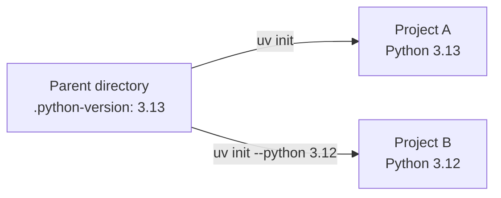

# Project Scaffolding with uv

## Introduction

Written in Rust, `uv` is a Python project and package manager maintained by [Astral](https://astral.sh/) since its first [release in 2024](https://astral.sh/blog/uv). `uv` manages a project from its first files to a published package. Its central configuration file is `pyproject.toml`, which describes the project, its dependencies, and, when needed, how to build it. This section follows one project through that workflow.

## Install uv

`uv` is distributed as a single, self-contained static binary and can be installed without Python already present.

=== "macOS and Linux"

    Run the standalone installer in a terminal:

    ```shell
    curl -LsSf https://astral.sh/uv/install.sh | sh
    ```

=== "Windows"

    Run the standalone installer in PowerShell:

    ```powershell
    powershell -ExecutionPolicy ByPass -c "irm https://astral.sh/uv/install.ps1 | iex"
    ```

Check that the command is available:

```shell
uv --version
```

## Manage Python with uv

### Installing Python with uv
Like [`nvm`](https://github.com/nvm-sh/nvm) for Node.js and [`rustup`](https://rust-lang.github.io/rustup/) for Rust, `uv` can install and select interpreter versions without replacing the system interpreter. Use the `uv python` commands to manage interpreters. Install version 3.13 alongside the system interpreter:

```shell
uv python install 3.13
```

On Linux, `uv` stores managed interpreter files in `~/.local/share/uv/python` by default. Run `uv python dir` to see the configured installation directory. For example, the output looks like this; the home-directory path varies by user:

```bash
$ uv python dir
/home/{user}/.local/share/uv/python
```

### Change the Project's Python Pin

Installing an interpreter does not select it for every project. A `.python-version` pin selects the local interpreter; `requires-python` in `pyproject.toml` declares which versions the project supports. From the directory that will contain the examples, create the pin. `--no-project` skips compatibility checks against an existing project:

```shell
uv python pin --no-project 3.13
```

The command writes `3.13` to `.python-version` in the current directory. Projects initialized here or in its subdirectories inherit this as their default Python version. To use another Python version the `--python <version>` must be passed alongside the `uv init` command when [Initializing a Project](#initialize-a-project).



## Initialize a Project

### Choose a Project Type

At the start of a project, `uv init` can scaffold a simple application, a packaged application, a library, or a bare `pyproject.toml` for a custom layout. Run these examples from the directory pinned to Python 3.13 in [Manage Python with uv](#manage-python-with-uv); no `--python` flag is needed. The inherited pin sets `requires-python` to `>=3.13`; standard templates also create their own `.python-version`, while the bare template relies on the parent pin.

=== "Simple application"

    An **application** is a program you run, such as a script or web server. This simple template has no `[build-system]` table in `pyproject.toml` and is not installed as a package in `.venv`.

    ```shell
    uv init --app --no-package hello-app
    ```

    The initial files include a script (`main.py`) at the project root:

    ```text
    hello-app/
    ├── .git/
    ├── .gitignore
    ├── .python-version
    ├── README.md
    ├── main.py
    └── pyproject.toml
    ```

    Its complete `pyproject.toml` can look like this:

    ```toml
    [project]
    name = "hello-app"
    version = "0.1.0"
    description = "A small Python application"
    readme = "README.md"
    requires-python = ">=3.13"
    dependencies = []
    ```

    To run it, pass the Python filename to `uv run` such as the generated `main.py`:

    ```shell
    uv run main.py
    ```

=== "Packaged application"

    A **packaged application** is a runnable program with a `[build-system]` table in `pyproject.toml`, allowing it to be installed and distributed. Packaging describes how code is delivered, not what it does; both applications and libraries can be packaged. Create one with an installable Python package and a command-line entry point:

    ```shell
    uv init --app --package --build-backend uv hello-app
    ```

    Its source code lives in a **Python package**, an importable directory containing `__init__.py`, under `src/`:

    ```text
    hello-app/
    ├── .git/
    ├── .gitignore
    ├── .python-version
    ├── README.md
    ├── pyproject.toml
    └── src/
        └── hello_app/
            └── __init__.py
    ```

    Its complete `pyproject.toml` can look like this (with a `main` function in `hello_app`):

    ```toml
    [project]
    name = "hello-app"
    version = "0.1.0"
    description = "A packaged Python application"
    readme = "README.md"
    requires-python = ">=3.13"
    dependencies = []

    [project.scripts]
    hello-app = "hello_app:main"

    [build-system]
    requires = ["uv_build>=0.11,<0.12"]
    build-backend = "uv_build"
    ```

    In development, `uv run` syncs `.venv` and installs the project in editable mode, keeping imports pointed at your working tree. After changing code in `src/hello_app/`, run the entry point declared in `[project.scripts]` such as `hello-app` again:

    ```shell
    uv run hello-app
    ```

=== "Library"

    A **library** provides reusable functions and classes that other projects import, rather than a program users run directly. The `--lib` option creates a packaged project with a `[build-system]` table in `pyproject.toml` for building and distributing it. Create one with an importable Python package:

    ```shell
    uv init --lib --build-backend uv hello-library
    ```

    The library has an importable Python package under `src/`. The `py.typed` marker tells type checkers that the library provides type information:

    ```text
    hello-library/
    ├── .git/
    ├── .gitignore
    ├── .python-version
    ├── README.md
    ├── pyproject.toml
    └── src/
        └── hello_library/
            ├── __init__.py
            └── py.typed
    ```

    Its complete `pyproject.toml` can look like this:

    ```toml
    [project]
    name = "hello-library"
    version = "0.1.0"
    description = "A reusable Python library"
    readme = "README.md"
    requires-python = ">=3.13"
    dependencies = []

    [build-system]
    requires = ["uv_build>=0.11,<0.12"]
    build-backend = "uv_build"
    ```

=== "Bare project"

    `--bare` creates just `pyproject.toml`; unlike the other templates, it skips source files, `README.md`, `.python-version`, `.gitignore`, and the `.git/` repository. Use it when you want to define the source layout yourself. It controls scaffolding, not project type; combine it with `--lib` or `--package` to add a build system without generating source files.

    Create a minimal starting point for an existing codebase or a custom layout:

    ```shell
    uv init --bare hello-project
    ```

    Only the configuration file is created:

    ```text
    hello-project/
    └── pyproject.toml
    ```

    Its complete `pyproject.toml` can look like this:

    ```toml
    [project]
    name = "hello-project"
    version = "0.1.0"
    requires-python = ">=3.13"
    dependencies = []
    ```

!!! info "uv init defaults"

    In `uv v0.11.1`, standard templates initialize a Git repository and create `.gitignore` by default; `--bare` skips Git initialization, and `--vcs none` disables it. Packaged templates default to Astral's `uv_build` backend, not setuptools. To use setuptools, pass `--build-backend setuptools`; the packaged examples above explicitly select uv's backend with `--build-backend uv`.

## Work in the Project Environment

### Create and Use `.venv`

Prepare the project's virtual environment:

```shell
uv sync
```

`uv` creates `.venv` if needed. You do not have to activate it: `uv run` uses it automatically. To create an environment manually outside a managed project, see [Standalone Environments and Tools](./section-04.md#create-a-standalone-environment).

### Add Dependencies and Run the Project

Add a library your application needs:

```shell
uv add rich
```

This updates `pyproject.toml`, `uv.lock`, and `.venv`. [Section 02](./section-02.md) explains dependency groups, removing packages, and synchronizing a team environment.

Run the packaged app's entry point (the `main` function shown in its configuration):

```shell
uv run hello-app
```

## Configure Project Tools

### Use `[tool.*]` Tables

Many tools can read settings from `pyproject.toml`, reducing the need for separate configuration files. For example, add this table to the packaged app's existing `pyproject.toml` to configure Ruff:

```toml
[tool.ruff]
line-length = 88
```

Each tool defines its own supported settings; `[tool.uv]` is for uv settings, while `[tool.ruff]` is for Ruff. This configures Ruff but does not install it. Running standalone tools is covered in [Section 04](./section-04.md#run-command-line-tools).

## Build a Package

### Understand the `uv_build` Backend

The packaged templates include `[build-system]`. Here, `uv_build` is the **build backend**: it turns source files into installable distributions. `uv` is the command-line tool that invokes the backend. The simple `--no-package` app has no build system; choose a packaged template when you intend to distribute your code.

### Create Distributions

Build the package from the project root:

```shell
uv build
```

The `dist/` directory contains a wheel (`.whl`) for installation and a source archive (`.tar.gz`) that can be built elsewhere. Both use the version declared in `pyproject.toml`.

## Publish a Package

### Upload to a Package Index

Before uploading, check the project name, version, and package contents. Set a PyPI token in `UV_PUBLISH_TOKEN`, then publish the files in `dist/`:

```shell
uv publish
```

By default, this publishes to PyPI. For a first trial, use [TestPyPI](https://test.pypi.org/) with a TestPyPI token and its upload URL:

```shell
uv publish --publish-url https://test.pypi.org/legacy/
```

## Manage Related Projects

### Introduce Workspaces

When several related packages live in one repository, a [uv workspace](https://docs.astral.sh/uv/concepts/projects/workspaces/) lets each keep its own `pyproject.toml` while sharing one `uv.lock`. For example, a root project can include packages under `packages/`:

```toml
[tool.uv.workspace]
members = ["packages/*"]
```

When the root depends on a member called `hello-library`, add it to the existing `[project]` dependencies and point uv to the local source:

```toml
[tool.uv.sources]
hello-library = { workspace = true }
```

The resulting `[project]` table includes `dependencies = ["hello-library"]`. Start with one project; introduce a workspace when you need to develop related packages together.
