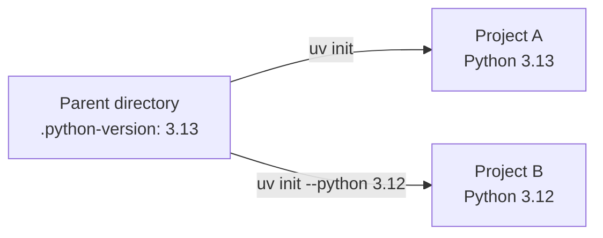
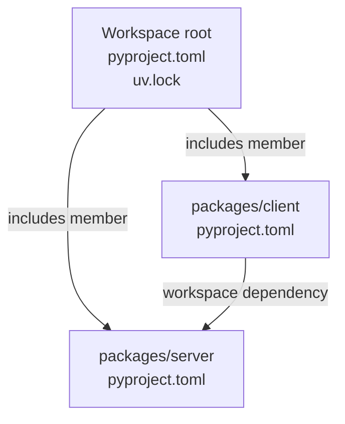

# Project Scaffolding with uv

## Introduction

Written in Rust, `uv` is a Python project and package manager maintained by [Astral](https://astral.sh/) since its first [release in 2024](https://astral.sh/blog/uv). `uv` manages a project from its first files to a published package. Its central configuration file is `pyproject.toml`, which describes the project, its dependencies, and, when needed, how to build it. This section follows one project through that workflow.

## Install uv

`uv` is distributed as a single, self-contained static binary and can be installed without Python already present.

=== "macOS and Linux"

    Run the standalone installer in a terminal:

    ```shell
    curl -LsSf https://astral.sh/uv/install.sh | sh
    ```

=== "Windows"

    Run the standalone installer in PowerShell:

    ```powershell
    powershell -ExecutionPolicy ByPass -c "irm https://astral.sh/uv/install.ps1 | iex"
    ```

Check that the command is available:

```shell
uv --version
```

## Manage Python with uv

### Installing Python with uv
Like [`nvm`](https://github.com/nvm-sh/nvm) for Node.js and [`rustup`](https://rust-lang.github.io/rustup/) for Rust, `uv` can install and select interpreter versions without replacing the system interpreter. Use the `uv python` commands to manage interpreters. Install version 3.13 alongside the system interpreter:

```shell
uv python install 3.13
```

On Linux, `uv` stores managed interpreter files in `~/.local/share/uv/python` by default. Run `uv python dir` to see the configured installation directory. For example, the output looks like this; the home-directory path varies by user:

```bash
$ uv python dir
/home/{user}/.local/share/uv/python
```

### Change the Project's Python Pin

Installing an interpreter does not select it for every project. A `.python-version` pin selects the local interpreter; `requires-python` in `pyproject.toml` declares which versions the project supports. From the directory that will contain the examples, create the pin. `--no-project` skips compatibility checks against an existing project:

```shell
uv python pin --no-project 3.13
```

The command writes `3.13` to `.python-version` in the current directory. Projects initialized here or in its subdirectories inherit this as their default Python version. To use another Python version the `--python <version>` must be passed alongside the `uv init` command when [Initializing a Project](#initialize-a-project).



## Initialize a Project

### Choose a Project Type

At the start of a project, `uv init` can scaffold a simple application, a packaged application, a library, or a bare `pyproject.toml` for a custom layout. Run these examples from the directory pinned to Python 3.13 in [Manage Python with uv](#manage-python-with-uv); no `--python` flag is needed. The inherited pin sets `requires-python` to `>=3.13`; standard templates also create their own `.python-version`, while the bare template relies on the parent pin.

=== "Simple application"

    An **application** is a program you run, such as a script or web server. This simple template has no `[build-system]` table in `pyproject.toml` and is not installed as a package in `.venv`.

    ```shell
    uv init --app --no-package hello-app
    ```

    The initial files include a script (`main.py`) at the project root:

    ```text
    hello-app/
    ├── .git/
    ├── .gitignore
    ├── .python-version
    ├── README.md
    ├── main.py
    └── pyproject.toml
    ```

    Its complete `pyproject.toml` can look like this:

    ```toml
    [project]
    name = "hello-app"
    version = "0.1.0"
    description = "A small Python application"
    readme = "README.md"
    requires-python = ">=3.13"
    dependencies = []
    ```

    To run it, pass the Python filename to `uv run` such as the generated `main.py`:

    ```shell
    uv run main.py
    ```

=== "Packaged application"

    A **packaged application** is a runnable program with a `[build-system]` table in `pyproject.toml`, allowing it to be installed and distributed. Packaging describes how code is delivered, not what it does; both applications and libraries can be packaged. Create one with an installable Python package and a command-line entry point:

    ```shell
    uv init --app --package --build-backend uv hello-app
    ```

    Its source code lives in a **Python package**, an importable directory containing `__init__.py`, under `src/`:

    ```text
    hello-app/
    ├── .git/
    ├── .gitignore
    ├── .python-version
    ├── README.md
    ├── pyproject.toml
    └── src/
        └── hello_app/
            └── __init__.py
    ```

    Its complete `pyproject.toml` can look like this (with a `main` function in `hello_app`):

    ```toml
    [project]
    name = "hello-app"
    version = "0.1.0"
    description = "A packaged Python application"
    readme = "README.md"
    requires-python = ">=3.13"
    dependencies = []

    [project.scripts]
    hello-app = "hello_app:main"

    [build-system]
    requires = ["uv_build>=0.11,<0.12"]
    build-backend = "uv_build"
    ```

    In development, `uv run` syncs `.venv` and installs the project in editable mode, keeping imports pointed at your working tree. After changing code in `src/hello_app/`, run the entry point declared in `[project.scripts]` such as `hello-app` again:

    ```shell
    uv run hello-app
    ```

=== "Library"

    A **library** provides reusable functions and classes that other projects import, rather than a program users run directly. The `--lib` option creates a packaged project with a `[build-system]` table in `pyproject.toml` for building and distributing it. Create one with an importable Python package:

    ```shell
    uv init --lib --build-backend uv hello-library
    ```

    The library has an importable Python package under `src/`. The `py.typed` marker tells type checkers that the library provides type information:

    ```text
    hello-library/
    ├── .git/
    ├── .gitignore
    ├── .python-version
    ├── README.md
    ├── pyproject.toml
    └── src/
        └── hello_library/
            ├── __init__.py
            └── py.typed
    ```

    Its complete `pyproject.toml` can look like this:

    ```toml
    [project]
    name = "hello-library"
    version = "0.1.0"
    description = "A reusable Python library"
    readme = "README.md"
    requires-python = ">=3.13"
    dependencies = []

    [build-system]
    requires = ["uv_build>=0.11,<0.12"]
    build-backend = "uv_build"
    ```

=== "Bare project"

    Unlike the other templates, `--bare` creates only a `pyproject.toml`; it does not scaffold source files. This template suits existing codebases and projects with a custom source layout. Because `--bare` controls scaffolding rather than project type, it can be combined with `--lib` or `--package` to add a build system without generating source files.

    Create a minimal starting point for an existing codebase or a custom layout:

    ```shell
    uv init --bare hello-project
    ```

    Only the configuration file is created:

    ```text
    hello-project/
    └── pyproject.toml
    ```

    Its complete `pyproject.toml` can look like this:

    ```toml
    [project]
    name = "hello-project"
    version = "0.1.0"
    requires-python = ">=3.13"
    dependencies = []
    ```

!!! info "uv init defaults"

    In `uv v0.11.1`, standard templates initialize a Git repository and create `.gitignore` by default; `--bare` skips Git initialization, and `--vcs none` disables it. Packaged templates default to Astral's `uv_build` backend, not setuptools. To use setuptools, pass `--build-backend setuptools`; the packaged examples above explicitly select uv's backend with `--build-backend uv`.

## Work in the Project Environment

### Add Dependencies and Run the Project

!!! info "Automatic Environment Updates"

    By default, `uv add` updates `pyproject.toml` and `uv.lock`, creates an in-project virtual environment `.venv` if needed, and installs the dependencies and packaged project. No activation or separate synchronization step is needed here. See [Dependency Management with uv](./section-02.md#synchronizing) for synchronization workflows.

Continue with the **Packaged application** example above, working from the `hello-app` project root. Add [Bottle](https://bottlepy.org/docs/dev/), a small web framework, with an exact version requirement:

```shell
uv add "bottle==0.13.4"
```

> Use `==` to specify a version

The complete configuration keeps the packaged application's entry point and build backend unchanged; only `dependencies` gains Bottle:

```toml title="pyproject.toml"
[project]
name = "hello-app"
version = "0.1.0"
description = "A packaged Python application"
readme = "README.md"
requires-python = ">=3.13"
dependencies = ["bottle==0.13.4"]

[project.scripts]
hello-app = "hello_app:main"

[build-system]
requires = ["uv_build>=0.11,<0.12"]
build-backend = "uv_build"
```

Add [Ruff](https://docs.astral.sh/ruff/) for linting and [pytest](https://docs.pytest.org/en/stable/) for testing to the `dev` dependency group, rather than the runtime requirements:

```shell
uv add --dev ruff pytest
```

This adds `[dependency-groups]` to `pyproject.toml` and installs both tools in `.venv`. The **complete updated `pyproject.toml`** now looks like this.

```toml title="pyproject.toml"
[project]
name = "hello-app"
version = "0.1.0"
description = "A packaged Python application"
readme = "README.md"
requires-python = ">=3.13"
dependencies = ["bottle==0.13.4"]

[project.scripts]
hello-app = "hello_app:main"

[build-system]
requires = ["uv_build>=0.11,<0.12"]
build-backend = "uv_build"

[dependency-groups]
dev = [
    "pytest>=9.1.1",
    "ruff>=0.16.10",
]
```

> **Version Note:** Your Ruff and pytest versions may differ. `>=` allows newer releases; use `==` to require an exact version, as with Bottle. `uv.lock` records the exact resolved versions either way.

Replace the generated code in `src/hello_app/__init__.py` with this Bottle application. Its `main()` function starts the server, so the existing `[project.scripts]` entry is unchanged:

```python title="src/hello_app/__init__.py"
from bottle import Bottle

app = Bottle()


@app.get("/")
def hello():
    return "Hello from Bottle!"


def main() -> None:
    app.run(host="127.0.0.1", port=8080)


if __name__ == "__main__":
    main()
```

Run the existing console command using the project's environment, then open `http://127.0.0.1:8080/`. The editable installation uses your updated source code directly. Stop the server with Ctrl+C:

```shell
uv run hello-app
```

### Use the Tool Table

Tools that support `pyproject.toml` can keep their settings alongside the project metadata, instead of using separate tool-specific configuration files. These tables configure the tools but do not install them:

- `ruff`: Set `line-length = 88` to limit line width. `[tool.ruff]` keeps this and other Ruff settings in `pyproject.toml` instead of a separate `ruff.toml`.
- `pytest`: Set `testpaths = ["tests"]` to locate tests and `addopts = "-ra"` to show a summary of non-passing tests. `[tool.pytest.ini_options]` keeps these settings in `pyproject.toml` instead of a separate `pytest.ini`.

The **complete updated `pyproject.toml`** combines runtime dependencies, development tools, packaging, and tool configuration:

```toml title="pyproject.toml"
[project]
name = "hello-app"
version = "0.1.0"
description = "A packaged Python application"
readme = "README.md"
requires-python = ">=3.13"
dependencies = ["bottle==0.13.4"]

[project.scripts]
hello-app = "hello_app:main"

[build-system]
requires = ["uv_build>=0.11,<0.12"]
build-backend = "uv_build"

[dependency-groups]
dev = [
    "pytest>=9.1.1",
    "ruff>=0.16.10",
]

[tool.ruff]
line-length = 88

[tool.pytest.ini_options]
testpaths = ["tests"]
addopts = "-ra"
```

## Build a Package

Python packaging separates building into a **frontend** and a **backend**, with their interface defined by [PEP 517](https://peps.python.org/pep-0517/). The frontend coordinates the build, while the backend creates installable distributions. [PEP 518](https://peps.python.org/pep-0518/) defines how a project declares its backend and build requirements in `[build-system]`.

Common frontends include `build` (run as `python -m build`) and `pip`; common backends include `setuptools`, `hatchling`, `poetry-core`, `meson-python`, and `scikit-build-core`. `uv` provides both components, with `uv build` as the frontend and `uv_build` as the backend. As noted [above](#choose-a-project-type), the build backend is defined in the `[build-system]` table in `pyproject.toml`. Run `uv build` from the project root to build the package:

```shell
uv build
```

Run `ls -lah dist/` to inspect the generated files. For this `hello-app` example, the output is:

```text
total 20K
drwxr-xr-x 2 vprav vprav 4.0K Oct  5 06:15 .
drwxr-xr-x 5 vprav vprav 4.0K Oct  5 06:15 ..
-rw-r--r-- 1 vprav vprav    1 Oct  5 06:15 .gitignore
-rw-r--r-- 1 vprav vprav 1.6K Oct  5 06:15 hello_app-0.1.0-py3-none-any.whl
-rw-r--r-- 1 vprav vprav  608 Oct  5 06:15 hello_app-0.1.0.tar.gz
```

## Publish a Package

Before uploading, check the project name, version, and package contents. Set a PyPI token in `UV_PUBLISH_TOKEN`, then publish the files in `dist/`:

For more detail on wheel packaging and uploading distributions, see [Chapter 02, Section 01](../chapter-02/section-01.md).

```shell
uv publish
```

By default, this publishes to PyPI. For a first trial, use [TestPyPI](https://test.pypi.org/) with a TestPyPI token and its upload URL:

```shell
uv publish --publish-url https://test.pypi.org/legacy/
```

## Manage Related Projects with uv Workspaces

When several related packages live in one repository, a [uv workspace](https://docs.astral.sh/uv/concepts/projects/workspaces/) lets each keep its own `pyproject.toml` while sharing one `uv.lock`. For example, a root project can include packages under `packages/`:

```toml title="pyproject.toml (root)"
[tool.uv.workspace]
members = ["packages/server", "packages/client"]
```

The `server` and `client` members each have their own project metadata. For example, `packages/server/pyproject.toml` can define the server package:

```toml title="pyproject.toml (server)"
[project]
name = "server"
version = "0.1.0"
requires-python = ">=3.13"
dependencies = []

[build-system]
requires = ["uv_build>=0.11,<0.12"]
build-backend = "uv_build"
```

The client can depend on the server by declaring it as a dependency and mapping it to the workspace member in `packages/client/pyproject.toml`:

```toml title="pyproject.toml (client)"
[project]
name = "client"
version = "0.1.0"
requires-python = ">=3.13"
dependencies = ["server"]

[tool.uv.sources]
server = { workspace = true }

[build-system]
requires = ["uv_build>=0.11,<0.12"]
build-backend = "uv_build"
```

The workspace root includes both members, and the client uses the server from that same workspace:



Start with one project; introduce a workspace when related packages need to be developed together.
