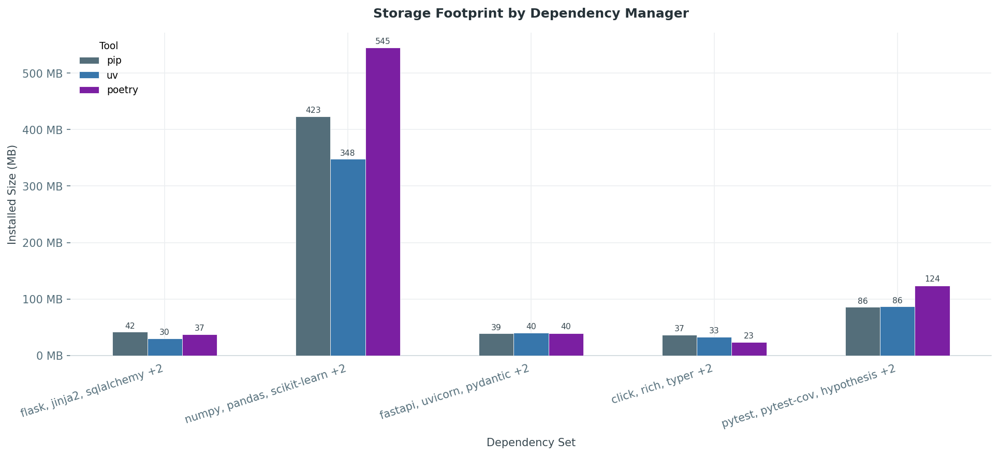

# Dependency management with uv

## Introduction

`uv` is a single self-contained binary written in **Rust**, developed by Astral — the same team behind the `ruff` linter. Because it compiles down to native machine code, it carries no Python runtime dependency of its own and starts in milliseconds.

It ships as two statically-linked binaries — **`uv`** (main CLI) and **`uvx`** (ephemeral tool runner, equivalent to `pipx run`) — with a total on-disk footprint of ~36 MB. There are no shared libraries, no interpreter bundles, and no background daemons. The global package cache (`~/.cache/uv`) is shared across all projects to avoid redundant downloads (see more about caching in [Section-03](./section-02.md)).

```
/usr/local/bin/
├── uv       36 MB   ← main CLI binary (statically linked Rust)
└── uvx     343 KB   ← tool runner (thin wrapper)
```

!!! note "`pip install uv`"
    When installed via `pip`, the wheel format requires a `site-packages` entry. In addition to the two binaries, pip therefore creates `site-packages/uv/` (a Python shim) and `site-packages/uv-<version>.dist-info/` (package metadata). The curl installer produces only the two binaries with no Python packaging overhead.

## uv in comparison

### Footprint

Python's ecosystem already has well-established answers to dependency management — `poetry` and `pip` (+ `virtualenv` and `pyenv`) — so let's look at how `uv` stacks up against them in terms of install footprint, performance, and feature coverage.

The official Poetry [installer](https://python-poetry.org/docs/#installation) bootstraps a full Python virtualenv with 15+ transitive dependencies. On `python:3.12-slim` that single install layer costs **104 MB** — more than the base image itself. The biggest offenders: `cryptography` (15 MB), a bundled `pip` (13 MB), and `rapidfuzz` (12 MB). Poetry itself is only 5.9 MB of that total.

The classic alternative — `pip` + `virtualenv` + `pyenv` — comes in at **39 MB**, but that number is misleading: it unpacks into **2,889 files** across three separate tool trees, with no shared cache, no lockfile, and no unified CLI.

| Tool | Install size |
|------|-------------|
| `uv` | ~36 MB|
| `poetry` (official installer) | ~104 MB |
| `pip` + `virtualenv` + `pyenv` | ~39 MB |

### Performance

The benchmark ran five representative dependency sets — a web stack (Flask), a data science stack (NumPy/pandas), an API stack (FastAPI), a CLI tooling set, and a dev-tools set (pytest/mypy/ruff) — each installed from scratch inside a `python:3.12-slim` container.


`uv` is consistently the fastest across all sets. The gap is most pronounced on the heavy data-science stack: `pip` takes **34.2 s**, `pipenv` **47.7 s**, `poetry` **28.0 s** — `uv` finishes in **20.8 s**. On lighter sets (FastAPI, CLI tools) `uv` is **2–3× faster** than `pip` alone.



The storage picture tells a similar story. `uv`'s installed layer is consistently smaller than `pip` and significantly smaller than `pipenv`. On the data-science stack the difference is most visible: `uv` installs **347.7 MB** vs `pip`'s **423.4 MB** and `pipenv`'s **536.2 MB**. The savings come from `uv`'s global deduplication cache — packages downloaded once are hard-linked into each environment rather than copied.

### Dependency Management

`uv` covers all three roles in a single ~36 MB binary — and adds a lockfile on top.

| Tool | Install size | Lockfile | Interpreter mgmt |
|------|-------------|:--------:|:----------------:|
| `uv` | ~36 MB (two binaries, zero Python deps) | ✓ | ✓ |
| `poetry` (official installer) | ~104 MB (Python venv + 15+ deps) | ✓ | ✗ |
| `pip` + `virtualenv` + `pyenv` | ~39 MB (three separate tools) | ✗ | ✓ |

| Tool | Introduced | Lockfile | Env Isolation | Interpreter Mgmt | Full Lifecycle |
|------|------------|:--------:|:-------------:|:----------------:|:--------------:|
| `pip` | 2008 | ✗ | ✗ | ✗ | ✗ |
| `poetry` | 2018 | ✓ | ✓ | ✗ | ✓ |
| `uv` | 2024 | ✓ | ✓ | ✓ | ✓ |


## Modern Python Project Setuop
- explaining the different kind of files

## UV workflow

`uv` manages the full project lifecycle through a small set of files and commands.

**Key files:**

| Filename | Description |
|----------|-------------|
| `pyproject.toml` | Project metadata and dependency declarations |
| `uv.lock` | Fully resolved dependency versions and hashes for reproducible installs |
| `.venv` | Virtual environment created and managed by `uv` |

Dependencies are declared in the standard `[project]` table of `pyproject.toml`:

```toml
[project]
name = "myapp"
version = "1.0.0"
requires-python = ">=3.11"
dependencies = [
    "requests>=2.28.0",
]

[dependency-groups]
dev = [
    "pytest>=7.4.0",
]
```

`uv.lock` records every resolved package with its source and hash for fully reproducible installs:

```toml
[[package]]
name = "requests"
version = "2.28.0"
source = { registry = "https://pypi.org/simple" }
wheels = [
    { url = "https://files.pythonhosted.org/packages/.../requests-2.28.0-py3-none-any.whl", hash = "sha256:58cd2187..." },
]
```

<!-- ---

## Topics

### Modern project setup
- Example project structure:
  - `pyproject.toml`
  - `.venv`
  - `uv.lock`

### Dependency management with uv
- Runtime dependencies
- Development dependencies
- Dependency groups
- Optional dependencies / extras

### Working with dependencies (uv commands)
- `uv add`
- `uv remove`
- `uv sync`
- `uv lock`
- `uv tree`

### Dependency definitions in `pyproject.toml`
- Version constraints
- Dependency groups
- Tool configurations
- Project structure best practices

### Reproducible builds
- Role of `uv.lock`
- Deterministic environments
- Team workflows
- CI/CD relevance

Hands-on:
- Recreate environments
- Update lockfiles
- Perform dependency upgrades

### Best practices
- Minimal runtime dependencies
- Separation of dev/runtime dependencies
- Clean dependency structures
- Lockfile strategy -->
