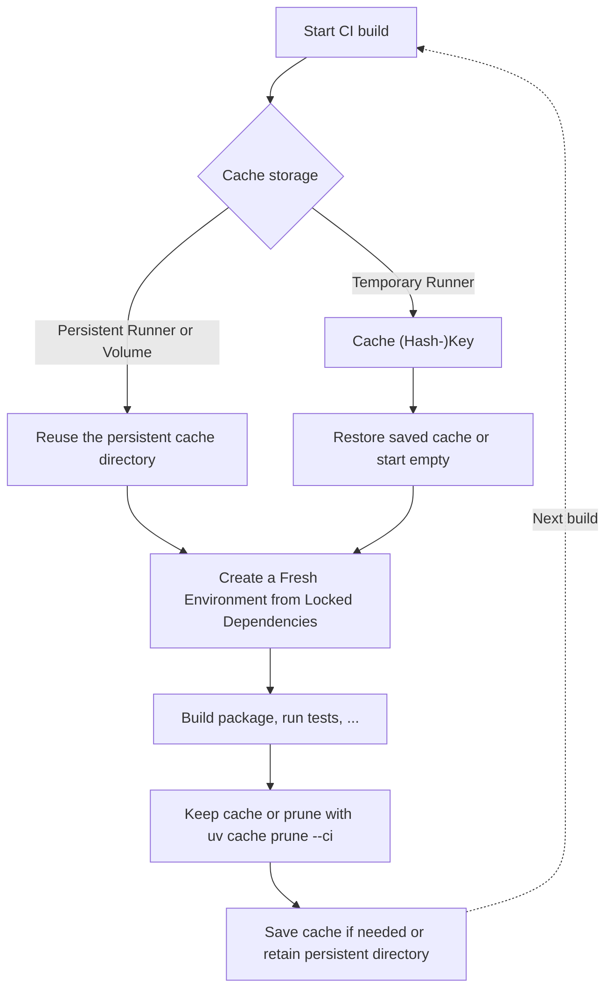

# Dependency Caching with uv

The cache is one of `uv`'s key features and a major contributor to its speed. It reuses package metadata, downloads, and built packages instead of fetching or building them again. Understanding the `uv` cache is an essential skill, especially in continuous integration (CI), where effective caching can shorten builds, reduce network traffic, and lower compute costs. This chapter explores how the cache is organized and how to create, reuse, and clean it during local development and in CI environments.

## Applied Project

The [uv cache demo](https://github.com/ValentinTwin1206/modern-python-devops-egineering/tree/main/projects/proj5_uv_cache) provides an Ubuntu 24.04 development container with uv and Python 3.12 for exploring cache reuse locally. Its [GitHub Actions workflow](https://github.com/ValentinTwin1206/modern-python-devops-egineering/blob/main/.github/workflows/uv-cache.yml) recreates `.venv` from `uv.lock` and compares full and CI-pruned caches across runs.

## Building Blocks

### Environment Variables That Influence Cache Behavior

The following environment variables configure where `uv` stores cache data, how it uses that data, or how it installs cached files. See the [uv environment variable reference](https://docs.astral.sh/uv/reference/environment/) for the full list.

| Variable | Cache behavior |
| --- | --- |
| `UV_CACHE_DIR` | Sets the cache directory, equivalent to `--cache-dir`. It takes precedence over the default location. |
| `UV_NO_CACHE` | Disables reading and writing the persistent cache, equivalent to `--no-cache`. `uv` uses a temporary cache for that invocation. |
| `UV_OFFLINE` | Disables network access, so `uv` must rely on cached data and locally available files, equivalent to `--offline`. |
| `UV_LINK_MODE` | Sets how cached files are installed: `clone` shares storage until files change; `hardlink` shares files on the same filesystem; `copy` duplicates files; `symlink` points to cached files. Cloning and linking usually install faster than copying. Avoid `symlink`: clearing the cache can break the environment. Current defaults: `clone` on macOS/Linux, `hardlink` on Windows. |
| `UV_LOCK_TIMEOUT` | Sets how long `uv` waits to acquire a file lock, including when cache operations are blocked by other `uv` processes. |
| `UV_CONCURRENT_CACHE_READS` | Sets the number of threads reading cached HTTP responses. Accepts a positive integer; the default is `4`. Higher values may speed up cache reads, but can slow them down if the storage is overloaded. |

### Commands That Influence the Cache

The following table lists common `uv` commands and describes their effects on the `uv` cache. For details on dependency locking and syncing, see [*Dependency Management with uv*](./section-02.md); for more on cache behavior, see the [uv caching guide](https://docs.astral.sh/uv/concepts/cache/).

| Command | Effect on the cache |
| --- | --- |
| `uv pip install {pkg}` | Installs a package, reusing cached metadata and artifacts and adding newly downloaded or built data to the cache. `--refresh` forces cached data to be revalidated and updates it for subsequent operations; `--refresh-package {pkg}` limits this to one package. |
| `uv add {pkg}` | Adds a dependency, resolves and synchronizes the project, and reuses or adds package data in the cache. |
| `uv sync` | Synchronizes the project environment and reuses or adds cached package data. `--refresh` forces cached data to be revalidated and updates it for subsequent operations; `--refresh-package {pkg}` limits this to one package. |
| `uv tool install {tool}` | Installs a tool in its own environment while sharing `uv`'s package cache. |
| `uv cache prune` | Removes unused cache data and project environments to free disk space. Add `--ci` to also remove downloaded wheels and unpacked source files while preserving wheels built from source. This reduces CI cache size without requiring expensive rebuilds. |
| `uv cache clean [package]` | Removes all cache entries, or only entries for the named package. |

## Using uv's Cache for Local Development

For day-to-day development, `uv` manages the cache automatically, and your project's `.venv` usually stays in place between sessions. Understanding the cache is useful when recreating environments, working offline, or freeing disk space, but managing it is less critical than in CI/CD, where environments are often rebuilt for every run. The following workflow lets you explore cache reuse and cleanup locally.

From the repository's `projects/` directory, the following command builds the image from `Dockerfile.devEnv` and launches a `bash` session inside the container:

```bash
./build.sh build \
    --path proj5_uv_cache/Dockerfile.devEnv \
    --rm-container
```

!!! warning "The project is bind-mounted"
    Changes to `/app` also change `projects/proj5_uv_cache` on your host. The following steps recreate `.venv`; do not use that environment in another session while following them. The container's package cache is disposable and separate from your host's uv cache.

### Inspect and Reuse the Cache

#### Create and Inspect the Cache

The `uv sync` command creates `.venv` if it does not exist and installs the project's dependencies there. In the background, `uv` maintains its package cache and updates `uv.lock` when needed:

```bash
uv sync
```

Inspect the populated cache, including hidden housekeeping files; `uv cache dir` supplies the active cache path:

```bash
tree -aL 1 --noreport "$(uv cache dir)"
```

You should see an output similiar to the following:

```text
/home/bob/.cache/uv
├── .gitignore
├── .lock
├── CACHEDIR.TAG
├── archive-v0
├── interpreter-v4
├── sdists-v9
└── wheels-v6
```

Each entry stores reusable package data or helps `uv` manage the cache safely:

| Entry | Purpose |
| --- | --- |
| `archive-v0` | Stores unpacked package files that `uv` copies or links into an environment. Reusing these files avoids downloading and unpacking the same package again. |
| `wheels-v6` | Stores records for `.whl`s (ready-to-install packages), including download metadata and links to unpacked files. These records help `uv` locate cached packages for installation. |
| `interpreter-v4` | Stores information about Python interpreters, such as their versions and supported platforms. `uv` can reuse this information instead of inspecting the same interpreter repeatedly. |
| `sdists-v9` | Stores cached source distributions and build results for packages that need to be built into wheels. The directory can exist even when all installed packages came from ready-made wheels. |
| `.gitignore`, `.lock`, `CACHEDIR.TAG` | `.gitignore` keeps cache contents out of Git, `.lock` coordinates cache access, and `CACHEDIR.TAG` marks the directory as disposable cache data. `uv` manages these files; they are not dependency declarations or settings to edit. |

> Other workflows may also create package-index metadata in `simple-v20`

Further inspect the wheel record of `scikit-learn` package:

```bash
tree -L 1 --noreport "$(uv cache dir)/wheels-v6/pypi/scikit-learn"
```

The dedicated cache folder for `scikit-learn` contains the structure shown below. The first entry marks a symbolic link (`->`) to the unpacked files in `archive-v0`. The second entry, is a binary file (`*.http`) that stores download-cache metadata managed by `uv`.

```text
/home/bob/.cache/uv/wheels-v6/pypi/scikit-learn
├── <version>-<python-tag>-<abi-tag>-<platform-tag> -> /home/bob/.cache/uv/archive-v0/<archive-id>
└── <version>-<python-tag>-<abi-tag>-<platform-tag>.http
```

> See [Package Layout in Chapter 2, Section 1](../chapter-02/section-01.md#package-layout) to undertand wheel filename tags.

Check the cache size with `uv cache size --human`:

```bash
uv cache size --human
```

In this run, the cache size was about 1.6 GiB:

```text
1.6GiB
```

#### Reuse the Cache

To demonstrate cache reuse, remove the `.venv` first. Thus, `uv` must recreate the environment from `uv.lock` instead of using packages already installed there. Removing it deletes the environment's installed packages, scripts, and metadata; it does not delete the separate `uv` cache. In this demo, `UV_LINK_MODE=copy` makes `uv` copy package files from its cache into `.venv`, so reusable cache data and the active environment reside in two locations. The `--offline` flag prevents downloads, requiring the sync to use the local cache:

```bash
rm -r .venv && uv sync --offline
```

A successful run installs the ML dependencies from the local cache without downloading them. Verify that `scikit-learn` imports from `.venv`, not the cache:

```bash
.venv/bin/python -c "import sklearn; print(sklearn.__file__)"
```

### Manage uv Cache

#### Prune Cache

The `uv cache prune` command frees disk space by removing cache data the current `uv` can no longer use, such as entries in obsolete formats and unpacked files no cache record refers to. It keeps valid cached packages and does not uninstall packages from project environments.

To see pruning in action, first add cache entries that the current `uv` version can no longer use. Use `uvx` to run an older release, `uv` 0.4.12, in an isolated tool environment. This older release writes to the shared cache using an outdated format (`wheels-v1`), giving the current `uv` version something to remove. Start by creating a temporary installation directory outside the project:

```bash
prune_demo=$(mktemp -d)
```

Install `scipy` with the older `uv` release, skipping dependencies with `--no-deps`:

```bash
uvx --from uv==0.4.12 uv pip install --python "$(uv python find 3.12)" --no-deps --target "$prune_demo" "scipy==1.15.3"
```

The older `uv` release created a `scipy` cache record under `wheels-v1` without changing the project dependencies. Use `find` to locate the record and see which cache format contains it:

```bash
find "$(uv cache dir)" -type d -path '*/wheels-v*/pypi/scipy' -print
```

Check the size again with `uv cache size --human`; in this run it grew from about 1.6 GiB to 1.8 GiB:

```text
1.8GiB
```

Remove the temporary installation; the old-format cache entries remain until they are pruned:

```bash
rm -r "$prune_demo"
```

Finally, validate that the `scipy` package get removed by running the following command:

```bash
uv cache prune
```

In this run, `uv` reported:

```text
Removed 1460 files (144.3MiB)
```

After pruning, `wheels-v1` was deleted, but the cache remained slightly larger than it was initially as `uvx` cached the `uv` 0.4.12 tool in the current `wheels-v6` format. `uv cache size --human` reported:

```text
1.7 GiB
```

#### Clean Cache

The `uv cache clean` command removes **all** entries from the cache, including valid wheels and unpacked package files. Packages already installed in project environments remain, but future installs that need those packages must download or build them again:

```bash
uv cache clean
```

Inspect the project files with `ls -lah`; `uv cache clean` leaves `.venv` and its installed packages untouched, along with `pyproject.toml` and `uv.lock`. It removes cached wheel data, not the package files already installed from those wheels. Verify that `scikit-learn` still works:

```bash
.venv/bin/python -c "import sklearn; print(sklearn.__file__)"
```

#### Cleanup Summary

The project environment and the shared cache are separate. Choose the cleanup command based on what you want to remove and whether later installs should reuse cached packages.

| Goal | Commands | Effect |
| --- | --- | --- |
| Remove installed packages, keep cached data | `rm -r .venv` | Deletes the project's environment. A later `uv sync` can reuse the shared cache. |
| Free cache space, keep reusable packages | `uv cache prune` | Removes obsolete and unreferenced cache data. Keeps valid package entries and leaves `.venv` unchanged. |
| Remove installed packages and cached data | `rm -r .venv`, then `uv cache clean` | Deletes this project's environment and clears the shared cache for all projects, but leaves their environments in place. A later `uv sync` must download or build dependencies again; `--offline` cannot restore them from an empty cache. |

## Using uv's Cache in CI Environments

In CI workflows such as GitHub Actions, reusing uv's cache avoids repeated downloads and builds. This shortens jobs, reduces network use, and gives your team faster feedback. Keeping large downloaded packages, such as machine-learning libraries, in the cache avoids downloading them on every build. This can save time and network traffic, but also increases the cache size. Compare those savings with the time needed to restore and save the cache.

### The CI Caching Pattern

The diagram below visualizes a sample CI caching pattern. Start with *Cache storage* to determine how package data is kept between jobs:

- **Persistent runner:** Reuse a cache directory outside the job's temporary workspace so cleanup does not delete it.
- **Temporary runner:** Restore a saved cache using a key based on the platform and dependency files; if no matching cache is available, uv populates a new one during installation. The [GitHub Actions example](#github-actions-example) uses this approach.

Both caching approaches now converge at *Create a Fresh Environment from Locked Dependencies*, using the committed `uv.lock`. Missing packages are downloaded and cached; an outdated lockfile causes the sync to fail rather than changing it.*Build the package, run tests, ...*, then *keep the cache or prune it with `uv cache prune --ci`*. This removes downloaded wheels but preserves wheels built from source, avoiding expensive rebuilds in future CI runs. Unlike regular `uv cache prune`, the CI option retains these built wheels. Compare both approaches before enabling pruning. Finally, *Save cache if needed or retain persistent directory* for the *Next build*. Preserve the package cache, not `.venv`, and include cache transfer time when comparing build durations.



### GitHub Actions Example

The [demo workflow](https://github.com/ValentinTwin1206/modern-python-devops-egineering/blob/main/.github/workflows/uv-cache.yml) checks out the repository, sets up Python 3.12, and installs `uv` with package caching enabled. The following steps show how it restores the cache, creates a fresh environment, checks dependencies, and measures cache usage.

#### Configure the Cache Key and Restore the Cache

For `uv`'s saved package cache, GitHub checks both the cache key and the branch allowed to access it:

- **Branch builds** can restore caches from their own branch or the default branch (usually `main`), but not from unrelated feature branches.
- **Pull-request builds** can also restore caches from the target branch. Caches saved by a pull-request run are limited to that pull request; `main` and other pull requests cannot reuse them.

Keeping a matching cache on `main` therefore helps other branches reuse downloaded packages. If no accessible cache matches, `uv` downloads the missing packages as usual. These are GitHub's [cache-sharing rules](https://docs.github.com/en/actions/reference/dependency-caching-reference#restrictions-for-accessing-a-cache), not restrictions imposed by `uv`.

This step installs `uv`, configures the cache key, and restores any matching saved cache:

```yaml
- name: Set up uv and restore its package cache
  id: uv
  uses: astral-sh/setup-uv@v5
  with:
    version: "0.11.1"
    enable-cache: true
    cache-dependency-glob: |
      projects/proj5_uv_cache/pyproject.toml
      projects/proj5_uv_cache/uv.lock
    cache-suffix: ${{ inputs.prune_cache && 'ml-demo-ci-pruned' || 'ml-demo-full' }}
    prune-cache: false
```

- `uses` — `astral-sh/setup-uv@v5`: Installs uv and manages the saved cache.
- `with` — Action settings:
    - `version` — Pins the `uv 0.11.1` release.
    - `enable-cache` — Restores a matching cache and saves one after a successful run when needed.
    - `cache-dependency-glob` — Hashes the contents of `pyproject.toml` and `uv.lock`. Changing either file changes the cache key.
    - `cache-suffix` — Full or CI-pruned label: Keeps the two experiments separate.
    - `prune-cache` — Leaves pruning to the following workflow's measured step.

#### Create a Fresh Environment from Locked Dependencies

The workflow uses `uv sync --locked` to install the committed lockfile's dependencies into a fresh environment, reusing the restored package cache. Missing packages are downloaded and cached for later builds. If the lockfile is out of date, the command fails instead of changing it. The following step runs the installation and records its duration:

```yaml
- name: Install ML packages into a fresh virtual environment
  id: install
  shell: bash
  run: |
    start_ms=$(date +%s%3N)
    uv sync --directory projects/proj5_uv_cache --locked --python 3.12
    end_ms=$(date +%s%3N)
    echo "milliseconds=$((end_ms - start_ms))" >> "$GITHUB_OUTPUT"
```

#### Measure and Optionally Prune the Cache

After checking imports, the workflow can run `uv cache prune --ci` to remove downloaded prebuilt wheels and unpacked source distributions while keeping wheels built from source. This reduces the cache size without discarding potentially expensive builds, but later installs must download the removed packages again. The following step measures cache disk usage before and after optional pruning and reports the space freed. These measurements describe the local cache, not GitHub's saved archive:

```yaml
- name: Measure cache and optionally prune for CI
  id: cache_size
  shell: bash
  env:
    PRUNE_CACHE: ${{ inputs.prune_cache }}
  run: |
    cache_dir=$(uv cache dir)
    before_kib=$(du -sk "$cache_dir" | cut -f1)
    if [[ "$PRUNE_CACHE" == "true" ]]; then
      uv cache prune --ci
    fi
    after_kib=$(du -sk "$cache_dir" | cut -f1)
    {
      echo "before_kib=$before_kib"
      echo "after_kib=$after_kib"
      echo "reclaimed_kib=$((before_kib - after_kib))"
    } >> "$GITHUB_OUTPUT"
```

> In this ML demo, the cache shrank from about 1.6 GiB to 36 KiB.

#### Save the Cache and Compare Builds

With `enable-cache: true`, `setup-uv` saves the cache after a successful run when needed. GitHub does not overwrite an existing exact-key cache entry, even if local pruning runs.

Run each strategy twice without changing dependencies and compare **whole build times**, including cache transfers on GitHub Actions, rather than cache size or `uv sync` time alone. See [uv's CI caching guidance](https://docs.astral.sh/uv/concepts/cache/#caching-in-continuous-integration).
