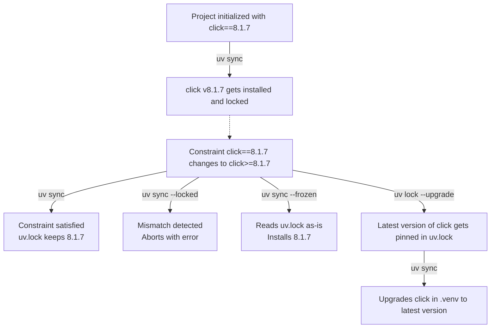

# Project Overview

## Overview

Python project setup used to be spread across files such as `setup.py`, `setup.cfg`, `requirements.txt`, and tool-specific configuration. `pyproject.toml` changed that by standardizing how projects define metadata, build backends, dependencies, and tool settings in one place. 

The *Depsight* project is built around this modern standard: project configuration lives in `pyproject.toml`, while `uv` manages environment creation, dependency synchronization, and publishing workflows.

---

## Project Configuration

The project is configured through a single `pyproject.toml` file:

```toml
[project]
name = "depsight"
version = "1.3.0"
description = "A modular dependency analysis framework"
readme = "README.md"
license = "MIT"
requires-python = ">=3.12"
authors = [
    { name = "Depsight Contributors" },
]
classifiers = [
    "Development Status :: 3 - Alpha",
    "Intended Audience :: Developers",
    "Programming Language :: Python :: 3",
    "Programming Language :: Python :: 3.12",
    "Programming Language :: Python :: 3.13",
    "Topic :: Software Development :: Build Tools",
]
dependencies = [
    "click>=8.1.7",
    "rich>=13.7.0",
    "rich-click>=1.7.0",
    "textual>=1.0.0",
]

[dependency-groups]
dev = [
    "build>=1.4.2",  # actually not needed since we use uv_build, but its listed for traiting purposes
    "mypy>=1.10",
    "pytest>=8.0",
    "ruff>=0.4",
]
docs = [
    "mkdocs>=1.6",
    "mkdocs-material>=9.5",
    "mkdocs-mermaid2-plugin>=1.1",
]

[project.scripts]
depsight = "depsight.cli:main"

[project.urls]
Homepage = "https://valentintwin1206.github.io/depsight-dependency-manager/"
Repository = "https://github.com/ValentinTwin1206/depsight-dependency-manager"
Issues = "https://github.com/ValentinTwin1206/depsight-dependency-manager/issues"

# Plugin support
[project.entry-points."depsight.plugins"]
uv = "depsight.core.plugins.uv.uv:UVPlugin"
vsce = "depsight.core.plugins.vsce.vsce:VSCEPlugin"

[build-system]
requires = ["uv_build>=0.11.1,<0.12"]
build-backend = "uv_build"

[tool.pytest.ini_options]
testpaths = ["tests"]
pythonpath = ["src"]
```

- `project`: Declares the package metadata, supported Python version, and runtime dependencies. This is the core identity and installation contract of the project.
- `dependency-groups`: Defines optional dependency sets for development and documentation work. These groups let `uv` install task-specific tooling without mixing it into runtime requirements.
- `project.scripts`: Registers the `depsight` CLI entry point. Installing the project exposes a runnable command that calls `depsight.cli:main`.
- `project.urls`: Publishes the main project links. These URLs point users and package tooling to the homepage, source repository, and issue tracker.
- `project.entry-points."depsight.plugins"`: Registers built-in plugins through Python entry points. This allows the application to discover and load plugin implementations by name.
- `build-system`: Defines the PEP 517 build configuration. Tools such as `uv build` act as the frontend, while `uv_build` is the backend that assembles the package artifacts and is declared in this table.
- `tool.pytest.ini_options`: Stores pytest configuration inside the shared project file. It tells pytest where tests live and ensures `src` is available on the import path during test runs.

---

## Dependency Management

### Synchronizing Dependencies

The `uv sync` command installs all **direct dependencies** declared in `pyproject.toml` at once, along with their full **transitive dependency graph**. On a clean checkout, uv generates a `uv.lock` lockfile if one does not yet exist and provisions a virtual environment at `.venv/`. Any packages that have been downloaded before are served from uv's global cache rather than fetched from the network again, which makes repeated installs significantly faster. On subsequent runs, it detects any drift between `pyproject.toml` and the lockfile and reconciles them. The virtual environment is always kept in sync automatically, so developers can immediately work with the correct set of packages without any manual intervention.

The `uv sync` command provides a set of flags that must be chosen carefully according to the target environment and use case. They significantly change its behaviour — from a permissive local install that re-resolves freely, to a strict CI check that fails on any lockfile drift, to a fully frozen production deployment that never touches `pyproject.toml` at all:

=== "Local Development"

    ```bash
    # Install all dependencies and the project itself in editable mode
    uv sync

    # Also include an optional dependency-group (e.g. docs or lint)
    uv sync --group docs
    ```

=== "CI/CD (Verification)"

    ```bash
    # Install all groups and abort if uv.lock is out of sync with pyproject.toml
    # Ensures the lockfile was updated whenever dependencies changed
    uv sync --all-groups --locked
    ```

=== "CI/CD (Production deployment)"

    ```bash
    # Install from uv.lock as-is, skip dev dependencies, never check pyproject.toml
    # Fastest and most reproducible option for containerised deployments
    uv sync --frozen --no-dev
    ```

### Updating Dependencies

Consider the *Depsight* project changed `click==8.1.7` to `click>=8.1.7` in `pyproject.toml` while `uv.lock` still pins `8.1.7`. Because the locked version still satisfies the loosened constraint, `uv sync` keeps installing `8.1.7`. To pull in a newer release explicitly, run `uv lock --upgrade-package click` followed by `uv sync`.



---

### Testing

Testing is the practice of executing code in a controlled way to verify that it behaves as intended and to catch regressions when the codebase changes. In Python, tests are usually written as regular Python functions that assert on expected behavior, which keeps the feedback loop simple and accessible. The ecosystem is centered around tools such as `pytest`, which handle discovery, fixtures, parametrization, and failure reporting.

Automated tests verify that the code behaves as expected and catch regressions before they reach other developers or production. Without a test runner, verifying correctness means manually re-running the application after every change — which does not scale and is error-prone. Depsight uses [pytest](https://docs.pytest.org/). A basic test looks like this:

Running `python -m pytest tests/` discovers and executes all `test_*` functions automatically.

---

### Code Quality Tools

#### Linter and Formatter

Linters and formatters improve source code quality before the program is ever run. In Python, this is especially valuable because the language emphasizes readability and has many style and correctness conventions that benefit from automatic enforcement. Modern Python tooling often combines import sorting, formatting, and static rule checking into a small number of fast commands that can run locally and in CI.

Depsight uses [Ruff](https://docs.astral.sh/ruff/) as its linter and formatter. Ruff is implemented in Rust and represents a modern consolidation of the Python tooling ecosystem. It is a full replacement of `flake8`, `isort`, and `black` in a single binary while being significantly faster than any of them. Rather than maintaining separate configuration files like `.flake8` or `tox.ini`, Ruff reads all its settings from `pyproject.toml` under `[tool.ruff]`, keeping the entire project configuration in one place. Running `ruff check` on the following code

```python
import os  # unused import
import sys

x=1+2      # missing whitespace around operator
print(x)
```

produces:

```
error[F401]: `os` imported but unused
error[E225]: missing whitespace around operator
```

> Both issues are caught before the code is ever run or reviewed.

#### Type Checker

Type checking verifies that values are used consistently with their declared types, such as ensuring that a function expecting a `str` is not given an `int`. Python remains dynamically typed at runtime, but its type hint system has grown into a major part of modern development because it allows tools to analyze code statically before execution. In practice, Python type checkers improve refactoring safety, editor support, and API clarity, especially in larger projects and plugin-based architectures.

Depsight uses [mypy](https://mypy.readthedocs.io/) as its static type checker. Python is dynamically typed by default, which means type errors only surface at runtime. mypy analyses the code without running it and catches type mismatches, missing attributes, and incorrect function signatures before they can become runtime failures. It replaces the need for a standalone `mypy.ini` configuration file by reading its settings from `pyproject.toml` under `[tool.mypy]`. For a project like Depsight that exposes a plugin API, type annotations enforced by mypy also serve as living documentatio. Callers know exactly what a function expects and returns without having to read the implementation. Running `mypy` on the following code:

```python
def greet(name: str) -> str:
    return "Hello, " + name

result: int = greet("world")  # assigned to int, but greet returns str
print(result.upper())         # int has no upper() — runtime crash waiting to happen
```

produces:

```
error: Incompatible types in assignment (expression has type "str", variable has type "int")
```
