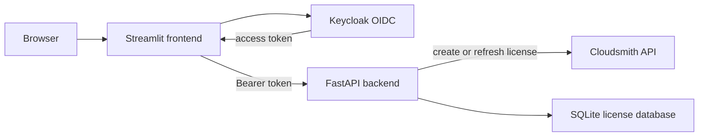

# Python Service Orchestration

## Applied Project

The applied project is an integrated license service for issuing and validating Cloudsmith credentials. It consists of three main application components:

* A [Streamlit](https://streamlit.io/) frontend provides the browser-based user interface. Users sign in through the frontend and can retrieve or validate their license.
* A [Keycloak](https://www.keycloak.org/) provides the OpenID Connect (OIDC) identity service. It authenticates users, manages the configured realm and client, and issues tokens for authenticated requests.
* A [FastAPI](https://fastapi.tiangolo.com/) backend validates OIDC access tokens, authorizes protected operations, stores license data in SQLite, and integrates with Cloudsmith.
* The [PyGuard](./../../projects/proj1_pyguard/README.md) library provides brute-force protection middleware for the backend. It tracks requests to protected endpoints and can temporarily block clients that exceed the configured attempt threshold.


```mermaid
flowchart LR
    B["Browser"] --> F["Streamlit frontend"]
    F --> K["Keycloak OIDC"]
    K -->|access token| F
    F -->|Bearer token| A["FastAPI backend"]
    A -->|create or refresh license| C["Cloudsmith API"]
    A --> D["SQLite license database"]
```

!!! info "For more information"
    The individual components are documented in their own README files:

    * [Frontend README](./../../projects/bonus1_license_service_oidc/frontend/README.md)
    * [Backend README](./../../projects/bonus1_license_service_oidc/backend/README.md)
    * [Keycloak README](./../../projects/bonus1_license_service_oidc/keycloak/README.md)

### Project Setup

Docker Compose starts the frontend, backend, and Keycloak services and places them on a shared network. The project demonstrates how a user-facing application, an external identity provider, a protected API, local persistence, and a third-party license service work together as one deployable system.

The Compose configuration is stored in `projects/bonus1_license_service_oidc/docker-compose.yml`. 

```yaml
services:
  devcontainer:
    build:
      context: .
      dockerfile: .devcontainer/Dockerfile
    command: sleep infinity
    depends_on:
      - backend
      - frontend
    volumes:
      - .:/workspace:cached
    working_dir: /workspace
    networks:
      license_service_network:

  backend:
    build:
      context: ./backend
      additional_contexts:
        pyguard: ../proj1_pyguard
    ports:
      - "8080:8080"
    volumes:
      - license_service_data:/app/data
    env_file:
      - .env
    environment:
      ADMIN_API_KEY: ${ADMIN_API_KEY:-dev-secret}
      OIDC_ISSUER_URL: http://keycloak.localhost:8081/realms/license-service
      OIDC_JWKS_URL: http://keycloak:8080/realms/license-service/protocol/openid-connect/certs
      DATABASE_PATH: /app/data/licenses.db
    networks:
      license_service_network:
        ipv4_address: ${BACKEND_IP:-172.30.0.2}

  frontend:
    build: ./frontend
    depends_on:
      - backend
    ports:
      - "8501:8501"
    extra_hosts:
      - "keycloak.localhost:172.30.0.1"
    volumes:
      - ./frontend/.streamlit/secrets.toml:/run/secrets/streamlit-secrets.toml:ro
    networks:
      license_service_network:
        ipv4_address: ${FRONTEND_IP:-172.30.0.3}
    environment:
      BACKEND_URL: http://backend:8080
      ADMIN_API_KEY: ${ADMIN_API_KEY:-dev-secret}

  keycloak:
    image: quay.io/keycloak/keycloak:26.3
    command: start-dev --import-realm
    environment:
      KC_BOOTSTRAP_ADMIN_USERNAME: ${KEYCLOAK_ADMIN:-admin}
      KC_BOOTSTRAP_ADMIN_PASSWORD: ${KEYCLOAK_ADMIN_PASSWORD:-admin}
      KC_HOSTNAME: http://keycloak.localhost:8081
    ports:
      - "8081:8080"
    volumes:
      - ./keycloak/realm-export.json:/opt/keycloak/data/import/realm-export.json:ro
    networks:
      license_service_network:
        ipv4_address: ${KEYCLOAK_IP:-172.30.0.4}

networks:
  license_service_network:
    ipam:
      config:
        - subnet: 172.30.0.0/24

volumes:
  license_service_data:
```

The most important Compose configuration keys are:

| Key | Purpose |
| --- | --- |
| `services` | Defines the containers that make up the application. |
| `build` | Builds a service image from a local Dockerfile. |
| `depends_on` | Defines service startup order. |
| `ports` | Maps host ports to container ports. |
| `environment` | Passes configuration values into a container. |
| `volumes` | Mounts the Keycloak realm and Streamlit secrets. |
| `networks` | Connects services to a shared Docker network. |
| `ipam` and `subnet` | Configure the address range of that network. |

The project-level `.env` file supplies variable values used by Docker Compose.
Compose loads these values when it reads the file and substitutes them into
`${...}` expressions in `docker-compose.yml`, while each service's `env_file`
setting passes the selected variables into that container's environment.


## Orchestration with Compose

### Services

Each entry under `services` describes one container role. Compose also gives each service a network identity that other services can use.

The `backend` service exposes port `8080`, the `frontend` service exposes port `8501`, and Keycloak exposes port `8081` to the host. The frontend declares a dependency on the backend so Compose starts the backend first. The Keycloak service imports the realm definition from `keycloak/realm-export.json`.

`depends_on` expresses startup order, but it does not prove that a dependency is ready to accept requests. Applications that need readiness guarantees should use health checks, retries, or an explicit readiness check.

### Networking

The frontend, backend, and Keycloak services join the
`license_service_network` network. The network uses the `172.30.0.0/24`
subnet, with configurable addresses for the services.

Published ports are different from internal service addresses. Port `8501`
makes the frontend available to the host, while port `8080` makes the backend
available to the host. Container-to-container traffic uses service names on
the internal Compose network.

### Discovery

Compose provides internal DNS-based service discovery. A container can resolve
another service using the service name from the Compose file:

```text
http://backend:8080
http://keycloak:8080
```

This is more stable than hard-coding an IP address because containers may be
recreated and receive different private addresses.

## Development Workflow
### Create the Environment

Start the complete application from the project directory:

```shell
cd projects/bonus1_license_service_oidc
docker compose up --build
```

The `--build` option rebuilds the backend and frontend images before starting
the stack. Keycloak imports the realm export during startup, and the frontend
uses the mounted Streamlit OIDC configuration.

Run the services in the background with `-d`:

```shell
docker compose up --build -d
docker compose ps
```

Stop and remove the containers and network with:

```shell
docker compose down
```

The application is then available at `http://localhost:8501`. Keycloak is
available at `http://localhost:8081`, and the backend API is available at
`http://localhost:8080`.

### Inspect the Environment

Inspect service output with:

```shell
docker compose logs -f frontend
docker compose logs -f backend
docker compose logs -f keycloak
```
