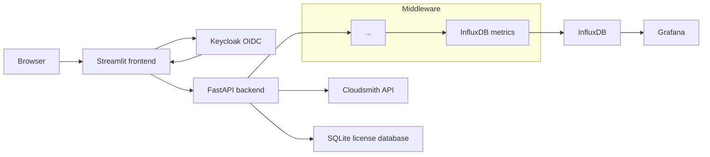

# Monitoring

## Applied Project

Section 02 extends the project introduced in [section-01](section-01.md) with a monitoring stack for collecting and visualizing API metrics.

The monitoring stack consists of two main components:

* [InfluxDB](https://www.influxdata.com/) stores the API metrics as time-series data.
* [Grafana](https://grafana.com/) visualizes the metrics in dashboards.



### Project Setup

The compose setup is extended with the two new members and looks like the following

```yaml
services:
  devcontainer:
    build:
      context: .
      dockerfile: .devcontainer/Dockerfile
    command: sleep infinity
    depends_on:
      - backend
      - frontend
    volumes:
      - .:/workspace:cached
    working_dir: /workspace
    networks:
      license_service_network:

  backend:
    build:
      context: ./backend
      additional_contexts:
        pyguard: ../proj1_pyguard
    ports:
      - "8080:8080"
    volumes:
      - license_service_data:/app/data
    env_file:
      - .env
    environment:
      ADMIN_API_KEY: ${ADMIN_API_KEY:-dev-secret}
      OIDC_ISSUER_URL: http://keycloak.localhost:8081/realms/license-service
      OIDC_JWKS_URL: http://keycloak:8080/realms/license-service/protocol/openid-connect/certs
      DATABASE_PATH: /app/data/licenses.db
    networks:
      license_service_network:
        ipv4_address: ${BACKEND_IP:-172.30.0.2}

  frontend:
    build: ./frontend
    depends_on:
      - backend
    ports:
      - "8501:8501"
    extra_hosts:
      - "keycloak.localhost:172.30.0.1"
    volumes:
      - ./frontend/.streamlit/secrets.toml:/run/secrets/streamlit-secrets.toml:ro
    networks:
      license_service_network:
        ipv4_address: ${FRONTEND_IP:-172.30.0.3}
    environment:
      BACKEND_URL: http://backend:8080
      ADMIN_API_KEY: ${ADMIN_API_KEY:-dev-secret}

  keycloak:
    image: quay.io/keycloak/keycloak:26.3
    command: start-dev --import-realm
    environment:
      KC_BOOTSTRAP_ADMIN_USERNAME: ${KEYCLOAK_ADMIN:-admin}
      KC_BOOTSTRAP_ADMIN_PASSWORD: ${KEYCLOAK_ADMIN_PASSWORD:-admin}
      KC_HOSTNAME: http://keycloak.localhost:8081
    ports:
      - "8081:8080"
    volumes:
      - ./keycloak/realm-export.json:/opt/keycloak/data/import/realm-export.json:ro
    networks:
      license_service_network:
        ipv4_address: ${KEYCLOAK_IP:-172.30.0.4}

  influxdb:
    image: influxdb:2.7
    container_name: influxdb
    env_file:
      - .env
    healthcheck:
      test: ["CMD", "curl", "-f", "http://localhost:8086/ping"]
      interval: 5s
      timeout: 3s
      retries: 10
    networks:
      license_service_network:
        ipv4_address: ${INFLUXDB_IP:-172.30.0.40}
    ports:
      - "8086:8086"
    volumes:
      - influxdb_data:/var/lib/influxdb2

  grafana:
    image: grafana/grafana:10.4.0
    container_name: grafana
    env_file:
      - .env
    depends_on:
      influxdb:
        condition: service_healthy
    networks:
      license_service_network:
        ipv4_address: ${GRAFANA_IP:-172.30.0.50}
    ports:
      - "3001:3000"
    volumes:
      - grafana_data:/var/lib/grafana

networks:
  license_service_network:
    ipam:
      config:
        - subnet: 172.30.0.0/24

volumes:
  license_service_data:
  influxdb_data:
  grafana_data:
```

Compared to the previous section, the most important monitoring-related
differences are:

| Key | Purpose |
| --- | --- |
| `influxdb` service | Runs InfluxDB 2.7 as the time-series database for API metrics. |
| `grafana` service | Runs Grafana and provides dashboards for the metrics stored in InfluxDB. |
| `healthcheck` | Checks the InfluxDB `/ping` endpoint so Grafana starts only after InfluxDB is ready. |
| `influxdb_data` | Persists InfluxDB data when the container is recreated. |
| `grafana_data` | Persists Grafana dashboards, users, and data-source configuration. |

## Monitoring
### InfluxDB

This example uses one measurement, `api_requests`, for all HTTP request points. The measurement identifies the kind of event being recorded; it is not a separate table for each request. The request method and path are tags, while the response status is the measured field.

Writing to an influx datasource in Python can easily be done with the `influxdb-client` as shown in the following excerpt of the ``middleware.py`` of the license-service:

```python
import os

from influxdb_client import InfluxDBClient, Point
from influxdb_client.client.write_api import SYNCHRONOUS

client = InfluxDBClient(
    url=os.getenv("INFLUXDB_URL"),
    token=os.environ["INFLUXDB_TOKEN"],
    org=os.getenv("INFLUXDB_ORG"),
)
write_api = client.write_api(write_options=SYNCHRONOUS)

point = (
  Point("api_requests")
    .tag("method", method)
    .tag("path", path)
    .field("status_code", status_code)
)

write_api.write( bucket=os.environ["INFLUXDB_BUCKET"], org=os.environ["INFLUXDB_ORG"], record=point, )
```

!!! info "Connect with InfluxDB"
	Open <http://localhost:8086>, sign in with the InfluxDB credentials from
	`.env`, and open **Explore**. Select the `oidc_license_service` organization
	and `api_metrics` bucket. Choose the `api_requests` measurement and a recent
	time range to verify that request points have been stored.

### Grafana

Grafana must first have a valid InfluxDB data source. In Grafana, open
**Connections** → **Data sources** → **Add new data source**, select
**InfluxDB**, and use these settings:

* URL: `http://influxdb:8086`
* Organization: `oidc_license_service`
* Bucket: `api_metrics`
* Token: `INFLUXDB_TOKEN` from `.env`

Click **Save & test**. Use `influxdb` rather than `localhost` because Grafana
runs in its own container and reaches InfluxDB through the Compose network.

Flux is InfluxDB's query language, sent through its HTTP API. `from` selects a
bucket, `range` selects the time period, and `filter` selects data. For
example, this query counts requests in one-minute windows:

```flux
from(bucket: "api_metrics")
  |> range(start: v.timeRangeStart, stop: v.timeRangeStop)
  |> filter(fn: (r) => r._measurement == "api_requests")
  |> filter(fn: (r) => r._field == "status_code")
  |> aggregateWindow(every: 1m, fn: count, createEmpty: true)
  |> yield(name: "api_calls")
```

Grafana provides `v.timeRangeStart` and `v.timeRangeStop` when it runs the
query in a dashboard. The `aggregateWindow` function groups the points and
`count` counts the `status_code` field.

## Development Workflow

### Create the Environment

Start the complete application and monitoring stack from the project
directory:

```shell
cd projects/bonus1_license_service_oidc
docker compose up --build -d
docker compose ps
```

The `--build` option rebuilds the backend and frontend images. The `-d`
option starts the services in the background. Compose waits for the InfluxDB
health check before starting Grafana.

### Inspect the Environment

Inspect the monitoring service status and logs with:

```shell
docker compose ps influxdb grafana
docker compose logs -f influxdb
docker compose logs -f grafana
```

Stop the complete stack while preserving the named volumes with:

```shell
docker compose down
```

To remove the persisted InfluxDB and Grafana data as well, use:

```shell
docker compose down -v
```

