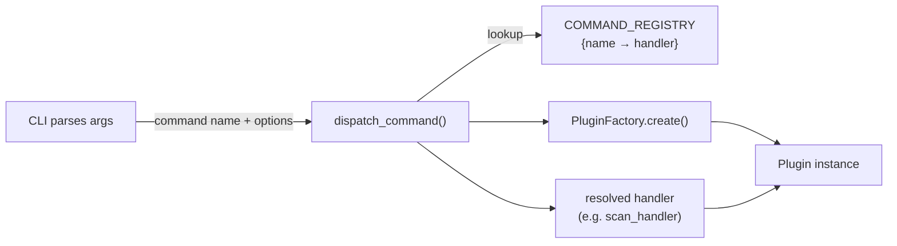
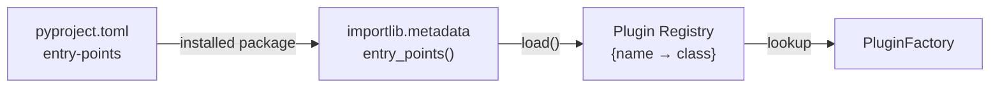

# CLI Architecture

## Overview

One of Python's main use cases is building terminal applications — the Python ecosystem itself is full of them: `pip`, `uv`, `ruff`, `pytest`, the AWS CLI, the Azure CLI, and many others are all CLI tools, making them ideal for CI/CD pipelines where every step is a shell command and there is no graphical display available. Frameworks such as [Click](https://click.palletsprojects.com/) make larger Python CLIs easier to scale by supporting top-level commands, nested subcommands, typed options, and generated help output.

The *Depsight* project is also implemented as a terminal application, available through the `depsight` CLI. A **CLI** application accepts arguments and flags from the user and executes a command — no graphical window required. **TUI** applications extend this further by rendering interactive panels and widgets directly in the terminal. Modern emulators such as [Windows Terminal](https://github.com/microsoft/terminal) support true-colour rendering and GPU-accelerated drawing, enabling tools like [Claude Code](https://www.anthropic.com/claude-code) and [Lazygit](https://github.com/jesseduffield/lazygit) that rival graphical interfaces in visual quality. Depsight uses Click to keep that command layer thin while delegating plugin-specific behavior and dependency analysis to the core application.

---

## Architecture and Design Patterns

### Depsight Entry Point

The `pyproject.toml` file supports a `[project.scripts]` table that maps a command name such as `depsight` to a Python callable. When the package is installed, the installer creates a small wrapper script on `PATH` so the command can be invoked directly from the shell without a `python -m` prefix:

```toml
[project.scripts]
depsight = "depsight.cli:main"
```

The value `"depsight.cli:main"` tells the installer to import the `main` function from the `depsight.cli` module. The generated wrapper script calls this function, forwards the process exit code, and handles the `sys.argv` handoff. In consequence, typing `depsight` in a terminal is equivalent to running `python -c "from depsight.cli import main; main()"`.

### Scalable Project Structure

Depsight separates the CLI layer from business logic using the **thin CLI, fat core** principle. The CLI parses arguments and renders output; all orchestration, plugin resolution, and dependency collection live in a framework-independent core. The top-level structure reflects this separation:

```
depsight/
├── cli.py              # CLI entry point and command registration
├── commands/           # Command handlers (no Click dependency - easy to test)
├── core/
│   ├── dispatcher.py   # Command dispatcher
│   └── plugins/        # Plugin contract, factory, and implementations
└── utils/              # Shared constants, logging, helpers
```

### Command Dispatcher Pattern

The command dispatcher pattern is a common approach in CLI applications, used in tools such as Django's `call_command()`, Flask's CLI, and Git's subcommand routing. Rather than growing `if`/`elif` chains as new commands are added, a registry maps command names to handler callables, so the dispatch logic itself never needs to change.

In Depsight, every command delegates to `dispatch_command()`, which looks up the matching handler in `COMMAND_REGISTRY`, uses the `PluginFactory` to create the correct plugin instance, and forwards both to the handler. The handler executes the business logic and returns an exit code (`0` for success, `1` for failure) back to the shell.



#### Improved Testability

Because `scan_handler` receives a plugin, a path, and a logger as plain arguments, a unit test can pass a `MockPlugin` directly and assert on `plugin.dependencies` without launching a process or parsing terminal output.

```python
import logging

from depsight.commands.scan import scan_handler


def test_scan_handler_collects_dependencies(tmp_path):
    plugin = MockPlugin(name="uv")
    logger = logging.getLogger("test")

    scan_handler(plugin, tmp_path, logger)

    assert plugin.collect_called
    assert len(plugin.dependencies) == 3
```

Without this separation, the equivalent test would require Click's `CliRunner` to invoke `main`, inspect `result.output` as a string, and assert on the rendered table format. This couples the test to CLI parsing and Rich rendering rather than the business logic being tested.

```python
from click.testing import CliRunner

from depsight.cli import main


def test_scan_via_cli(tmp_path):
    runner = CliRunner()
    result = runner.invoke(main, ["uv", "scan", "--project-dir", str(tmp_path)])

    assert result.exit_code == 0
    assert "click" in result.output  # fragile: depends on rendered table format
```

### Factory Pattern

The factory pattern is one of the most widely used creational design patterns in software engineering. It centralises object construction behind a single interface so that callers request an instance by name or type without knowing which concrete class is returned. Validation, error handling, and implementation selection are all handled in one place, making it straightforward to add new implementations without touching existing call sites.

In Depsight, `PluginFactory.create()` is the single entry point for plugin instantiation. The dispatcher passes a plugin name string and receives a fully validated `BasePlugin` instance in return, with no knowledge of which class was constructed or how:

```python
class PluginFactory:
    @staticmethod
    def create(plugin_name: str) -> BasePlugin:
        # Step 1: Lookup — resolve the plugin class from the registry
        plugin_cls = SUPPORTED_PLUGINS.get(plugin_name)
        if plugin_cls is None:
            raise ValueError(
                f"Unknown plugin '{plugin_name}'. "
                f"Available: {', '.join(SUPPORTED_PLUGINS)}"
            )

        # Step 2: Instantiate — create the plugin object
        plugin = plugin_cls()

        # Step 3: Validate — confirm the instance satisfies the BasePlugin protocol
        if not isinstance(plugin, BasePlugin):
            raise TypeError(
                f"Plugin '{plugin_name}' ({plugin_cls.__qualname__}) "
                "does not implement BasePlugin."
            )

        return plugin
```

The factory executes three steps in sequence:

- It **looks up** the plugin class in the registry
- It **instantiates** the plugin class
- It **validates** that the resulting object satisfies the `BasePlugin` protocol at runtime.

This effectively eliminates `if`/`elif` chains, catches third-party plugins that declare an entry point but fail to implement the required interface, and ensures that adding a new plugin never requires changes outside the plugin itself and its entry point registration.

### Plugin Pattern

The plugin pattern is an advanced, language-agnostic design pattern that was standardised in Python when `importlib.metadata` was added to the standard library in Python 3.8 (2019). It lets an application be extended without modifying its source code. Rather than maintaining a hard-coded list of supported tools, the application defines a **hook** that installed packages can register against. When the application starts, it finds everything that has registered under that hook and loads it automatically.

Prominent examples are [pytest](https://docs.pytest.org/), where installing `pytest-cov` or `pytest-xdist` is all it takes to activate those plugins, and Go-based tools such as [Docker](https://docs.docker.com/engine/extend/), which discovers installed CLI plugins at startup — Docker Compose v2 uses the same approach.

#### Entry Point Registration

Plugins register themselves in the `[project.entry-points]` table of `pyproject.toml`, mapping a short name to the dotted import path of the plugin class. Depsight's built-in plugins are registered directly in its own `pyproject.toml`:

```toml title="Internal plugin — depsight/pyproject.toml"
[project.entry-points."depsight.plugins"]
uv   = "depsight.core.plugins.uv.uv:UVPlugin"
vsce = "depsight.core.plugins.vsce.vsce:VSCEPlugin"
```

The system also supports **external** plugins that are developed and distributed independently and declare entry points under the same group name. An external plugin requires no changes to the Depsight codebase; it simply ships its own `pyproject.toml`, and the [Factory Pattern](#factory-pattern) takes care of looking it up, instantiating it, and validating that it satisfies the `BasePlugin` contract:

```toml title="External plugin — depsight-npm/pyproject.toml"
[project.entry-points."depsight.plugins"]
npm = "depsight_npm.plugin:NpmPlugin"
```

#### Plugin Discovery

At startup, the application queries the entry point group and builds a name-to-class registry. Python's `importlib.metadata` module provides `entry_points()` for this purpose. Wrapping the query in a dedicated `discover_plugins()` function is good practice because it centralises the discovery logic and lets the rest of the application work with a simple dictionary.

```python
import importlib.metadata


def discover_plugins(app_name: str = "depsight") -> dict:
    """Build the full plugin registry from entry points.

    All plugins (built-in and third-party) are discovered via the
    `<app_name>.plugins` entry-point group declared in `pyproject.toml`.

    Parameters
    ----------
    app_name - Application name used to look up the entry-point group (e.g. `"depsight"`).

    Returns
    -------
    dict[str, type]
        A mapping of plugin name → plugin class.
    """
    registry: dict[str, type] = {}
    entry_points = importlib.metadata.entry_points(group=f"{app_name}.plugins")
    for ep in entry_points:
        plugin_cls = ep.load()
        registry[ep.name] = plugin_cls
    return registry
```

The function iterates over every entry point in the group, calls `load()` to import the class, and stores it under its declared name. The result is a flat dictionary of all available plugins, both internal and external, ready for the `PluginFactory` to look up by name.



#### Plugin Contract

Every plugin must satisfy a contract so the application can call it uniformly. Depsight defines this contract as an **Abstract Base Class** (ABC). Subclasses must implement `name`, `dependency_files`, `default_file`, and `collect`. Otherwise, the Python interpreter will raise a `TypeError` at instantiation time if any of them is missing. The `export` method has a shared concrete implementation in `BasePlugin` that all plugins inherit for free:

```python
from abc import ABC, abstractmethod

class BasePlugin(ABC):
    dependencies: list[Dependency]

    @property
    @abstractmethod
    def name(self) -> str: ...

    @property
    @abstractmethod
    def dependency_files(self) -> tuple[str, ...]: ...

    @property
    @abstractmethod
    def default_file(self) -> str:
        """Filename used by `collect()` when `--file` is omitted.

        Must be one of the entries in `dependency_files`. Plugins are
        required to declare this explicitly so there is no implicit
        fallback when multiple lockfile formats are supported.
        """

    @abstractmethod
    def collect(self, path: str | Path, file: str | None = None) -> None: ...

    def export(self, project_dir: str | Path, output_dir: str | Path) -> Path: ...
```

#### Selecting a Dependency File

A single package manager often supports more than one lockfile format. The `uv` plugin, for example, reads both the native `uv.lock` and the PEP 751 interoperable `pylock.toml`. Rather than hard-coding a single filename, plugins expose every supported file via `dependency_files` and declare a preferred one via `default_file`. The CLI surfaces this through a `--file` option whose allowed values are derived from the plugin itself:

```bash
# Scans uv.lock (the plugin default)
depsight uv scan --project-dir ./my-app

# Opts into the PEP 751 interoperable lockfile
depsight uv scan --project-dir ./my-app --file pylock.toml
```

At registration time, the CLI instantiates each plugin to read its `dependency_files` tuple and pins the `--file` option to a `click.Choice(...)` built from that tuple. The chosen filename is forwarded to `plugin.collect(path, file=...)`, where the plugin routes to the matching parser. Adding a new file format is therefore a single-plugin change: extend `dependency_files`, add a parser method, and the CLI automatically exposes the new value.

### Dataclass Pattern

The [`dataclasses`](https://docs.python.org/3/library/dataclasses.html) module is part of the Python standard library since Python 3.7. The `@dataclass` decorator auto-generates `__init__`, `__repr__`, and `__eq__` from type annotations, eliminating boilerplate while keeping the structure explicit and type-checked. Compared to plain Python dictionaries `{}`, a dataclass enforces a fixed schema at construction time. A typo in any field name raises a `TypeError` immediately instead of silently creating a new key, and type checkers like `mypy` can verify field access statically.

Depsight uses a dataclass to define `Dependency`, the shared schema that all plugins produce and all command handlers consume. Each plugin's `collect()` method parses a lockfile and returns a `list[Dependency]`, giving the rest of the codebase a single, predictable type to work with regardless of which package manager produced the data.

```python
@dataclass(slots=True)
class Dependency:
    name: str                          # Package or extension identifier, e.g. "click"
    version: str | None = None         # Resolved version from the lockfile, e.g. "8.3.1"
    constraint: str | None = None      # Version specifier from the manifest, e.g. ">=8.1.7"
    tool_name: str | None = None       # Which plugin discovered it, e.g. "uv"
    registry: str | None = None        # Package registry URL, e.g. "https://pypi.org/simple"
    file: str | None = None            # Absolute path to the source file
    category: packageType = "prod"     # "dev" or "prod"
    is_transitive: bool = False        # True when the dependency is indirect (not declared by the project)
```

Furtheremore, [Pydantic](https://docs.pydantic.dev/) models are a popular alternative that add runtime validation and coercion, making them the standard choice for API frameworks like FastAPI where input data is untrusted. Dataclasses are the lighter option when the data originates from trusted internal code and no validation layer is needed.
