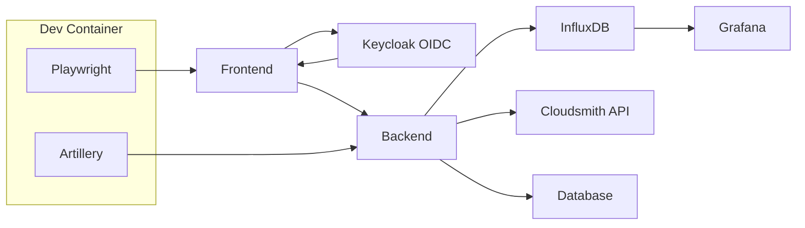

# Testing

## Applied Project

This section builds on the previous [section](./section-03.md) by adding a Dev Container as another project component. Dev Containers were first introduced in [Chapter 01, Section 04](../../chapter-01/section-04.md) as a way to provide a reproducible development environment. Here, the container includes the heavier configuration and tooling needed to test the complete application stack in a more realistic, end-to-end environment. 


```mermaid
flowchart LR
		F --> K["Keycloak OIDC"]
		K --> F["Frontend"]
		F --> A["Backend"]
		A --> INFLUXDB["InfluxDB"]
		INFLUXDB --> GRAFANA["Grafana"]
		A --> C["Cloudsmith API"]
		A --> D["Database"]
		subgraph DEVCONTAINER["Dev Container"]
			PW["Playwright"]
			ART["Artillery"]
		end
		PW --> F
		ART --> A
```

!!! info "info"
	This section uses Playwright and Artillery, both JavaScript-based tools. Rather than covering them in depth, it focuses on the infrastructure and setup needed to integrate them into the development and testing workflow.

### Project Setup

**docker-compose.yaml**

The compose setup is extended with the new service `devcontainer` which provides the needed tools for our end-to-end testing chain. 

```yaml
services:
  devcontainer:
    build:
      context: .
      dockerfile: .devcontainer/Dockerfile
    command: sleep infinity
    depends_on:
      - backend
      - frontend
    volumes:
      - .:/workspace:cached
    working_dir: /workspace
    networks:
      license_service_network:

	...

```

**Dockerfile**

The Dev Container image is based on Microsoft's JavaScript and Node.js development image and is stored in the required `.devcontainer/Dockerfile` path. It installs the command-line tools required by the project, including Bun, Playwright, and Artillery, and stores Playwright's browser binaries in a shared directory.

```dockerfile
FROM mcr.microsoft.com/devcontainers/javascript-node:24-bookworm

SHELL ["/bin/bash", "-o", "pipefail", "-c"]

ARG HTTP_PROXY
ARG HTTPS_PROXY
ARG NO_PROXY
ENV HTTP_PROXY=${HTTP_PROXY}
ENV HTTPS_PROXY=${HTTPS_PROXY}
ENV NO_PROXY=${NO_PROXY}
ENV PLAYWRIGHT_BROWSERS_PATH=/ms-playwright

USER root
RUN apt-get update && apt-get upgrade -y \
	&& apt-get install -y bats bats-support bats-assert bats-file dnsutils \
	&& rm -rf /var/lib/apt/lists/*

RUN curl -kfsSL https://bun.com/install \
	| sed 's/curl --fail/curl --insecure --fail/' \
	| bash \
	&& cp /root/.bun/bin/bun /usr/local/bin/bun \
	&& cp /root/.bun/bin/bunx /usr/local/bin/bunx

RUN mkdir -p /ms-playwright \
	&& npm install -g @playwright/test@1.58.0 artillery \
	&& apt-get update \
	&& npx playwright install --with-deps \
	&& chown -R node:node /ms-playwright

USER node
WORKDIR /workspace
ENV PATH=/workspace/node_modules/.bin:$PATH

EXPOSE 9323
CMD ["sleep", "infinity"]
```

!!! info "bats-core"
	[Bats-core](https://bats-core.readthedocs.io/en/stable/) is a Bash-based testing framework for writing and running automated tests. It is installed in the Dockerfile, but its use is outside the scope of this section.

**devcontainer.json**

The `devcontainer.json` file connects the development container to the existing Docker Compose application. It selects the `devcontainer` service and starts the other services alongside it, installs the relevant VS Code extensions, and forwards the application ports to the host.

```json
{
  "name": "License Service DevContainer",
  "dockerComposeFile": ["../docker-compose.yml"],
  "service": "devcontainer",
  "workspaceFolder": "/workspace",
  "postCreateCommand": "npm ci",
  "runServices": [
    "backend",
    "frontend",
    "devcontainer",
    "keycloak",
    "influxdb",
    "grafana"
  ],
  "customizations": {
    "vscode": {
      "extensions": [
        "ms-azuretools.vscode-docker",
        "ms-playwright.playwright"
      ]
    }
  },
  "forwardPorts": [
    8080,
    8501,
    8081,
    8086,
    3001
  ],
  "portsAttributes": {
    "8080": {
      "label": "Backend",
      "onAutoForward": "silent"
    },
    "8501": {
      "label": "Frontend",
      "onAutoForward": "silent"
    },
    "8081": {
      "label": "Keycloak",
      "onAutoForward": "silent"
    },
    "8086": {
      "label": "InfluxDB",
      "onAutoForward": "silent"
    },
    "3001": {
      "label": "Grafana",
      "onAutoForward": "silent"
    }
  },
  "remoteUser": "node",
  "overrideCommand": false
}
```

!!! info "Bootstrapping"
	Please check the below section about bootstrapping the license-service through a devcontainer.

## End-To-End Testing 

### Playwright

[Playwright](https://playwright.dev/) is an end-to-end testing framework for automating browsers and verifying web applications from a user's perspective. It supports Chromium, Firefox, and WebKit through one consistent API.

All browser-testing tools are provided inside the Dev Container: its Dockerfile installs Bun and bunx *(L34-L38)*, then Playwright, Artillery, browser binaries, and required system dependencies *(L41-L46)*. 

The project's [browser test](../../projects/bonus1_license_service_oidc/tests/e2e/app.spec.js) verifies the OIDC login flow: it opens Streamlit, follows the redirect to Keycloak, signs in, and checks the authenticated UI.

```javascript
import { test, expect } from '@playwright/test';

test('signs in through Keycloak', async ({ page }) => {
  const username = process.env.KEYCLOAK_TEST_USERNAME;
  const password = process.env.KEYCLOAK_TEST_PASSWORD;

  if (!username || !password) {
    throw new Error('Set KEYCLOAK_TEST_USERNAME and KEYCLOAK_TEST_PASSWORD in .env');
  }

  await page.goto('/');
  await expect(page.getByText('🔑 License Service')).toBeVisible();
  await expect(page.getByText('You are not logged in.')).toBeVisible();
  await page.getByRole('button', { name: 'Log in with Keycloak' }).click();

  await expect(page).toHaveURL(
    /keycloak\.localhost:8081\/realms\/license-service\/protocol\/openid-connect\/auth/,
  );
  await page.locator('#username').fill(username);
  await page.locator('#password').fill(password);
  await page.locator('#kc-login').click();

  await expect(page.getByText(`Signed in as: ${username}`)).toBeVisible();
  await expect(page.getByRole('button', { name: 'Get license' })).toBeVisible();
  await expect(page.getByRole('textbox', { name: 'License Key' })).toBeVisible();
});
```

The `page` fixture provides an isolated browser page. `page.goto('/')` uses the frontend base URL from the [Playwright configuration](../../projects/bonus1_license_service_oidc/playwright.config.js). Compose supplies the test credentials through environment variables; missing credentials fail the test immediately. After Keycloak redirects back to Streamlit, the assertions verify the username and license controls—not license creation or validation. 

!!! info "Playwright"
	See the [README](../../projects/bonus1_license_service_oidc/tests/README.md) for more details about Playwright and the project configuration.

### Artillery

[Artillery](https://www.artillery.io/) is a load-testing tool for measuring how an application behaves when it receives requests from many concurrent users. It helps identify performance bottlenecks, high error rates, and slow response times before they affect users in production.

Artillery tests are commonly configured in YAML. The `config` section sets the target service and load phases, while `scenarios` define the requests each virtual user makes. This test also uses the `processor` section to load custom JavaScript callbacks from `helpers/test-helpers.cjs`; these callbacks inspect responses, capture a returned license token, and validate it:

```yaml
config:
  target: "http://backend:8080"

  phases:
    - duration: 60
      arrivalCount: 120
      name: "GET license brute-force limit"

  processor: "./helpers/test-helpers.cjs"

scenarios:
  - name: "GET license and validate returned token"
    flow:
      - get:
          url: "/licenses"
          headers:
            x-api-key: "dev-secret"
          afterResponse: "checkResponse"
      - ifTrue:
          condition: "{{ tokenCaptured }}"
          then:
            - get:
                url: "/licenses/{{ cloudsmithToken }}"
                afterResponse: "checkTokenResponse"
```

For successful license requests, the processor captures the returned token and the scenario checks that the token is valid. Artillery records response times, throughput, and response statuses for the run.

!!! info "Artillery"
	The test is intended to exceed `PyGuard`'s limit of 100 attempts in a 60-second window, to verify that the protection is enforced under load. For more details on running and interpreting the load test, see the [README](../../projects/bonus1_license_service_oidc/tests/README.md).

## Development Workflow

### Create the Environment

The project can be started from VS Code using the `devcontainer.json` configuration. It builds the development container and starts it together with the backend and frontend services defined in Docker Compose.

1. **Install the prerequisites.** Install Docker and the [Dev Containers extension](https://marketplace.visualstudio.com/items?itemName=ms-vscode-remote.remote-containers) for VS Code. Make sure Docker is running.

2. **Open the project.** In VS Code, select **File > Open Folder** and open:

	```text
	projects/proj11_license_service_devcontainer
	```

	The folder contains `.devcontainer/devcontainer.json` and the referenced `docker-compose.yml` file.

3. **Start the container.** Open the Command Palette with **Ctrl+Shift+P** or **Cmd+Shift+P**, then run **Dev Containers: Reopen in Container**. VS Code builds the image and starts the `backend`, `frontend`, and `devcontainer` services. The first build may take several minutes because Playwright browsers are installed.

4. **Use the application.** Open `http://localhost:8501` for the frontend or `http://localhost:8080` for the backend. To verify the tools, open a VS Code terminal and run:

	```bash
	bunx playwright --version
	artillery --version
	```

Use **Dev Containers: Reopen Folder Locally** to leave the container. After changing the Dockerfile or `devcontainer.json`, use **Dev Containers: Rebuild Container**.


### Run tests in the Dev Container

After opening the project in the Dev Container, run these commands from the project root. The `backend`, `frontend`, and `devcontainer` Compose services should be running.

Run the browser-based tests:

```bash
bun run gui-test
```

Run the load test:

```bash
bun run spike-test
```

!!! info "Further reading"
	For details about the test scenarios, configuration, generated reports, and result evaluation, see the [tests README](../../projects/bonus1_license_service_oidc/tests/README.md).

