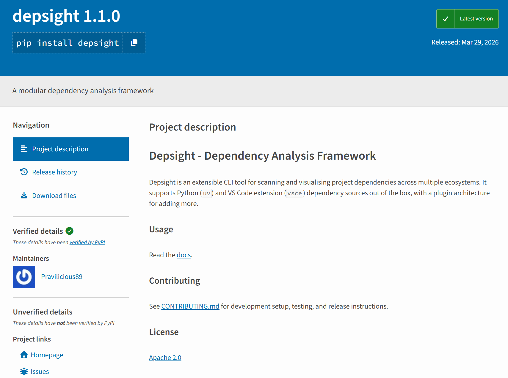
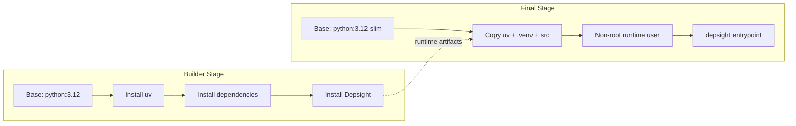

# Distribution

## Overview

The most common way to distribute Python projects is as a **wheel** (`.whl`) — a pre-built binary standardised by [PEP 427](https://peps.python.org/pep-0427/) that installs without a build step and accounts for the vast majority of packages on [PyPI](https://pypi.org). Wheels suit developer tools and libraries well, but require Python and a package manager (`pip` or `uv`) on the target machine, making them a poor fit for end-user applications or locked-down environments. For those cases, [PyInstaller](https://pyinstaller.org/) and [Nuitka](https://nuitka.net/) produce self-contained executables at the cost of a more complex build toolchain. A complementary option is to ship the tool as a portable [OCI container image](https://opencontainers.org/) built with [Docker](https://www.docker.com/) or [Podman](https://podman.io/), which bundles the interpreter and all dependencies into a single runnable unit.

Depsight is a developer tool designed for learning purposes and does not target any production environment. It is shipped both as a wheel on [PyPI](https://pypi.org) and as a container image on [Docker Hub](https://hub.docker.com/).

---

## Python Wheels

### Package Builds

The *Depsight* project uses `uv_build` as its PEP 517-compliant build backend. Because the PEP 517 standard decouples the frontend from the backend, `uv build` is the default but any compliant frontend such as `python -m build` can invoke the same backend and produce identical artifacts:

=== "uv"
    ```bash
    uv build
    ```

=== "build"
    ```bash
    python -m build
    ```

```
dist/
├── depsight-1.0.0-py3-none-any.whl
└── depsight-1.0.0.tar.gz
```

The generated `.whl` can be used to install Depsight locally before publishing:

=== "pip"
    ```bash
    pip install dist/depsight-1.0.0-py3-none-any.whl
    ```

=== "uv"
    ```bash
    uv pip install dist/depsight-1.0.0-py3-none-any.whl
    ```

### Wheel Contents

A wheel (`.whl`) is a ZIP archive with a standardised layout. It contains the source code, package metadata, and entry-point declarations — everything an installer needs to place the package into a Python environment without running arbitrary build code.

```
depsight-0.1.0-py3-none-any.whl
├── depsight/
│   ├── __init__.py
│   ├── cli.py
│   ├── commands/...
│   ├── core/...
│   └── utils/...
└── depsight-0.1.0.dist-info/
    ├── METADATA          # Package name, version, dependencies
    ├── entry_points.txt  # CLI + plugin entry points
    ├── RECORD            # File checksums
    └── WHEEL             # Wheel format version, generator, and compatibility tag
```

The `entry_points.txt` file registers the CLI command and the [plugin system](./section-03.md#plugin-pattern):

```toml
[console_scripts]
depsight = depsight.cli:main

[depsight.plugins]
uv = depsight.core.plugins.uv.uv:UVPlugin
vsce = depsight.core.plugins.vsce.vsce:VSCEPlugin
```

### Package Deployment

The *Depsight* project leverages `pypi.org` to host the `depsight*.whl` and uses `uv` for publishing it. Unlike `twine`, which must be separately installed as a third-party dependency, `uv publish` is built directly into `uv`  requiring no additional installs. The following commands publish the distribution artifacts in `dist/` to PyPI:

```bash
uv publish
```

Once published, Depsight is listed at `https://pypi.org/project/depsight/` where the package metadata, release history, and download statistics are publicly visible. The page is generated automatically by PyPI from the wheel's `METADATA` file and kept up to date with each new release.



!!! info "PyPI Account and API Token"
    Uploading a package requires an account and an API token. The token is scoped either to the entire account or to a single project, and is passed as a secret during publishing.

### Package Installation

Any published version of Depsight can be installed directly from PyPI with a single command:

=== "pip"
    ```bash
    pip install depsight
    ```

=== "uv"
    ```bash
    uv tool install depsight
    ```

---

## Container Images

Beyond the wheel on PyPI, Depsight is also packaged as a portable Open Container Initiative (OCI) image. The top-level `Dockerfile` is the build recipe that installs `depsight` into a slim Python base image, which is then published to [Docker Hub](https://hub.docker.com/) alongside the wheel.

### Docker Official Images

Docker maintains a curated library of [Official Images](https://hub.docker.com/search?image_filter=official) on Docker Hub. These images follow best practices, receive regular updates, and serve as trusted base layers for application containers. For Python projects, the most commonly used variants are the full `python:<version>` image and its leaner counterpart `python:<version>-slim`, which ships a minimal Debian installation with only the packages required to run CPython.

Depsight builds on top of `python:3.12-slim`. The slim variant keeps the image small while still providing the standard library, `pip`, and the shared libraries needed to install compiled packages. Using an official image also means that security patches flow in through regular upstream rebuilds without requiring manual intervention.

### Dockerfile Architecture

#### Container Build Primitives

The `Dockerfile` is composed of a small set of instructions that together define the build and runtime behavior of the image. The following subsections describe the primitives used in the Depsight Dockerfile.

##### `ARG`

`ARG` declares a build-time variable that can be passed via `--build-arg` on the command line. It only exists during the build and is not available at container runtime. Depsight uses `ARG` to parameterize the Python version, the `uv` version, and the non-root user identity so that the CI pipeline or a developer can pin exact versions without editing the Dockerfile.

| Argument           | Default     | Purpose                              |
|--------------------|-------------|--------------------------------------|
| `PYTHON_VERSION`   | `3.12`      | Base Python image tag                |
| `UV_VERSION`       | `0.11.1`    | `uv` installer version              |
| `USER_ID`          | `1000`      | UID for the non-root runtime user    |
| `USER_NAME`        | `depsight`  | Username for the non-root runtime user |

##### `RUN`

`RUN` executes a command inside the build container and commits the resulting filesystem change as a new image layer. Each `RUN` instruction creates one layer, so chaining related commands with `&&` reduces layer count and image size. In the builder stage, `RUN` installs system packages, downloads `uv`, and runs `uv sync` to install dependencies and the project.

##### `COPY`

`COPY` transfers files from the build context (or from a previous stage via `--from`) into the image. Depsight copies `pyproject.toml` and `uv.lock` before copying `src/` so that Docker can cache the dependency layer independently. In the final stage, `COPY --from=builder` selectively pulls the virtual environment and `uv` binaries without carrying over the build-time toolchain.

##### `ENTRYPOINT`

`ENTRYPOINT` sets the default executable for the container. When a user runs `docker run depsight:local --help`, Docker invokes the entrypoint binary with `--help` as its argument. Depsight sets `ENTRYPOINT ["depsight"]` so the container behaves like a direct invocation of the CLI.

#### Multi-Stage Builds

##### Introduction

A [multi-stage build](https://docs.docker.com/build/building/multi-stage/) splits a Dockerfile into multiple `FROM` stages. Each stage starts from its own base image and can selectively copy artifacts from a previous stage. The main advantage is image size. Build-time tools, compilers, and intermediate files never end up in the final image because they are discarded when the stage completes.

Depsight uses two stages. The **builder** stage starts from `python:3.12`, installs `uv` and all project dependencies, and then installs `depsight` itself. The **final** stage starts from a fresh `python:3.12-slim` image and copies only the runtime artifacts (the `uv` binaries, the virtual environment, and the plugin source) from the builder. This keeps build-time dependencies such as `curl` and the full source tree out of the shipped image.

<div style="zoom: 1.6;">

</div>

##### Builder Stage

The builder stage starts from `python:3.12, installs [`uv`](https://docs.astral.sh/uv/) via its official installer script, and then builds the project inside a virtual environment.

```dockerfile
ARG PYTHON_VERSION=3.12
FROM python:${PYTHON_VERSION} AS builder

ARG UV_VERSION=0.11.1
RUN curl -LsSf https://astral.sh/uv/${UV_VERSION}/install.sh | UV_INSTALL_DIR=/usr/local/bin sh

WORKDIR /depsight
```

Dependencies are installed **before** copying the source code. Docker caches each layer independently, so as long as `pyproject.toml`, `uv.lock`, `README.md` and `CONTRIBUTING.md` have not changed, the dependency layer is reused and only the final project install is re-run.

```dockerfile
# Install dependencies (Cached Layer)
COPY pyproject.toml uv.lock ./
RUN uv sync --frozen --no-dev --no-install-project

# Install the actual project
COPY src/ src/
COPY README.md ./

# --no-editable ensures the code is physically moved into site-packages
RUN uv sync --frozen --no-dev --no-editable
```

!!! tip "Layer Caching"
    Splitting `uv sync` into two steps — dependencies first, then the project — means that a source-only change rebuilds only the last layer. This significantly speeds up iterative builds during development.

##### Runtime Stage

The final stage starts from a fresh `python:3.12-slim` image and copies only what is needed at runtime.

```dockerfile
FROM python:${PYTHON_VERSION}-slim

WORKDIR /depsight

# Create non-root user
ARG USER_ID=1000
ARG USER_NAME=depsight
RUN apt-get update && \
    apt-get upgrade -y && \
    rm -rf /var/lib/apt/lists/* && \
    groupadd -g ${USER_ID} ${USER_NAME} && \
    useradd -u ${USER_ID} -g ${USER_NAME} -m -s /bin/bash ${USER_NAME}

# Copy the virtual environment ONLY
# Because we used --no-editable, the code lives inside this folder now.
COPY --from=builder --chown=${USER_NAME}:${USER_NAME} /depsight/.venv /depsight/.venv

# Copy uv binaries ONLY if Depsight needs to call 'uv' commands at runtime
COPY --from=builder /usr/local/bin/uv /usr/local/bin/uvx /usr/local/bin/
```

The container runs as a **non-root user** (`depsight`) and exposes the CLI as its entrypoint.

```dockerfile
RUN mkdir -p /home/${USER_NAME}/.depsight/logs /home/${USER_NAME}/.depsight/data && \
    chown -R ${USER_NAME}:${USER_NAME} /depsight /home/${USER_NAME}

USER ${USER_NAME}

ENV PATH="/depsight/.venv/bin:$PATH"
ENV PYTHONPATH="/depsight/src"
ENV PYTHONUNBUFFERED=1

ENTRYPOINT ["depsight"]
```

### Docker Command Primitives

The `docker build` command reads the `Dockerfile` in the current directory, executes both stages, and tags the resulting image as `depsight:local`. This image exists only on the local machine and is not pushed to any registry.

```bash
docker build -t depsight:local .
```

The `docker run` command creates a short-lived container from the local image. The `--rm` flag removes the container automatically after it exits. Any arguments after the image name are forwarded to the `depsight` entrypoint, so `--help` and `uv scan --help` print the CLI and subcommand usage respectively.

```bash
docker run --rm depsight:local --help
docker run --rm depsight:local uv scan --help
```