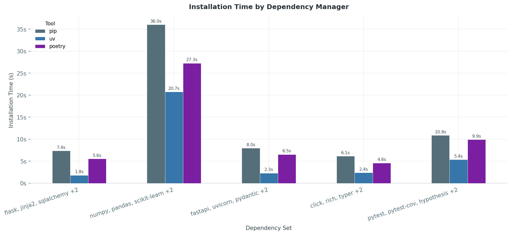

# uv in Comparison

## Introduction

To put `uv` into perspective, this section compares it against `pip` and `poetry` — the two most widely used package managers in the Python ecosystem. `pip` is the de-facto standard installer that ships with virtually every Python distribution, while `poetry` has become a popular choice for project-centric workflows that combine dependency management, lock files, and environment handling.

## Footprint

The official Poetry [installer](https://python-poetry.org/docs/#installation) bootstraps a full Python virtualenv with 15+ transitive dependencies. On `python:3.12-slim` that single install layer costs **104 MB** — more than the base image itself. The biggest offenders: `cryptography` (15 MB), a bundled `pip` (13 MB), and `rapidfuzz` (12 MB). Poetry itself is only 5.9 MB of that total.

The classic alternative — `pip` + `virtualenv` + `pyenv` — comes in at **39 MB**, but that number is misleading: it unpacks into **2,889 files** across three separate tool trees, with no shared cache, no lockfile, and no unified CLI.

| Tool | Install size |
|------|-------------|
| `uv` | ~36 MB|
| `poetry` (official installer) | ~104 MB |
| `pip` + `virtualenv` + `pyenv` | ~39 MB |

## Performance

The benchmark ran five representative dependency sets — a web stack (Flask), a data science stack (NumPy/pandas), an API stack (FastAPI), a CLI tooling set, and a dev-tools set (pytest/mypy/ruff) — each installed from scratch inside a `python:3.12-slim` container.

`uv` is consistently the fastest across all sets. The gap is most pronounced on the heavy data-science stack: `pip` takes **99.8 s**, `poetry` **28.0 s** — `uv` finishes in **29.3 s**. On lighter sets (FastAPI, CLI tools) `uv` is **2–3× faster** than `pip` alone.

## Dependency Management

### Environment isolation

`uv` and `poetry` both provide first-class support for isolated virtual environments. They create and manage project-local environments automatically and activate them transparently when installing packages or running commands. This removes the need for manual activation, and in both cases the environment location can be configured (project-local or global).

`pip`, by contrast, does not provide environment isolation on its own. It relies on external tools such as `venv`, `virtualenv`, or Conda, which the user has to create, activate, and manage manually before installing packages.

| Feature | uv | Poetry | pip |
|------|-------------|:--------:|:----------------:|
| Built-in virtual environment support | ✓ | ✓ | ✓ |
| Automatic environment creation | ✓ | ✓ | ✗ |
| Automatic environment selection | ✓ | ✓| ✗ |
| Manual setup required | Minimal | Minimal | High |

### Locking

`uv` and `poetry` both ship native lock files — `uv.lock` and `poetry.lock` respectively. When dependencies are added or updated, each tool resolves the complete dependency graph and stores the exact versions, sources, and metadata required for deterministic installations. During subsequent installs, the lock file is used as the source of truth, which reproduces the same environment across machines and CI systems.

`pip`, on the other hand, has historically relied on manually maintained `requirements.txt` files. These can pin versions (e.g. `numpy==2.1.0`) but do not capture the full dependency graph on their own. While newer versions of `pip` offer experimental locking via `pip lock`, reproducible workflows in practice usually still depend on auxiliary tools such as `pip-tools` (`pip-compile`).

| Feature | uv | Poetry | pip |
|------|-------------|:--------:|:----------------:|
| Native lock file | ✓ | ✓ | ✗ |
| Stores full dependency graph | ✓ | ✓ | ✗ |
| Reproducible installations | ✓ | ✓| ✗ |

### Interpreter Management 

`uv` stands out by integrating full Python interpreter management into the tool itself. It can download, install, and switch between multiple Python versions, and it automatically selects an appropriate interpreter based on the project's requirements.

`poetry` can work with different interpreters and switch between them via commands like `poetry env use python3.12`, but it cannot install or manage Python versions on its own. The desired interpreter must already be available on the system.

`pip`, finally, has no interpreter management at all. It always operates on the Python interpreter that invokes it (e.g. `python3.12 -m pip install package`), so switching versions requires fully external tooling.

| Feature | uv | Poetry | pip |
|------|-------------|:--------:|:----------------:|
| Install Python versions | ✓ | ✗ | ✗ |
| Switch interpreter versions | ✓ | ✓ | ✗ |
| Automatic interpreter selection | ✓ | (✓)| ✗ |
| Requires external tool | ✗ | ✓| ✓ |

### Resolution

`uv` implements a modern resolver that performs full dependency-graph resolution while staying compatible with Python packaging standards. It is optimized for speed and produces deterministic results.

`poetry` also performs full resolution whenever dependencies are added or updated, evaluating version constraints across the entire graph and writing a consistent lock file. However, as seen above, resolution can become slow on large projects.

`pip` has used a backtracking resolver since version `20.3`, which evaluates compatibility across dependencies instead of installing greedily. This greatly improved correctness compared to older versions, but it can still lead to long resolution times in projects with many conflicting constraints.

| Feature | uv | Poetry | pip |
|------|-------------|:--------:|:----------------:|
| Full dependency graph resolution | ✓ | ✓ | ✓ |
| Lock-file-based resolution | ✓ | ✓ | (✓) |
| Deterministic dependency graph | ✓ | ✓| (✓) |
| Optimized for resolution speed | ✓ | (✓) | ✗ |
