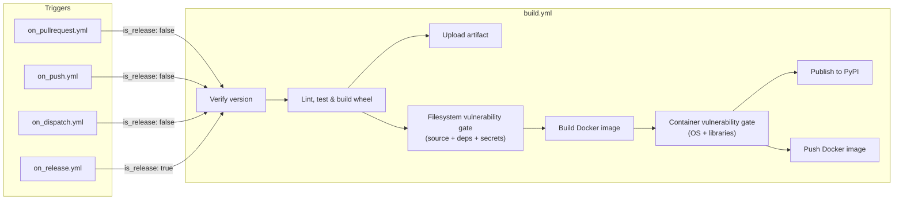
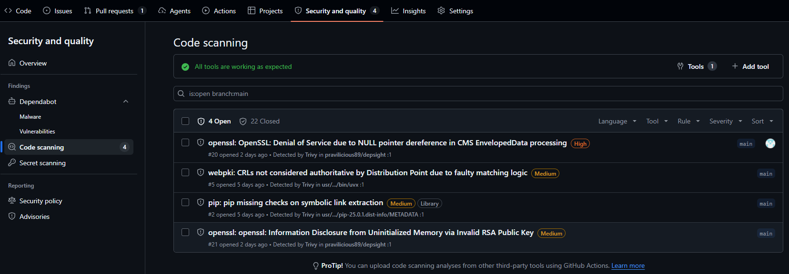
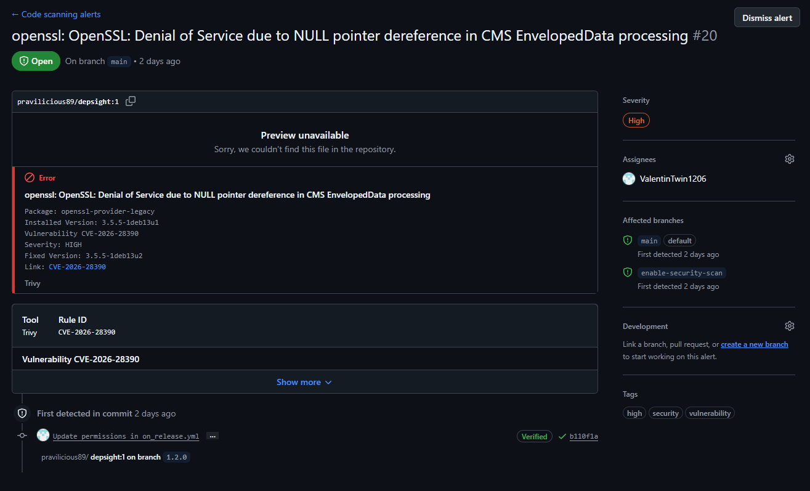

# CI/CD

## Overview

Continuous Integration and Continuous Delivery (CI/CD) automate the steps between writing code and shipping it to users. A CI pipeline typically checks out the source, runs linters, type checkers, and tests, and then builds a distributable artifact. If all checks pass, a CD pipeline publishes the artifact to a package registry, a container registry, or both. Automating these steps eliminates manual errors, enforces quality gates on every change, and ensures that the released artifact is always built from a known-good state of the codebase.

The Depsight project uses [GitHub Actions](https://docs.github.com/en/actions) for its CI/CD pipeline. GitHub Actions is a workflow automation platform built into GitHub that executes jobs in response to repository events such as pushes, pull requests, and releases. Workflows are defined as YAML files inside the `.github/workflows/` directory and run on GitHub-hosted virtual machines. A typical `.github` folder looks like this:

```
.github/
├── actions/            # composite actions shared across workflows
├── scripts/            # shell or Python scripts called from run: steps
└── workflows/
```

---

## GitHub Actions Workflows

Depsight provides four entry-point workflows that trigger the CI/CD pipeline:

- **On Pull Request** — quality gate on every PR to `main`; lints, type-checks, tests, and builds the wheel without publishing
- **On Push** — post-merge guard that re-runs the full pipeline on every push to `main`; never publishes
- **On Dispatch** — manual trigger for on-demand builds; supports toolchain version selection and optional wheel artifact upload
- **On Release** — fires on a published GitHub Release; publishes the wheel to PyPI and pushes the Docker image to Docker Hub

Each responds to a different GitHub event and delegates the heavy lifting to `build.yml` via `workflow_call`. The entry points differ in how they determine version numbers, which inputs they forward, and whether they trigger a release publish.

!!! note "Why separate `On Push` and `On Release`?"
    Triggering publishing on a push to `main` would couple every merge to a release, force version bumps to precede each merge, and break the tag-to-artifact mapping. Using `release: [published]` ties each publish to an immutable, human-authored git tag — the single source of truth for shipped artifacts. `On Push` complements it by re-running CI on `main` HEAD after every merge, catching regressions that slip past pre-merge checks (for example, from squash-merges or direct pushes).

### On Pull Request

The `on_pullrequest.yml` workflow runs automatically when a pull request is opened or updated against the `main` branch. It calls `build.yml` with `is_release: false`, which means the pipeline lints, type-checks, tests, and builds the wheel but does not publish anything.

Documentation-only PRs are detected at the job level rather than via `paths-ignore`. A dedicated `changes` job uses [`dorny/paths-filter`](https://github.com/dorny/paths-filter) to decide whether the diff touches anything outside `README.md`, `docs/**`, and `mkdocs.yml`. If it does not, the `parse-version` and `call-build` jobs are skipped.

```yaml
jobs:
  changes:
    runs-on: ubuntu-latest
    outputs:
      code: ${{ steps.filter.outputs.code }}
    steps:
      - uses: actions/checkout@v4
      - id: filter
        uses: dorny/paths-filter@v3
        with:
          predicate-quantifier: 'every'
          filters: |
            code:
              - '!README.md'
              - '!docs/**'
              - '!mkdocs.yml'

  call-build:
    needs: [changes, parse-version]
    if: needs.changes.outputs.code == 'true'
    uses: ./.github/workflows/build.yml
    ...
```

A trailing `ci-result` sentinel job always runs and reports the aggregated outcome of `call-build`. This job is the one configured as a **required status check** in branch protection. On docs-only PRs, `call-build` is skipped and `ci-result` reports success; on code PRs, `ci-result` mirrors the build outcome. Without this shim, a docs-only PR would leave the required check pending forever because `paths-ignore` suppresses the workflow status entirely.

```yaml
  ci-result:
    needs: [call-build]
    if: always()
    runs-on: ubuntu-latest
    steps:
      - run: |
          result="${{ needs.call-build.result }}"
          if [[ "$result" == "failure" || "$result" == "cancelled" ]]; then
            exit 1
          fi
```

### On Push

The `on_push.yml` workflow runs on every push to `main` that touches anything outside `README.md`, `docs/**`, and `mkdocs.yml`. It is identical in structure to `On Pull Request` but uses a simple `paths-ignore` filter because there is no required-check status to keep green on merge commits. Like the PR workflow, it calls `build.yml` with `is_release: false` — nothing is published.

This workflow guards `main` HEAD against regressions that can slip past PR review, such as out-of-order merges, branch-protection bypasses, or a stale PR merged without re-running CI.

```yaml
on:
  push:
    branches:
      - main
    paths-ignore:
      - 'README.md'
      - 'docs/**'
      - 'mkdocs.yml'
```

### On Dispatch

The `on_dispatch.yml` workflow is triggered manually from the GitHub Actions UI. It exposes inputs that let the operator optionally override the Python version and the `uv` version. The Python version defaults to the value in `.python-version` if left empty. Like the pull request workflow, it calls `build.yml` with `is_release: false`, so nothing is published to PyPI or Docker Hub. This workflow is useful for testing a specific configuration or producing a pre-release wheel for local validation.

```yaml
on:
  workflow_dispatch:
    inputs:
      depsight_version:
        description: "Depsight version (must match pyproject.toml, e.g. 1.0.0)"
        required: true
        type: string
      python_version:
        description: "Python version override (leave empty to use .python-version)"
        required: false
        default: ""
        type: string
      uv_version:
        description: "uv version (e.g. 0.11.1)"
        required: false
        default: "0.11.1"
        type: string
      upload_artifact:
        description: "Upload the wheel as a workflow artifact"
        required: false
        default: false
        type: boolean
```

### On Release

The `on_release.yml` workflow fires when a GitHub Release is published. It first verifies that the release tag is [PEP 440](https://peps.python.org/pep-0440/) compliant, then calls `build.yml` with `is_release: true`. This flag enables the publish steps that upload the wheel to PyPI and push the Docker image to Docker Hub. The workflow forwards the `PYPI_TOKEN` and `DOCKER_PAT` secrets so that the reusable workflow can authenticate with both registries.

The checkout step pins `ref` to the release tag so the build runs against the exact commit that was tagged, not the current tip of `main`.

```yaml
on:
  release:
    types: [published]

permissions:
  actions: read
  contents: write

jobs:
  verify-tag:
    steps:
      - uses: actions/checkout@v4
        with:
          ref: ${{ github.event.release.tag_name }}
      ...

  call-build:
    uses: ./.github/workflows/build.yml
    with:
      is_release: true
      ...
    secrets:
      PYPI_TOKEN: ${{ secrets.PYPI_TOKEN }}
      DOCKER_PAT: ${{ secrets.DOCKER_PAT }}
```

### Reusable Build Workflow

The `build.yml` workflow is the single source of truth for all build, test, and publish logic. It is never triggered directly by a repository event. Instead, the three entry-point workflows call it via `workflow_call`, passing the version, toolchain pins, and the `is_release` flag that controls whether artifacts are published.



The workflow accepts the following inputs and secrets:

| Input / Secret      | Type      | Purpose                                              |
|----------------------|-----------|------------------------------------------------------|
| `is_release`         | boolean   | Enables PyPI and Docker Hub publish steps            |
| `uv_version`         | string    | `uv` version to install in the DevContainer          |
| `python_version`     | string    | Python version override — falls back to `.python-version` if omitted |
| `depsight_version`   | string    | Expected version (validated against `pyproject.toml`) |
| `upload_artifact`    | boolean   | Attach the wheel as a downloadable workflow artifact |
| `PYPI_TOKEN`         | secret    | API token for PyPI publishing                        |
| `DOCKER_PAT`         | secret    | Personal access token for Docker Hub                 |

---

## Build and Publish Pipeline

### Version Verification

The workflow compares the `depsight_version` input against the version in `pyproject.toml` and fails immediately on a mismatch, preventing releases with inconsistent metadata.

### Lint, Test and Build Wheel

The wheel is built inside the same [DevContainer](./section-02.md) used for local development. The `devcontainers/ci` action spins up the container defined in `.devcontainer/devcontainer.json`, ensuring the CI environment is identical to the local setup. Inside the container the step verifies lockfile integrity, activates the virtual environment, runs the full quality pipeline (linting, type checking, tests), and only then builds the wheel.

```yaml
- name: Lint, test & build wheel
  uses: devcontainers/ci@v0.3
  with:
    configFile: .devcontainer/devcontainer.json
    runCmd: |
      set -e
      source .venv/bin/activate
      ruff check src/ tests/
      mypy src/
      python -m pytest tests/ -v --tb=short
      uv build
```

### Upload Wheel Artifact

When `upload_artifact` is `true`, the wheel is attached to the workflow run with a 14-day retention period. This is useful for validating a pre-release build without publishing to PyPI.

```yaml
- name: Provide wheel as workflow artifact
  if: ${{ inputs.upload_artifact }}
  uses: actions/upload-artifact@v4
  with:
    name: depsight-wheel
    path: dist/*.whl
    retention-days: 14
    if-no-files-found: error
```

### Filesystem Vulnerability Gate

Immediately after the wheel is built, a Trivy filesystem scan checks the repository for `CRITICAL` Python dependency vulnerabilities and leaked secrets. If anything is found the pipeline fails before both the wheel and container image are published.

```yaml
- name: Filesystem vulnerability gate (block on CRITICAL)
  uses: aquasecurity/trivy-action@master
  with:
    scan-type: "fs"
    scan-ref: "."
    format: "table"
    exit-code: "1"
    ignore-unfixed: true
    scanners: "vuln,secret"
    severity: "CRITICAL"
```

### Build Docker Image

[Docker Buildx](https://docs.docker.com/build/buildx/) is initialised on every run so the image build can use BuildKit features. The image is built on every workflow run so that `Dockerfile` issues are caught early. The `load: true` option imports the image into the local daemon without pushing. Python and `uv` versions are forwarded as build arguments to match the CI test environment. Two tags are applied: the exact version and `latest`.

```yaml
- name: Set up Docker Buildx
  uses: docker/setup-buildx-action@v3

- name: Build Docker image
  uses: docker/build-push-action@v6
  with:
    context: .
    load: true
    build-args: |
      PYTHON_VERSION=${{ inputs.python_version }}
      UV_VERSION=${{ inputs.uv_version }}
    tags: |
      ${{ vars.DOCKER_REPOSITORY }}:${{ inputs.depsight_version }}
      ${{ vars.DOCKER_REPOSITORY }}:latest
```

### Container Vulnerability Gate

After the image is built, a Trivy image scan checks the full container inclduing OS packages and installed Python libraries for `CRITICAL` vulnerabilities. If any unfixed critical CVE is found the pipeline fails and no artifacts are published.

```yaml
- name: Container vulnerability gate (block on CRITICAL)
  uses: aquasecurity/trivy-action@master
  with:
    image-ref: "${{ vars.DOCKER_REPOSITORY }}:${{ inputs.depsight_version }}"
    format: "table"
    exit-code: "1"
    ignore-unfixed: true
    vuln-type: "os,library"
    scanners: "vuln"
    severity: "CRITICAL"
```

!!! note "Two gates, two artifacts"
    Both vulnerability gates run unconditionally on every build to ensure neither the wheel nor the image is published with known critical vulnerabilities. Continuous monitoring with SARIF upload is handled separately by the [Security Pipeline](#security-pipeline).

### Publish Wheel to PyPI (release-only)
 
Triggered only on [release events](#on-release), this step publishes the Depsight wheel to [PyPI](https://pypi.org). The `uv build` step runs inside the DevContainer, but `uv publish` runs on the bare GitHub runner where `uv` is not pre-installed. The [`astral-sh/setup-uv`](https://github.com/astral-sh/setup-uv) action installs the pinned version first, and the `PYPI_TOKEN` secret is passed via `UV_PUBLISH_TOKEN`.

```yaml
- name: Install uv
  if: ${{ inputs.is_release }}
  uses: astral-sh/setup-uv@v5
  with:
    version: ${{ inputs.uv_version }}

- name: Upload wheel to PyPI
  if: ${{ inputs.is_release }}
  env:
    UV_PUBLISH_TOKEN: ${{ secrets.PYPI_TOKEN }}
  run: uv publish
```

### Push Docker Image (release-only)

Triggered only on [release events](#on-release), this step pushes the Depsight image to [Docker Hub](https://hub.docker.com). Because the image was already built earlier in the same job with `load: true` — so the container vulnerability gate could scan it — it is already present in the runner's local Docker daemon under both the version and `latest` tags. The release step therefore authenticates and calls `docker push` directly, avoiding a second full `docker build` run.

```yaml
- name: Log in to Docker Hub
  if: ${{ inputs.is_release }}
  uses: docker/login-action@v3
  with:
    username: ${{ vars.DOCKER_USERNAME }}
    password: ${{ secrets.DOCKER_PAT }}

- name: Push Docker image
  if: ${{ inputs.is_release }}
  run: |
    docker push ${{ vars.DOCKER_REPOSITORY }}:${{ inputs.depsight_version }}
    docker push ${{ vars.DOCKER_REPOSITORY }}:latest
```

!!! info "Docker Hub Credentials"
    `DOCKER_USERNAME` is configured as a repository **variable** and `DOCKER_PAT` as a repository **secret**. The PAT requires the **Read & Write** permission scope for the target repository on Docker Hub.

---

## Security Pipeline

Depsight uses a two-layer security model: continuous vulnerability monitoring via a dedicated workflow, and blocking vulnerability gates inside the build pipeline.

### Vulnerability Monitoring

The `trivy.yml` workflow runs independently of the build pipeline. It performs two scans — a **filesystem scan** of the repository source and an **image scan** of a locally built Docker image (never pushed). Both scans always render findings as a formatted table in the Actions log. In addition, SARIF reports are generated and uploaded to the Security tab for most triggers:

| Trigger | Console output | SARIF | Uploaded to Security tab |
|---|---|---|---|
| `push` to `main` | Yes | Yes | Yes |
| `pull_request` to `main` | Yes | Yes | Yes |
| `schedule` (weekly) | Yes | Yes | Yes |
| `workflow_dispatch` on `main` | Yes | Yes | Yes |
| `workflow_dispatch` on any other branch | Yes | No | No |

The console scans run unconditionally on every trigger, giving immediate visibility in the Actions log. When SARIF output is also enabled, results are uploaded to the repository's Security tab via the CodeQL upload action (see [section below](#github-security-tab)).

#### Filesystem Scan

The filesystem scan (`trivy fs .`) checks the repository source for Python dependency vulnerabilities and leaked secrets. It runs before the Docker image is built, providing fast feedback without waiting for a container build.

The console step runs unconditionally on every trigger and renders findings as a formatted table directly in the Actions log.

```yaml
- name: Trivy filesystem scan (console)
  uses: aquasecurity/trivy-action@master
  with:
    scan-type: "fs"
    scan-ref: "."
    format: "table"
    exit-code: "0"
    ignore-unfixed: true
    scanners: "vuln,secret"
    severity: "CRITICAL,HIGH"
```

The SARIF step runs conditionally — only on pushes, pull requests, scheduled runs, and manual dispatches targeting `main`. It writes findings to a SARIF file instead of the log.

```yaml
- name: Trivy filesystem scan (SARIF)
  if: ${{ github.event_name != 'workflow_dispatch' || github.ref == 'refs/heads/main' }}
  uses: aquasecurity/trivy-action@master
  with:
    scan-type: "fs"
    scan-ref: "."
    format: "sarif"
    output: "trivy-fs-results.sarif"
    exit-code: "0"
    ignore-unfixed: true
    scanners: "vuln,secret"
    severity: "CRITICAL,HIGH"
```

The upload step submits the SARIF file to GitHub under the `trivy-filesystem` category, making findings visible in **Security → Code scanning** (see [GitHub Security Tab](#github-security-tab)).

```yaml
- name: Upload filesystem scan results to GitHub Security tab
  if: ${{ always() && (github.event_name != 'workflow_dispatch' || github.ref == 'refs/heads/main') }}
  uses: github/codeql-action/upload-sarif@v4
  with:
    sarif_file: "trivy-fs-results.sarif"
    category: "trivy-filesystem"
```

#### Image Scan

The image scan targets the locally built Docker image and checks OS packages and installed Python libraries for vulnerabilities. It runs after the Docker image is built, complementing the filesystem scan with OS-level coverage.

The console step runs unconditionally on every trigger and renders findings as a formatted table in the Actions log.

```yaml
- name: Trivy image scan (console)
  uses: aquasecurity/trivy-action@master
  with:
    image-ref: "${{ vars.DOCKER_REPOSITORY }}:${{ github.sha }}"
    format: "table"
    exit-code: "0"
    ignore-unfixed: true
    vuln-type: "os,library"
    scanners: "vuln"
    severity: "CRITICAL,HIGH"
```

The SARIF step applies the same conditional logic as the filesystem scan — it only runs when results should be tracked in the Security tab.

```yaml
- name: Trivy image scan (SARIF)
  if: ${{ github.event_name != 'workflow_dispatch' || github.ref == 'refs/heads/main' }}
  uses: aquasecurity/trivy-action@master
  with:
    image-ref: "${{ vars.DOCKER_REPOSITORY }}:${{ github.sha }}"
    format: "sarif"
    output: "trivy-image-results.sarif"
    exit-code: "0"
    ignore-unfixed: true
    vuln-type: "os,library"
    scanners: "vuln"
    severity: "CRITICAL,HIGH"
```

The upload step submits findings under the `trivy-image` category, keeping container vulnerabilities distinct from filesystem findings in the Security tab.

```yaml
- name: Upload image scan results to GitHub Security tab
  if: ${{ always() && (github.event_name != 'workflow_dispatch' || github.ref == 'refs/heads/main') }}
  uses: github/codeql-action/upload-sarif@v4
  with:
    sarif_file: "trivy-image-results.sarif"
    category: "trivy-image"
```

### GitHub Security Tab

Once a SARIF file is uploaded via the `github/codeql-action/upload-sarif` action, GitHub parses it and surfaces each finding as a **code scanning alert** under **Security → Code scanning**. Alerts are deduplicated across scan runs and tracked per branch, so a vulnerability first detected on `main` will show as also present on any branch where it persists.



Each alert includes the CVE identifier, the affected package, the installed and fixed versions, the severity rating, the detecting tool (Trivy), and the branches where the issue is active. Alerts remain open until the vulnerability is resolved or explicitly dismissed, providing a persistent audit trail.



!!! info "Resolving the CVE"
    The runtime stage of the `Dockerfile` initially did not run `apt-get update && apt-get upgrade`, leaving OS packages at the version baked into the base image. Adding these two commands to the [runtime](./section-04.md#runtime-stage) stage ensured that the latest security patches were applied during the image build, which resolved the CVE.

The two scan categories (`trivy-filesystem` and `trivy-image`) are tracked independently, so findings from Python dependency CVEs and OS-level vulnerabilities are separated and can be filtered individually in the Security tab.
