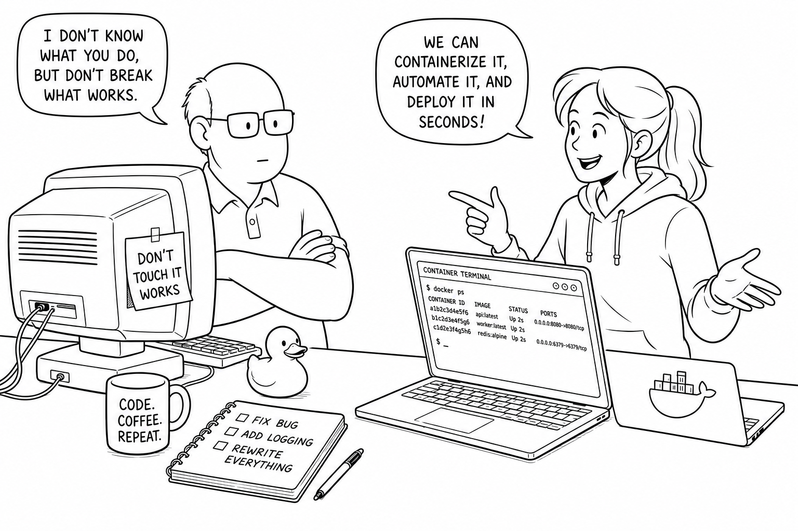

# System Interpreter — Dependency Isolation Demonstration

A role-play notebook about one shared Ubuntu server. **Alice**, an application
developer, needs an environment for two Python projects. **Bob**, the server
admin, is convinced that one machine means one Python. The notebook follows
them through three walls and knocks each one down.

The notebook is organised as five acts plus an epilogue. Every section prints
the Python executable and the package versions actually in play, so nothing is
implicit.

| Act | Content |
| --- | --- |
| I — The Ticket | The cast, Alice's request, and the container image Bob provisions. |
| II — Taking Inventory | The distribution, the two accounts, the shared interpreter and its import paths. |
| III — Everybody Installs | Bob installs `python3-psutil` with APT and pins `requests==2.25.1` system-wide; Alice installs FastAPI with `pip install --user`. |
| IV — The Three Applications | Bob's legacy host/domain checker, Alice FastAPI v1 (Pydantic v1) and v2 (Pydantic v2). |
| V — Hitting the Walls | The system-wide conflict, the per-user fix, the project-versus-project conflict, and the per-project virtual environments that finally resolve it. |
| Epilogue | A table of where a package can live, and three rules that follow from the story. |

## Files in this directory

| Path | Description |
| --- | --- |
| `.devcontainer/Dockerfile` | Ubuntu 24.04 image with Python 3, `python3-dev`, `pip`, `venv`, JupyterLab, `notebook`, `ipykernel` and `sudo`. Creates two real Linux users, `bob` (sudo) and `alice` (no sudo). Deliberately contains **no** application dependency — every package Bob and Alice use is installed live from the notebook. |
| `.devcontainer/devcontainer.json` | VS Code Dev Container config. Default user is `bob`. Installs the Python and Jupyter extensions and pins the default interpreter to `/usr/bin/python3`. |
| `system_interpreter.ipynb` | Everything else. The three demo applications are embedded in the notebook as Python strings and written to disk from a cell. |

## Usage

### Prerequisites

Before opening the project, make sure you have:

- VS Code + Dev Containers extension for VS Code
- Docker Desktop

### Getting Started

- Open the repository root in VS Code.
- Run **Dev Containers: Reopen in Container** and pick the
  `notebooks/system_interpreter` folder.
- When the container is ready, open `system_interpreter.ipynb`.
- Select the kernel **Python 3 — Ubuntu System** (this is
  `/usr/bin/python3`). Run cells top-to-bottom.
