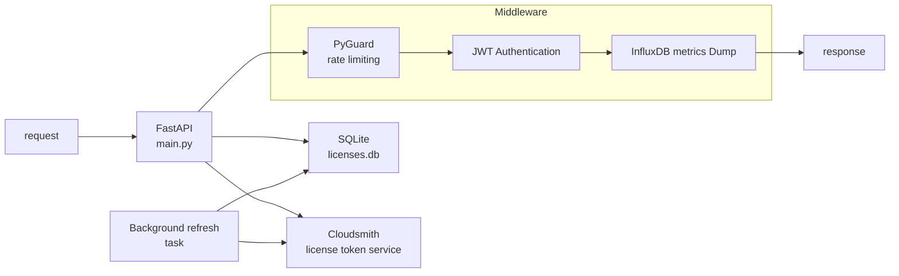

# License Service Backend

The License Service backend is a small [FastAPI](https://fastapi.tiangolo.com/) application for creating, retrieving, validating, and revoking license keys from [clousmith](www.cloudsmith.io). 

It uses [Pydantic](https://docs.pydantic.dev/) for typed API models, [Uvicorn](https://www.uvicorn.org/) as the application server, and SQLite for local license storage.

The backend also validates OIDC bearer tokens for protected operations and uses [PyGuard](https://github.com/ValentinTwin1206/modern-python-devops-egineering/blob/main/projects/proj1_pyguard/README.md) to rate-limit requests that can be used for brute-force attacks.

## Architecture

The following diagram shows the application flow inside the License Service backend. 

1. `main.py` creates the database and FastAPI application.
2. The application lifespan loads the Cloudsmith configuration and checks the current database state at startup.
3. Middleware applies PyGuard rate limiting, validates bearer tokens for protected license operations and send metrics to InfluxDB.
4. Route handlers authorize the request, read or update SQLite, and call Cloudsmith when a license is created or refreshed.
5. A background task refreshes the stored Cloudsmith token while the service is running and is cancelled cleanly during shutdown.



## Basic Components

The License Service backend is boostrapped as a `FastAPI` application and uses `asynccontextmanager` as its lifespan manager. The following snippet refers to the `main.py` and shows the basic logic

```python
# main.py
from fastapi import FastAPI
from license_service.middleware import configure_middleware

@asynccontextmanager
async def lifespan(_app: FastAPI):
    # on startup
    try:
        yield
    finally:
        # on teardown
        ...

app = FastAPI(
    title="License Service",
    description="Small example service for generating and validating license keys.",
    lifespan=lifespan,
)

configure_middleware(app)

```

The `FastAPI` instance stores the application metadata, routes, and middleware. Its `lifespan` handler performs startup and shutdown work:

* Loads Cloudsmith configuration from environment variables.
* Logs the current active-license state.
* Verifies the Cloudsmith repository when Cloudsmith is configured.
* Starts the background token-refresh task.
* Cancels and awaits the refresh task during shutdown.

If Cloudsmith configuration is incomplete, the service remains available for health checks and license retrieval, but license creation returns `503` until the required configuration is provided.

### Middleware

The middleware is configured within the `configure_middleware()` method and consists of three basic middleware operations:

1. **PyGuard middleware** tracks requests to protected paths and returns `429`
  when the configured brute-force threshold is exceeded.
2. **JWT authentication middleware** validates an `Authorization: Bearer` token
  for protected license operations and stores the validated claims on
  `request.state.jwt_claims`.
3. **Metrics middleware** writes metrics to the monitoring stack using flux protocol


```python
# license_service/middleware.py
def configure_middleware(app):

    ...

    @app.middleware("http")
    async def security_middleware(request: FastAPIRequest, call_next):
        ...
    
       response = await call_next(request)

    @app.middleware("http")
    async def jwt_auth_middleware(request: FastAPIRequest, call_next):

        ...
        return await call_next(request)

    @app.middleware("http")
    async def metrics_middleware(request: FastAPIRequest, call_next):
        ...

```

``FastApi`` offers the decorator ``@app.middleware("http")`` that registers the function as an HTTP middleware. Within, a developer can utilize the ``call_next()`` method, that passes the request to the next processing layer. Depending on the middleware stack, this can be another middleware or, eventually, the actual FastAPI route.

The part after the ``call_next()`` can be used to modify the reponse back to the client. 


### Routes and models

The application implements its endpoints within the `main.py` and decorates them with the `@app.get`, `@app.post`, etc. decorators. The backend uses Pydantic response models to document and validate its API:

* `LicenseResponse` contains the owner, Cloudsmith token, and expiration time.
* `LicenseCheckResponse` contains the validation status and optional owner.
* The health route returns the service name and an `ok` status.

FastAPI exposes interactive API documentation at `/docs` and the generated OpenAPI schema at `/openapi.json`.

The following shows an example snippet inside the `main.py`

```python
# main.py
from fastapi  import Depends, FastAPI, HTTPException, Query, Request as FastAPIRequest
from pydantic import BaseModel

class LicenseResponse(BaseModel):
    user: str
    cloudsmith_token: str
    cloudsmith_expires_at: str

@app.get(
    "/licenses",
    response_model=LicenseResponse,
    dependencies=[Depends(require_admin_or_user)],
)
def get_license() -> LicenseResponse:
    """Return the current Cloudsmith token without refreshing it."""
    
    ...
    
    return LicenseResponse(
        user=license_row["user"],
        cloudsmith_token=license_row["cloudsmith_token"],
        cloudsmith_expires_at=license_row["expires_at"],
    )
```

## Project Structure

| Path | Purpose |
| --- | --- |
| `main.py` | FastAPI application, lifecycle, middleware registration, and routes |
| `license_service/schedule.py` | Background Cloudsmith token refresh loop |
| `license_service/database.py` | SQLite database creation and license operations |
| `license_service/helpers.py` | OIDC validation and authorization helpers |
| `license_service/middleware.py` | PyGuard and JWT middleware configuration |
| `license_service/cloudsmith.py` | Cloudsmith configuration and API integration |
| `pyproject.toml` | Runtime and development dependencies |
| `Dockerfile` | Container image definition |
| `test/` | Backend tests |

## Development Setup

### Requirements

* Python 3.9+
* [uv](https://docs.astral.sh/uv/)
* Cloudsmith configuration for creating or refreshing licenses
* OIDC issuer and JWKS configuration for protected user requests

### Getting started

From this directory, create the environment and install the locked
dependencies:

```bash
uv sync
```

The backend reads its runtime configuration from environment variables. Set the Cloudsmith and OIDC values required by the deployment before using the protected endpoints. The database path defaults to `licenses.db` and can be changed with `DATABASE_PATH`.

## Run the Application

Start the backend from this directory:

```bash
uv run python main.py
```

The service listens on `http://localhost:8080`. Interactive API documentation is available at [http://localhost:8080/docs](http://localhost:8080/docs).

For development, start Uvicorn with reload enabled:

```bash
uv run uvicorn main:app --reload --host 0.0.0.0 --port 8080
```

## Run Tests

Run the backend test suite with:

```bash
uv run pytest
```

## Container Build

Build the backend image from the `bonus1_license_service_oidc` project root with `docker compose`:

```bash
docker compose up
```
