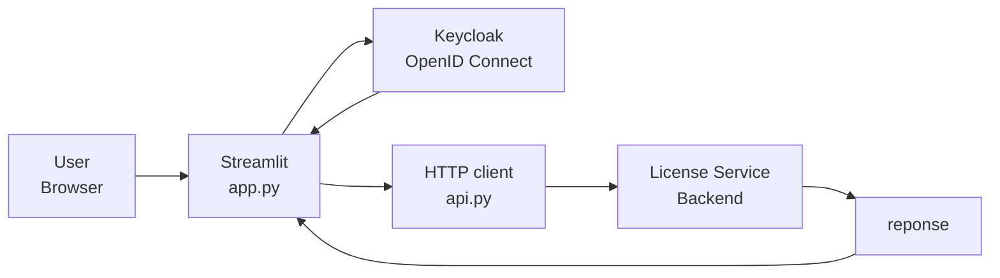

# License Service Frontend

The License Service frontend is a small [Streamlit](https://streamlit.io/) application for obtaining and checking licenses. It authenticates users with Keycloak through OpenID Connect (OIDC), forwards the access token to the backend API, and presents the result in a browser-based user interface.

Streamlit reruns `app.py` from top to bottom whenever the user interacts with a widget, while the current license values are kept in `st.session_state` between reruns.

## Architecture

The following diagram shows the application flow inside the License Service frontend. 

1. The user signs in through Keycloak.
2. Streamlit exposes the authenticated OIDC access token through `st.user`.
3. `app.py` passes that token to `api.py` when requesting the current license.
4. `api.py` sends HTTP requests to the backend configured by `BACKEND_URL`.
5. The backend returns license information, which Streamlit renders in the UI.



## Basic Components

Streamlit applications are ordinary Python scripts. They execute from top to bottom and rerun after widget interaction. The frontend uses the following important building blocks:

* `st.user` exposes the current OIDC authentication state.
* `st.login()` and `st.logout()` start and end the Keycloak session.
* `st.button()` starts an operation during a script rerun.
* `st.stop()` prevents unauthenticated users from reaching protected UI code.
* `st.session_state` preserves the retrieved token and expiration timestamp
	across reruns.

### app.py

Besides rendering, the `app.py` handles Streamlit's OIDC flow. The configuration is stored in `.streamlit/secrets.toml`. The `[auth]` section defines the callback URL and session-cookie settings. The `[auth.keycloak]` section identifies the Keycloak client and its discovery endpoint.

```toml
[auth]
redirect_uri = "http://localhost:8501/oauth2callback"
cookie_secret = "31e5353a9a803bf266cac370ad263235e73d1654331dca5fb1687aefcbcd14d0"
# Expose the access token so the frontend can forward it to the backend API.
expose_tokens = ["id", "access"]

[auth.keycloak]
client_id = "streamlit-frontend"
client_secret = "streamlit-dev-secret"
server_metadata_url = "http://keycloak.localhost:8081/realms/license-service/.well-known/openid-configuration"
```

With this configuration in place, `app.py` uses Streamlit's built-in OIDC authentication API:

```python
import streamlit as st
...
if not st.user.is_logged_in:
    st.write("You are not logged in.")
    if st.button("Log in with Keycloak"):
        st.login("keycloak")
    st.stop()
...
```

When the user clicks **Log in with Keycloak**, `st.login("keycloak")` starts the authorization-code flow using the provider configured in
`[auth.keycloak]`. The browser is redirected to Keycloak, where the user authenticates. Keycloak then redirects the browser to the exact
`redirect_uri` configured for the client.

Streamlit handles the callback, exchanges the authorization code for tokens, and stores the authenticated session in its user context. On subsequent reruns, `st.user.is_logged_in` is true and the application can read the user claims and the exposed access token. The access token is then sent to the backend as a bearer token when the frontend calls protected API endpoints.

### `api.py`

`api.py` keeps HTTP communication out of the Streamlit interface. It reads the backend URL from `BACKEND_URL` and provides two small functions:

* `get_license()` calls `GET /licenses` with the OIDC bearer token.
* `check_license()` calls `GET /licenses/{cloudsmith_token}` without
	authentication.

## Project Structure

| Path | Purpose |
| --- | --- |
| `app.py` | Streamlit interface, OIDC state, and button handlers |
| `api.py` | HTTP client for the backend license API |
| `entrypoint.sh` | Generates runtime secrets and starts Streamlit |
| `pyproject.toml` | Runtime and development dependencies |
| `uv.lock` | Locked dependency versions |
| `.streamlit/secrets.toml.example` | Local OIDC configuration template |
| `Dockerfile` | Container image definition |

## Development Setup
### Requirements

* Python 3.12+
* [uv](https://docs.astral.sh/uv/)
* A running backend service
* A running Keycloak instance configured with the `license-service` realm

## Run the Application

Start Streamlit on all interfaces so it can also be reached from a container or another machine:

```bash
uv run streamlit run app.py \
	--server.address=0.0.0.0 \
	--server.port=8501
```

The application is available at [http://localhost:8501](http://localhost:8501). For login and license retrieval, the backend and Keycloak services must also be running.

## Container Build

Build the frontend image from the `bonus1_license_service_oidc` project root with `docker compose`:

```bash
docker compose up
```
