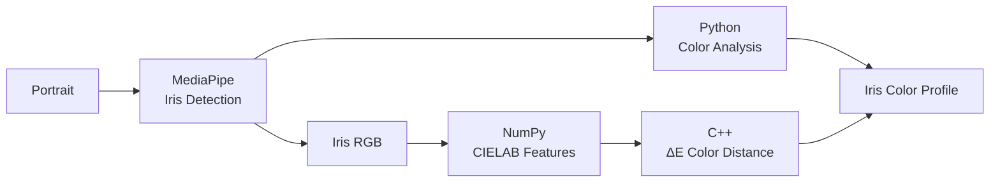

# IrisLab

IrisLab is a Python/C++ sample project for analyzing iris color from portrait images.

The project demonstrates how **Conda can manage both Python and native C++ dependencies** within the same development and packaging workflow.

IrisLab combines:

- **MediaPipe** for local eye and iris detection
- **NumPy and CIELAB** for iris-color analysis
- **C++** for perceptual color-distance calculations
- **pybind11** to connect Python and C++
- **CIE ΔE** for comparing measured colors with reference profiles

The project uses a **Conda-first workflow** based on `environment.yml` and Conda recipes. No `pyproject.toml` is required.

## Architecture



MediaPipe runs locally and identifies the eye and iris regions in the image.

Python analyzes the extracted iris pixels and classifies the eye color as:

**Blue · Green · Gray · Hazel · Amber · Brown**

The representative iris color is transformed into CIELAB color space and passed to the native C++ library, which calculates the perceptual color distance to predefined reference profiles.

## Project Structure

| Path | Purpose |
| --- | --- |
| `src/irislab/` | Python application, CLI, iris detection, and color analysis |
| `cpp/` | Native C++ color-distance library and pybind11 bindings |
| `models/` | Local MediaPipe model |
| `samples/` | Example portrait images |
| `environment.yml` | Conda development environment |
| `recipe/` | Conda package recipe |
| `Dockerfile.devEnv` | Ubuntu-based development environment |

## Development Setup

The development container starts from **Ubuntu 26.04** and installs a pinned
Miniconda release explicitly.

This keeps the different layers visible:

```text
Ubuntu 26.04
      │
      ▼
   Miniconda
      │
      ▼
 irislab environment
      │
      ├── Python dependencies
      └── C/C++ dependencies
```

Inside the development container, create the project environment if it does not
already exist:

```bash
if conda env list | awk '{print $1}' | grep -qx irislab; then
    echo "Conda environment 'irislab' already exists"
else
    conda env create --file environment.yml
fi

conda activate irislab
```

To update an existing environment:

```bash
conda env update -f environment.yml --prune
```

MediaPipe is installed from PyPI after creating or updating the Conda
environment:

```bash
python -m pip install mediapipe
```

## Build the Native Extension

IrisLab contains a native C++ color-analysis component exposed to Python through pybind11.

Build it locally with:

```bash
cmake \
  -S cpp \
  -B build-dev \
  -G Ninja \
  -DIRISCOLOR_BUILD_BINDINGS=ON

cmake --build build-dev

cp build-dev/_native*.so src/irislab/
```

## Run IrisLab

Analyze one of the sample portraits:

```bash
python -m irislab.cli \
  --image samples/blue-eyes.png
```

Example:

```text
IrisLab Iris Color Analysis

Classification       Blue
RGB                  (69, 77, 83)
CIELAB               L* 32.1, a* -1.4, b* -4.7
Chroma               4.9
CIELAB hue           253.4°
Closest profile      Blue-01
Color distance (ΔE)  3.8
Eyes detected        2
```

All image processing and iris detection runs **locally on the CPU**. No cloud inference service or GPU is required.

## Run Tests

Run the test suite with:

```bash
PYTHONPATH=src pytest
```

## Conda Packages

The project demonstrates a multi-output Conda recipe with two packages:

| Package | Purpose |
| --- | --- |
| `libiriscolor` | Native C++ color-analysis library and headers |
| `irislab-tools` | Python application, CLI, and pybind11 extension |

Build both packages with:

```bash
conda build recipe/ --channel conda-forge
```

`irislab-tools` depends on `libiriscolor`, allowing Conda to resolve the native dependency automatically.

Install the packaging and publication tools separately when you need to build
or upload Conda packages:

```bash
conda install \
    --name base \
    --channel conda-forge \
    conda-build \
    conda-package-handling

conda run --name base \
    python -m pip install cloudsmith-cli==1.26.0
```

## Install the Packaged Application

Once published to your Conda repository, IrisLab can be consumed from another environment:

```yaml
name: irislab

channels:
  - {YOUR_CONDA_CHANNEL}
  - conda-forge
  - nodefaults

dependencies:
  - python=3.12
  - irislab-tools
```

Create and activate the environment:

```bash
conda env create --file environment.yml

conda activate irislab

python -m pip install mediapipe
```

The native `libiriscolor` dependency is installed automatically by Conda.