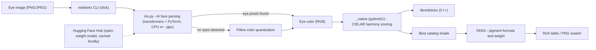

# RedSticks

RedSticks is a Conda sample project that suggests lipstick shades from eye-color images. It combines AI or Pillow-based color extraction, RDKit pigment chemistry, and a native C++ CIELAB scorer exposed through pybind11. The Conda-only build uses `environment.yml` for development and `recipe/meta.yaml` to produce the `libredsticks` and `redsticks-tools` packages.

## Architecture



## Project Components

| Component | Description |
| --------- | ----------- |
| [src/redsticks/*](src/redsticks/) | Python package with the suggestion API, AI eye-color extraction (`iris.py`), pigment catalog, RDKit integration, and `redsticks` CLI. |
| [cpp/*](cpp/) | C++ CIELAB scoring library, public header, pybind11 bindings, and CMake build for `libredsticks` and `_native`. |
| [environment.yml](environment.yml) | Defines the Conda environment and installs Python, RDKit, Pillow, NumPy, PyTorch, torchvision, transformers, build tools, and development tooling from `conda-forge`. The solver picks the CUDA build of PyTorch on machines with an NVIDIA driver and the CPU build otherwise. |
| [Dockerfile.devEnv](Dockerfile.devEnv) | Provides the complete containerized development environment with Miniconda, Conda packaging tools, Cloudsmith CLI, C++ build tooling, and the project environment. |
| [recipe/meta.yaml](recipe/meta.yaml) | Multi-output Conda recipe that produces the `libredsticks` and `redsticks-tools` packages. The Python output is built inline with CMake; this recipe does not use pip or `pyproject.toml`. |

## End-User Guide

### Requirements

- Miniconda or Anaconda.
- Access to the proprietary Cloudsmith Conda repository that publishes the `libredsticks` and `redsticks-tools` packages.

### Installation

Choose the package that matches your use case:

- `redstick-tools`: Provides the Python API and CLI, and automatically pulls in a matching `libredsticks` build.
- `libredsticks`: Provides the native C++ shared library and headers for C/C++ consumers without the Python stack.

Add the package(s) to your project's `environment.yml` file:

```yaml
name: redsticks-demo
channels:
    - {YOUR_CONDA_CHANNEL}
    - conda-forge
dependencies:
    - python=3.12
    - redsticks-tools    # Python API + CLI
    # - libredsticks     # only needed explicitly for C/C++ consumers
```

> Use the channel URL and authentication settings from your Cloudsmith Conda repository. For private repositories, configure credentials in Conda or through your organization's standard secret-management workflow instead of committing tokens to `environment.yml`.

Create and activate the environment from that file:

```bash
conda env create -f environment.yml && conda activate redsticks-demo
```

### Usage

#### Run on CPU

Analyze an eye-color image with the default CPU workflow:

```bash
redsticks --image samples/green-eye.png
```

The open-weight [`jonathandinu/face-parsing`](https://huggingface.co/jonathandinu/face-parsing) model extracts eye-region pixels and is cached in `~/.cache/huggingface`. If no eyes are detected, RedSticks falls back to Pillow color quantization.

#### Run on GPU

Use the GPU with a CUDA-enabled PyTorch installation:

```bash
redsticks --image samples/green-eye.png --gpu
```

> Conda automatically selects the CUDA build when an NVIDIA driver is available.

## Developer Guide

### Setup Environment

The [Dockerfile.devEnv](Dockerfile.devEnv) contains all required development tools. Developers should use the container so the host system does not need Python, Conda, RDKit, CMake, compilers, or Cloudsmith CLI installed. Build artifacts are stored on the host in `.build/`. Run the following command from the `projects` directory to open an interactive shell in the development image:

```bash
./build.sh build --path proj4_redsticks/Dockerfile.devEnv
```

Within the running container, the Conda environment is created solely from `environment.yml` using the Conda CLI:

```bash
conda env create -f environment.yml && conda activate redsticks-demo
```

On a machine with an NVIDIA GPU the same file installs the CUDA build of PyTorch automatically: conda-forge ships the CUDA runtime libraries as regular Conda packages and selects them via the `__cuda` virtual package, so the host only needs the NVIDIA driver. This includes Windows WSL2, where the Windows NVIDIA driver is exposed to the Linux distribution — never install a Linux driver inside WSL. Containers additionally need `nvidia-container-toolkit` and `docker run --gpus all`.

### Sync Environment

Within the running container, update the Conda environment to match `environment.yml`, removing any packages that are no longer listed:

```bash
conda env update -f environment.yml --prune
```

### Local Development Build

The pybind11 extension `_native` must be compiled once (and after every C++ change) so the Python package can import it. Build it in-place with CMake and copy it into the package:

```bash
cmake -S cpp -B build-dev -G Ninja -DREDSTICKS_BUILD_BINDINGS=ON
cmake --build build-dev
cp build-dev/_native*.so src/redsticks/
```

Outside a Conda build, `libredsticks` is not pre-installed, so CMake automatically embeds the library sources into the extension (see `cpp/CMakeLists.txt`).

### Run Tests

Within the running container, run the test suite with pytest:

```bash
PYTHONPATH=src pytest
```

### Build Guide

#### Install Packaging Tools

Install Conda packaging tools into the base environment:

```bash
conda install -n base -c conda-forge conda-build conda-package-handling
```

#### Build Packages

Build the packages from the project root. The multi-output recipe declares exactly two outputs, `libredsticks` and `redsticks-tools`, and produces both in a single invocation. The `libredsticks` output is built by `recipe/build-libredsticks.sh`, while the `redsticks-tools` output is built by an inline CMake command in `recipe/meta.yaml` that compiles `_native` and copies the Python sources into `site-packages`. This packaging pipeline is entirely Conda-driven and does not use pip or `pyproject.toml`:

```bash
conda build recipe/ --channel conda-forge
```

Each resulting package contains platform-specific binaries (a native shared library for `libredsticks`, a compiled pybind11 extension for `redsticks-tools`), so neither may be published as `noarch`.

#### Authenticate with Cloudsmith

Authenticate the Cloudsmith CLI with an API key that can deploy to the Conda repository:

```bash
export CLOUDSMITH_API_KEY="<your-api-key>"
```

#### Publish Packages

Resolve the exact built artifact paths instead of hard-coding a `noarch` location. `conda build --output` prints one path per output package:

```bash
mapfile -t PACKAGES < <(conda build recipe/ --channel conda-forge --output)
```

Upload each built package to your Cloudsmith Conda repository:

```bash
for PACKAGE in "${PACKAGES[@]}"; do
    cloudsmith push conda "${CLOUDSMITH_REPOSITORY}" "$PACKAGE"
done
```

Verify that Cloudsmith can find both uploaded artifacts:

```bash
cloudsmith list packages "${CLOUDSMITH_REPOSITORY}" -q "libredsticks OR redsticks-tools"
```
