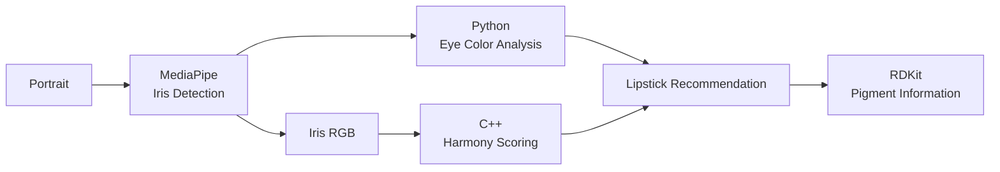

# RedSticks

RedSticks is a Python/C++ sample project that recommends lipstick shades based on eye color.

The project demonstrates how **Conda can manage both Python and native C++ dependencies** within the same development and packaging workflow.

RedSticks combines:

- **MediaPipe** for local iris detection
- **NumPy and CIELAB** for eye-color analysis
- **C++** for lipstick color-harmony scoring
- **pybind11** to connect Python and C++
- **RDKit** for pigment chemistry

The project uses a **Conda-first workflow** based on `environment.yml` and Conda recipes. No `pyproject.toml` is required.

## Architecture



MediaPipe runs locally and identifies the iris regions in the image.

Python analyzes the extracted iris pixels and classifies the eye color as:

**Blue · Green · Gray · Hazel · Amber · Brown**

The representative iris color is passed to the native C++ library, which calculates the harmony between the eye color and the available lipstick shades.

## Project Structure

| Path | Purpose |
| --- | --- |
| `src/redsticks/` | Python application, CLI, iris detection, and eye-color analysis |
| `cpp/` | Native C++ harmony algorithm and pybind11 bindings |
| `models/` | Local MediaPipe model |
| `samples/` | Example portrait images |
| `environment.yml` | Conda development environment |
| `recipe/` | Conda package recipe |
| `Dockerfile.devEnv` | Ubuntu-based development environment |

## Development Setup

The development container starts from **Ubuntu 24.04** and installs Miniconda explicitly.

This keeps the different layers visible:

```text
Ubuntu 24.04
      │
      ▼
   Miniconda
      │
      ▼
redsticks environment
      │
      ├── Python dependencies
      └── C/C++ dependencies
```

Inside the development container, create the project environment:

```bash
conda env create -f environment.yml
conda activate redsticks
```

To update an existing environment:

```bash
conda env update -f environment.yml --prune
```

## Build the Native Extension

RedSticks contains a native C++ component exposed to Python through pybind11.

Build it locally with:

```bash
cmake \
  -S cpp \
  -B build-dev \
  -G Ninja \
  -DREDSTICKS_BUILD_BINDINGS=ON

cmake --build build-dev

cp build-dev/_native*.so src/redsticks/
```

## Run RedSticks

Analyze one of the sample portraits:

```bash
python -m redsticks.cli \
  --image samples/blue-eyes.png
```

Example:

```text
RedSticks Suggestion

Eye color        Blue
Eye RGB          (69, 77, 83)
Extraction       iris-landmarks
Eyes detected    2
Suggested shade  Coral Flame
Harmony          71/100
```

All image processing and ML inference runs **locally on the CPU**. No cloud inference service or GPU is required.

## Run Tests

Run the test suite with:

```bash
PYTHONPATH=src pytest
```

## Conda Packages

The project demonstrates a multi-output Conda recipe with two packages:

| Package | Purpose |
| --- | --- |
| `libredsticks` | Native C++ library and headers |
| `redsticks-tools` | Python application, CLI, and pybind11 extension |

Build both packages with:

```bash
conda build recipe/ --channel conda-forge
```

`redsticks-tools` depends on `libredsticks`, allowing Conda to resolve the native dependency automatically.

## Install the Packaged Application

Once published to your Conda repository, RedSticks can be consumed from another environment:

```yaml
name: redsticks

channels:
  - {YOUR_CONDA_CHANNEL}
  - conda-forge

dependencies:
  - python=3.12
  - redsticks-tools
```

Create the environment:

```bash
conda env create -f environment.yml
conda activate redsticks
```

The native `libredsticks` dependency is installed automatically by Conda.