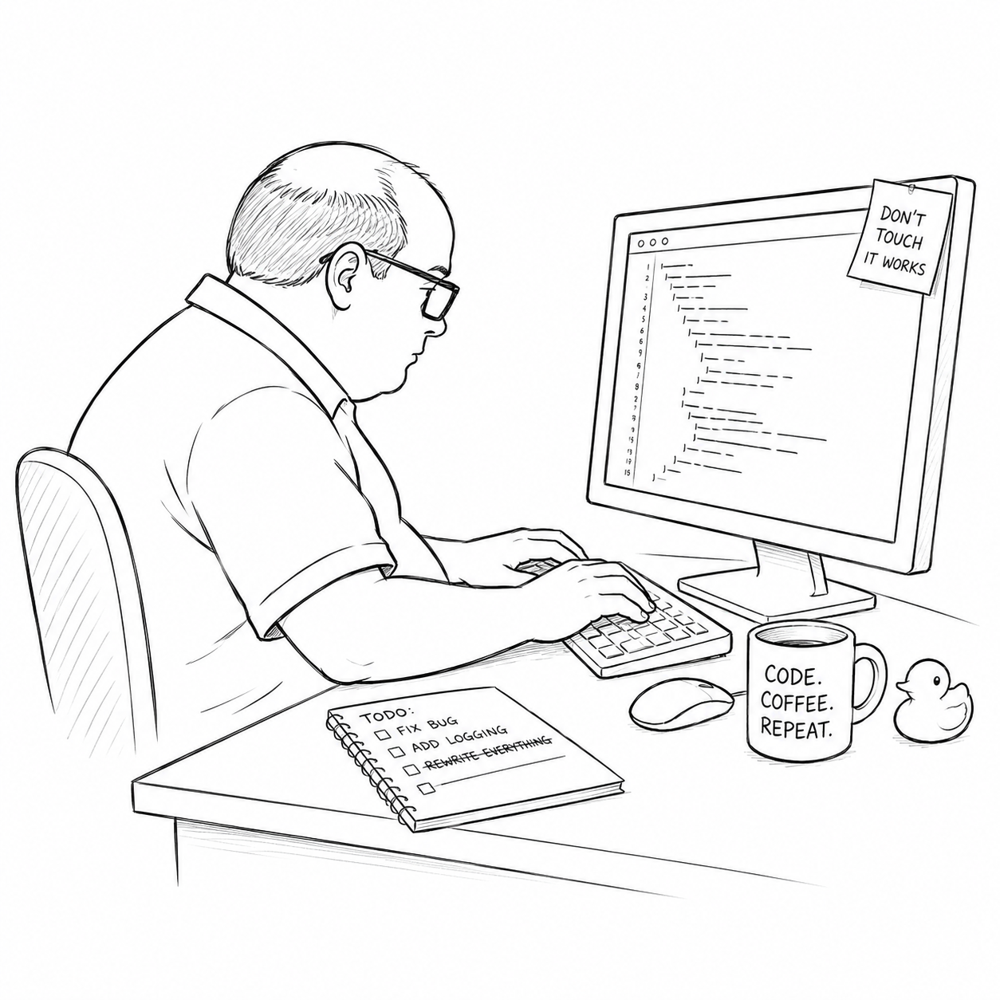

# Bob's server



## Introduction

This is Bob's web server. Bob left the company six years ago. The server still runs and answers requests every single day...nobody is entirely sure why.

It depends on libraries that haven't been upgraded in years. Every developer agrees it should be modernized.

The project lead has a different idea.

"You're the new person, right? Great. You'll maintain Bob's server."

Your assignment isn't to rewrite it. Your assignment is to keep it running.

## Getting started

Before you start asking questions remember one important rule:

> **It works in production. Don't touch it.**

To start the service, simply run:

```bash
python server.py
```

Open your browser and visit:

```
http://127.0.0.1:8000
```

If the server starts successfully, congratulations—you are now officially responsible for maintaining it.

Good luck.